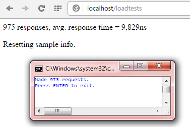

# 第十二章压力测试

本节介绍的源代码位于[比特桶存储库](https://bitbucket.org/syncfusiontech/web-servers-succinctly)的文件夹**示例\第 12 章**中。Visual Studio 解决方案文件位于**第 12 章\克利夫顿。WebServer** 文件夹。

压力测试或负载测试是潘多拉的盒子。一旦你打开它，就会出现关于测试结果是否准确、测试本身是否正确、测试是否正确以及如何理解测试结果的问题。考虑到这一点，我们将花一点时间探索这块岩石地形。

首先，让我们为每个请求创建一个最小的工作流:

```cs
    public static void InitializeWorkflow(string websitePath)
    {
      StaticContentLoader sph = new StaticContentLoader(websitePath);
      workflow = new Workflow<ContextWrapper>(AbortHandler, OnException);

      workflow.AddItem(new WorkflowItem<ContextWrapper>(sph.GetContent));
      workflow.AddItem(new WorkflowItem<ContextWrapper>(Responder));
    }

```

代码清单 101

这是静态页面服务器的工作流程。它所做的只是用与该网址相关联的文件内容来响应请求。事实证明，路由等额外的工作流例程对性能测试的影响可以忽略不计(这是一个线索！).

这是我的测试代码，旨在能够从多个线程命中服务器。用服务器的 IP 地址替换 IP 地址。我用一个 IP 地址代替`localhost`，因为我想在一个单独的机器上运行这些测试。

```cs
    class Program
    {
      static int n = 0;

      static void Main(string[] args)
      {
        List<Thread> threads = new List<Thread>();

        for (int i = 0; i < 1; i++)
        {
          Thread thread = new Thread(new ThreadStart(RunForOneSecond));
          thread.IsBackground = true;
          threads.Add(thread);
        }

        threads.ForEach(t => t.Start());

        Thread.Sleep(1250);

        Console.WriteLine("Made {0} requests.", n);
        Console.WriteLine("Press ENTER to exit.");
        Console.ReadLine();
      }

      static void RunForOneSecond()
      {
        DateTime now = DateTime.Now;
        WebClient client = new WebClient();
        client.Proxy = null;

        try
        {
          while ((DateTime.Now - now).TotalMilliseconds < 1000)
          {
            Interlocked.Increment(ref n);
            string downloadString = client.DownloadString("http://192.168.1.21/");
          }
        }
        catch (Exception ex)
        {
          Console.WriteLine(ex.Message);
        }
      }
    }

```

代码清单 102

我们将从一个线程向服务器发出请求开始:


图 37:单线程负载测试

顺便说一句，这些数字相当一致。让我们尝试两个线程:


图 38:两个线程进行负载测试

基本上，可以处理的请求数量在四个负载测试线程附近达到峰值(顺便说一下，我在测试机上有八个内核)，最大吞吐量约为每秒 600 个请求。顺便说一句，这些数字不会改变，不管使用什么技术来听一个请求或者有多少听众在听。

但是我们实际测量的是什么呢？当然，我们可以说我们正在测量整个请求流，从发起请求到接收响应。中间有很多。让我们对请求-接收到响应-给定的时间执行检测(不使用工作流，因此影响最小)，这样我们就可以看到工作流本身实际花费了多少时间。注意我们如何在获取上下文后立即开始，并在发送上下文前立即停止时钟。这消除了所有的。NET 和操作系统的片段。首先，我们将重构`ContextWrapper`以添加一个秒表，该秒表在包装器被实例化的瞬间开始运行，这发生在我们接收到上下文之后。

```cs
    public class ContextWrapper
    {
      public HttpListenerContext Context { get; protected set; }
      public Response PendingResponse { get; set; }
      public Session Session { get; set; }
      public System.Diagnostics.Stopwatch Stopwatch { get; set; }

      public ContextWrapper(HttpListenerContext context)
      {
        Context = context;
        Stopwatch = new System.Diagnostics.Stopwatch();
        Stopwatch.Start();
      }
    // ... etc ...

```

代码清单 103

然后，在应答器中，我们将停止秒表，并将时间添加到我们的累计计数中(我已经验证了我使用的是高分辨率性能计数器作为秒表):

```cs
    public static WorkflowState Responder(
      WorkflowContinuation<ContextWrapper> workflowContinuation,
      ContextWrapper wrapper)
    {
      wrapper.Stopwatch.Stop();
      Server.CumulativeTime += wrapper.Stopwatch.ElapsedTicks;
      ++Server.Samples;

    // ... etc ...

```

代码清单 104

现在，我要将路由器重新添加到工作流中，这样我们就可以通过 URL 显示平均处理时间，如下所示:

```cs
    routeTable.AddRoute("get", "loadtests", new RouteEntry()
    {
      RouteHandler = (continuation, wrapper, session, pathParams) =>
      {
        long nanosecondsPerTick = (1000L * 1000L * 1000L) /             System.Diagnostics.Stopwatch.Frequency;

        if (Server.Samples == 0)
        {
          wrapper.SetPendingResponse("<p>No samples!</p>");
        }
        else
        {
          long avgTime = Server.CumulativeTime * nanosecondsPerTick / Server.Samples;
          string info = String.Format("<p>{0} responses, avg. response time =
    {1}ns</p><p>Resetting sample info.</p>", Server.Samples, avgTime.ToString("N0"));
          Server.CumulativeTime = 0;
          Server.Samples = 0;
          wrapper.SetPendingResponse(info);
        }

        return WorkflowState.Continue;
      }
    });

```

代码清单 105

现在，我们应该了解服务器内部的处理时间:


图 39:内部处理时间

所以，让我们调用那 150 *微秒*来处理请求。对比一下我们的负载测试，它告诉我们平均一个请求需要超过 1.5 *毫秒。*

我认为这意味着我们负载测试的开销是请求实际处理时间的 10 倍。我会得出这样的结论，我们的服务器，做一些相当小的事情，实际上每秒可以处理大约 6000 个请求。

让我们尝试一些不同的东西来进一步检查我们的测试。我们不要加载 index.html 文件，而是简单地以特定的路径返回数据，并将测试改为使用该路径:

```cs
    routeTable.AddRoute("get", "sayhi", new RouteEntry()
    {
      RouteHandler = (continuation, wrapper, session, pathParams) =>
      {
        wrapper.SetPendingResponse("<p>hello</p>");

        return WorkflowState.Continue;
      }
    });

```

代码清单 106

在我们的测试程序中(您必须更改 IP 地址):

```cs
    string downloadString = client.DownloadString("http://192.168.1.21/sayhi");

```

代码清单 107

现在看看结果(计数减少了 2，因为我们也在浏览`loadtests`页面进行计数):



图 40:不读取文件的负载测试

哇，我们通过四个线程进行查询获得了三分之一的响应，并且我们的服务器中的响应时间下降到 9 *微秒，*至少在理论上转化为每秒处理超过 100，000 个请求的能力。

这让你了解了...什么事？操作系统？那个。NET 框架？测试过程？真的不好说。

## 我们能从中拿走什么？

这里的要点是，如果您想要一台高性能服务器，请非常仔细地观察您的路由处理程序在做什么，以及您对文件系统、数据库等的访问。应用中的许多东西都会降低 web 服务器的性能。

例如，将视图引擎添加到我们的上一次测试中，导致响应时间增加了近百倍:平均 700 微秒。当你考虑到可能进入你的网站的请求数量时，这就增加了许多潜在的不必要的开销。