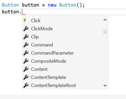
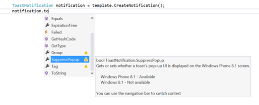

# 二、基本概念：Visual Studio、XAML 和 C#

## 开发者许可证

当您创建第一个通用窗口应用时，Visual Studio 将请求您的微软帐户凭据:此步骤的目的是获取开发人员许可证，该许可证将用于生成在您的计算机上测试应用所需的临时证书。这一要求与我们在第 1 章中提到的在商店中发布应用所需的开发人员帐户无关，您只需拥有有效的微软帐户即可获得许可证。

唯一不同的是证书的到期日期:如果微软帐户连接到开发人员帐户，它将在 90 天内有效，否则为 30 天。但是，您可以在每次需要时续订许可证—除了在续订时需要活跃的互联网连接之外，没有任何限制。

## 模板

当您第一次启动 Visual Studio 2013 并选择创建新项目时，您会注意到许多不同的类别。我们感兴趣的属于**商店应用**类别。在这里，您会发现以下子类别:

*   **Universal Apps** 包含创建 Universal Windows 应用所需的模板，因此它将创建一个共享项目，并为每个平台添加一个项目。
*   **Windows 应用**包含只为 Windows 8.1 创建 Windows 商店应用所需的模板。
*   **Windows Phone 应用**包含只为 Windows Phone 创建 Windows Store 应用所需的模板。在这个类别中，你还会发现一些后缀为**的模板:它们可以用来创建一个基于 Silverlight 框架的手机应用，适用于 Windows Phone 8.0 和 8.1。**

如果您只为 Windows 或 Windows Phone 创建了一个应用，并且您后来改变了主意，那么您可以随时将它变成一个通用的 Windows 应用:只需在解决方案资源管理器窗口中右键单击该解决方案，即可为另一个目标添加项目。

无论您选择哪种模板来创建通用 Windows 应用，Visual Studio 都会为您创建一个由三个项目组成的解决方案:

*   一个带**的。Windows** 后缀，包含 Windows 8.1 的 Windows 商店应用
*   一个带**的。WindowsPhone** 后缀，包含 Windows Phone 8.1 的 Windows 商店应用
*   一个有。**共享**后缀，包含所有数据(代码、XAML 控制、资产等。)您希望在两个平台之间共享的内容。

共享项目是用一种叫做**链接文件**的技术来管理的:每次向共享项目中添加一个文件，就会自动为两个平台的特定项目添加一个链接。因此，Visual Studio 将编译特定包中的所有文件，将它们捆绑在一起，但共享文件实际上只存在于一个位置。这样，当您编辑文件时，这两个项目都将自动获得更改。

## 页面，XAML，后面还有代码

视窗商店应用放弃了旧的窗口范例，使用基于页面的新窗口，页面以分层方式组织。启动应用后，用户登陆主页面；从那里，他可以移动到包含不同和特定内容的其他页面。例如，新闻应用可以在主页中显示最近的新闻列表。用户可以点击其中一个并导航到详细页面，该页面将显示新闻的全文。此外，应用可以有更多的页面:一个用于视频，一个用于照片库，一个用于特定的新闻类别，等等。

应用中的所有页面都由两个不同的文件组成:

*   主文件，以**结束。xaml** 扩展。它包含页面的视觉布局，并使用基于 XML 的 XAML 语言编写。
*   后面的代码，以**xaml . cs**扩展名结束。它包含能够与用户界面交互并执行逻辑操作的代码。要在解决方案资源管理器中查看此文件，您必须单击 XAML 文件附近显示的小箭头。事实上，代码隐藏文件在树结构中显示为 XAML 文件的子文件。后面代码中使用的语言取决于您使用的投影:在我们的示例中，它将包含 C#代码。

## 项目的结构

无论您使用什么样的模板，都有一些文件和文件夹是 Windows Store 应用必不可少的，并且包含在每个项目中。让我们看看最重要的。

### app . xaml 文件

最初，您可能认为这个文件代表应用页面之一:事实上，像任何其他页面一样，它由一个 XAML 和一个代码隐藏文件组成。实际上，App.xaml 文件是一个特殊的类，因为它(通常)是每个 Windows Store 应用的起点。它负责初始化应用正常工作所需的一切，从管理应用不同页面的`Frame`类开始。此外，它提供了管理应用生命周期的所有入口点，这将在第 4 章中详细介绍。

`App`类的一个重要特性是，它的实例一直保持活动状态，直到应用关闭或挂起:当应用运行时，在这个类中声明的每个属性都可以被访问，以便以后使用。这种行为的另一个后果是 App.xaml 文件是注册所有资源(如样式和模板)的中心点，这些资源可以从应用页面中的控件中使用。我们将在本章后面详细介绍如何使用这个特性。

### 资产文件夹

该文件夹通常包含所有视觉资源(图像、徽标、图标等)。)在应用中使用。这不是一个严格的要求:您可以将这样的数据放在项目的任何其他文件夹中。但是，将所有内容都放在资产文件夹中是一个很好的做法。可视资源可以放在共享项目中，但默认情况下，它们是在特定的 Windows 和 Windows Phone 项目中创建的。原因是，由于平板电脑和智能手机支持不同的外形和分辨率，这两个应用通常需要使用不同的图像，即使它们显示相同的数据。但是，在接下来的章节中，您将看到 Windows Store 应用支持一种轻松管理不同分辨率和设备大小的方法。得益于一项名为捆绑的功能(将在第 12 章中详细介绍)，您将能够在共享项目中包含所有图像，并根据应用运行的设备，让手机在安装过程中自动从商店下载适当的图像。

### 清单文件

在每个平台的特定项目中，你会发现一个名为 **Package.appxmanifest** 的特殊文件。它被称为**清单文件**，它非常重要:它的目的是定义应用的所有主要特性，如标准视觉资产(徽标、切片)、元数据(名称、描述)、功能、与操作系统的集成等。在引擎盖下，它是一个 XML 文件，但是 Visual Studio 提供了一个可视化编辑器，当您双击它时，它会自动加载。

清单由以下部分组成:

*   **应用:**本节描述了应用的所有基本元数据，如名称、默认语言、支持的方向和推送通知配置。
*   **视觉资产**:本节描述了应用的视觉布局，定义了所有用作商店徽标、默认图块背景或应用加载时显示的闪屏的默认图像。由于 Windows 和 Windows Phone 支持多种分辨率和屏幕大小，本部分将允许您为同一图像上传不同的格式。在第 4 章中，您将更好地理解 Windows 和 Windows Phone 如何管理这种情况。
*   **要求**:本部分仅在 Windows Phone 上提供，列出了我们的应用可能会用到的一组硬件功能(如陀螺仪或摄像头)。这样，设备不具备这些功能的用户将无法从商店安装应用。
*   **功能**:本部分用于设置应用正在使用哪些功能(硬件或软件)，如互联网连接、地理定位服务、图片库等。在这本书里，每次我们讨论一个需要您启用特定功能的特性时，您都会发现一个特别的注释。
*   **声明**:本节用于扩展应用，使其能够与操作系统或其他应用进行深度交互。每次我们要使用一些扩展应用的代码时(比如在后台执行操作或共享内容)，我们都需要在这一部分设置入口点。我们将在本书的最后几章中详细介绍这一部分，届时我们将讨论合同和后台执行。
*   **内容 URIs** :这一部分是专门针对一个名为**网络视图**的控件，它可以用来显示应用内部的网络内容(就像一个 HTML 页面)。这个控件通过拦截和调用特定的 JavaScript 函数，为开发人员提供了一种与页面交互的方式。此功能仅针对受信任的网站启用，这些网站的网址需要在此部分中添加。为了提高安全性，仅支持使用 HTTPS 协议的站点。
*   **打包**:这最后一部分可以用来定制一些关于你将要在商店发布的包的信息，比如应用名、发布者名或者版本号。当您将应用与商店关联以发布它时，本节中详细介绍的许多信息都会自动设置；你会在第 12 章找到更多细节。

## XAML

XAML 代表**可扩展应用标记语言**:它基于 XML，用于定义页面的视觉布局，就像 HTML 用于定义网页的布局一样。

控件(如按钮或文本块)由一个 XML 标记标识，该标记按照层次结构插入到页面中。标签可以插入到其他标签中以定义关系。例如，这种方法被广泛用于定义页面的布局:有一些特殊的控件(我们将在第 3 章中详细介绍)充当其他控件的容器，因此，它们一个嵌套在另一个中。

以下是页面定义的样子:

```cs
          <Page
              x:Class="Styles.MainPage"

              xmlns:x="http://schemas.microsoft.com/winfx/2006/xaml"
              xmlns:local="using:Styles"
              xmlns:d="http://schemas.microsoft.com/expression/blend/2008"
              xmlns:mc="http://schemas.openxmlformats.org/markup-compatibility/2006"
              mc:Ignorable="d">

              <Grid>
                  <StackPanel>
                      <TextBlock Text="Hello world" />
                  </StackPanel>
              </Grid>
          </Page>

```

每个页面都继承自一个名为`Page`的基类，它是起始节点；放置在其中的每隔一个标签将定义页面布局。您可以看到，在页面定义中有一个名为`x:Class`的属性:它定义了哪个代码隐藏类连接到页面。在示例中，它是一个名为`MainPage`的类，属于名为`Styles`的命名空间。

### 命名空间

名称空间的概念应该已经为开发人员所熟悉:这是一种通过为类定义逻辑路径来更好地组织代码的方法。这样(即使这不是建议的方法)，您也可以有两个同名的类，因为它们属于两个不同的名称空间。命名空间用句点分隔；例如，如果您有一个名为`Person`的类，它属于`Entities`命名空间，它将由完整的定义`Entities.Person`来表示。通常，默认情况下，项目内的名称空间与文件夹映射:如果您创建一个名为`Entities`的文件夹，并在其中创建一个新类，默认情况下，它将属于`Entities`名称空间。

XAML 的命名空间也是如此:XAML 控件最终是属于特定命名空间的标准类。当您想要在页面中使用控件时，您必须确保在页面定义中添加了正确的命名空间。对于开发人员创建的自定义控件或包含在外部库中的第三方控件来说尤其如此。事实上，大多数原生控件(按钮、文本框等。)可以使用，而不必担心命名空间。

让我们看一个关于如何在 XAML 使用 Bing Maps 控件的命名空间的示例，Bing Maps 控件是一个外部库，可以添加到 Windows Store 应用中，供 Windows 显示地图。该控件包含在命名空间`Bing.Maps`中；因此，在`Page`定义中需要以下声明:

```cs
          xmlns:maps="using:Bing.Maps"

```

每个命名空间都以`xmlns`前缀(XML Namespace)开头，这始终是必需的。然后，您需要为命名空间指定一个唯一的标识符，每当您需要访问一个控件或属于它的类(在前面的示例中，它是`maps`)时，就会在页面内部使用该标识符。下面是在页面中显示必应地图控件的示例代码:

```cs
          <maps:Map x:Name="MyMap" />

```

如您所见，我们已经在控件名称(`Map`)前添加了我们之前分配给命名空间(`maps`)的标识符作为前缀。

## 属性和事件

每个控件都可以通过两种方式进行自定义:定义属性和订阅事件。它们中的每一个都用控件的属性来标识，即使它们有两个不同的目的。

**属性**用于确定控件的外观和行为，只需为特定属性赋值即可设置。假设我们希望通过使用名为`TextBlock`的控件在页面上显示文本:在这种情况下，我们需要更改名为`Text`的属性值，如下例所示。

```cs
          <TextBlock Text="Hello world" />

```

但是，有一些属性不能像前面的示例那样用简单的字符串来表示。例如，如果要将图像定义为控件的背景，则需要使用扩展语法设置名为`Background`的属性，如下例所示:

```cs
          <Grid>
              <Grid.Background>
                  <ImageBrush ImageSource="/Assets/Background.png" />
              </Grid.Background>
          </Grid>

```

扩展语法用设置为控件子级的节点表示:前缀与控件的名称相同，后跟用句点分隔的属性名称。在示例中，由于我们需要设置名为`Grid`的控件的`Background`属性，因此我们使用表达式`Grid.Background`。

任何控件都有一个特殊的属性，称为`x:Name`:它是一个字符串，在页面中唯一标识它(不能有两个同名的控件)。它特别重要，因为它允许开发人员从后面的代码访问控件:由于这个标识符，您将能够直接从代码中读取和设置属性。

例如，假设您有一个`TextBlock`控件，您以下列方式为其分配一个唯一的标识符:

```cs
          <TextBlock x:Name="MyText" />

```

在后面的代码中，只需使用`x:Name`属性的值，就可以与控件进行交互。以下示例显示了如何在代码中更改`Text`属性:

```cs
          MyText.Text = "Hello world!";

```

**事件，**另一方面**、**用于确定用户或应用如何与您的控件交互。每当发生涉及控件的事情时，都会引发一个事件，您将能够在后面的代码中管理它。一个非常常见的事件是`Click`，它由所有提供与用户直接交互的控件公开，就像`Button`控件一样。每次用户按下按钮(通过点击鼠标或点击)，都会引发`Click`事件。您将需要用一个特定的方法来管理它，称为**事件处理程序**。Visual Studio 将帮助您以正确的方式定义此方法:在您编写要分配给事件的事件名称后，Visual Studio 将负责在代码中为您创建事件处理程序。

以下示例向您展示了如何为 XAML 的`Button`控件的`Click`事件定义事件处理程序:

```cs
          <Button Click="OnButtonClicked" />

```

Visual Studio 将生成以下事件处理程序:

```cs
          private void OnButtonClicked(object sender, RoutedEventArgs e)
          {
              MyText.Text = "Hello world!";
          }

```

如您所见，事件处理程序是常规方法，但有特定的定义:它们总是提供一些参数(通常是两个)，作为开发人员，我们可以使用这些参数来更好地跟踪事件。第一个参数叫做`sender`，它是对调用事件的对象的引用(在我们的示例中，它将包含对`Button`控件的引用)。相反，第二个参数提供了一些有助于理解事件上下文的属性。在接下来的章节中，我们将看到这个参数的更详细的示例用法。在事件处理程序中，您只需编写在事件引发时要执行的代码。在上一个示例中，我们在每次按下`Button`时设置`TextBlock`控件的`Text`属性。

Visual Studio 提供了一个名为**智能感知**的功能，它能够在您编写代码时自动完成代码，并动态提供一些关于属性和事件的有用信息。IntelliSense 还提供了一个有用的视觉参考来区分属性和事件:属性通过一个小扳手来识别，事件通过一个闪电来识别。



图 8:用于突出显示属性和事件的不同图标

### 资源

如果您曾经使用过像 HTML 这样的网络技术，那么资源的概念对您来说将是熟悉的。就像在 HTML 世界中一样，您可以通过使用 CSS 文件在多个页面中共享和重用样式。资源可用于定义控件的样式和行为，并在应用的不同页面中重用它。

资源由任何控件提供的名为`Resources` `,`的属性定义。由于 XML 基于分层结构，每个嵌套控件都能够使用其父控件定义的资源。以下示例显示了如何定义一些资源，这些资源可用于`Grid`控件以及嵌套在其中的任何其他控件:

```cs
          <Grid>
              <Grid.Resources>
                  <!-- insert here your resources -->
              </Grid.Resources>
          </Grid>

```

然而，资源通常被定义为两个不同的范围:页面和应用。

由于`Page`类提供的`Resources`属性，页面资源是在页面本身中定义的。这样，页面中包含的所有控件都将能够访问资源。以下是页面资源定义的示例:

```cs
          <Page
              x:Class="Styles.MainPage"

              xmlns:x="http://schemas.microsoft.com/winfx/2006/xaml"
              xmlns:local="using:Styles"
              xmlns:d="http://schemas.microsoft.com/expression/blend/2008"
              xmlns:mc="http://schemas.openxmlformats.org/markup-compatibility/2006"
              mc:Ignorable="d">

              <Page.Resources>
                  <!-- insert here your resources -->
              </Page.Resources>
          </Page>

```

相反，应用资源是使用 **App.xaml** 文件中定义的`Application`类的`Resources`属性来定义的。这样，应用的任何页面中的任何控件都可以使用这些资源。下面是一个示例定义:

```cs
          <Application
              x:Class="Styles.MainPage "

              xmlns:x="http://schemas.microsoft.com/winfx/2006/xaml"
              xmlns:local="using:Styles">

              <Application.Resources>
                  <!-- insert your resources here -->
              </Application.Resources>

          </Application>

```

就像控件由`x:Name`属性唯一标识一样，资源由`x:Key`属性标识。要将资源应用于控件的属性，您需要使用一种称为**标记扩展**的特殊 XAML 语法:这是一种直接在 XAML 描述复杂操作的方法，否则这些操作需要在代码中编写一些逻辑。XAML 有许多标记扩展，我们将在本章中讨论其中的一些。

用于将资源应用于控件的称为`StaticResource`。下面是如何使用它将样式应用于`TextBlock`控件的示例:

```cs
          <TextBlock Style="{StaticResource CustomStyle}" />

```

通过在大括号中包含`StaticResource`关键字来应用资源，后跟资源的名称(这是分配给`x:Key`属性的值)。

在某些情况下，尤其是如果您有很多资源，页面或应用的定义可能会变得过于拥挤和难以阅读。XAML 为您提供了一种更好地管理资源的方法，通过在一个专用文件中声明它们，就像在 HTML 中您可以在另一个文件中定义 CSS 样式一样，而不仅仅是内联。

在 XAML，这些外部文件被称为**资源字典**。Visual Studio 提供了创建此类文件的特定模板:只需在解决方案资源管理器中右键单击您的项目，然后选择**添加** > **新项目**。作为可用模板之一，您会发现一个名为**资源二进制**的文件类型。它将自动创建一个具有以下定义的文件:

```cs
          <ResourceDictionary

              xmlns:x="http://schemas.microsoft.com/winfx/2006/xaml">

               <!-- here you can place all your resources -->

          </ResourceDictionary>

```

使用这个文件真的很简单:你只需要在`ResourceDictionary`标签中包含你所有的资源，就像你添加它们作为页面或应用资源一样。然后，您需要在主应用中包含资源字典文件，方法是在 App.xaml 文件中声明它，如下所示:

```cs
          <Application.Resources>
              <ResourceDictionary>
                  <ResourceDictionary.MergedDictionaries>
                      <ResourceDictionary Source="Resources/Styles.xaml" />
                  </ResourceDictionary.MergedDictionaries>
              </ResourceDictionary>
          </Application.Resources>

```

资源字典文件被添加到由`ResourceDictionary`类提供的`MergedDictionaries`属性中。在前面的示例中，您可以看到我们只添加了一个文件，但是您可以添加任意多个文件(例如，如果您想要根据资源的类型或用例将资源拆分到不同的文件中)。

现在让我们详细看看 XAML 框架为开发人员提供了哪种资源。

#### 风格

XAML 的样式与 CSS 样式非常相似:它们的目的是在一个样式中收集多个属性定义，这样当样式应用于控件时，所有属性都会自动更改。这样，如果您改变主意，想要编辑其中一个属性，您可以只在一个地方(样式定义)进行编辑，而不是手动编辑所有控件。

以下是一种风格的外观:

```cs
          <Style TargetType="TextBlock" x:Key="RedStyle">
              <Setter Property="Foreground" Value="Red" />
              <Setter Property="FontSize" Value="30" />
          </Style>

```

样式由`Style`控件标识，该控件提供了一个名为`TargetType`的属性，用于指定该样式可以应用于哪种控件。在`Style`控件中，您可以放置任意数量的`Setter`标签:每个标签都可以更改特定属性(使用`Property`属性)的值(使用`Value`属性)。

在前面的示例中，我们定义了一种仅适用于`TextBlock`控件的样式，并更改了它的两个属性:颜色(`Foreground`)和文本大小(`FontSize`)。

样式可以应用于任何类型与我们在`TargetType`属性中定义的类型相匹配的控件。这样，您就不必使用`StaticResource`属性手动应用样式；它将被自动应用。这些样式被称为**隐式样式**，它们通过省略`x:Key`属性来定义，如下例所示:

```cs
          <Style TargetType="TextBlock">
              <Setter Property="Foreground" Value="Red" />
              <Setter Property="FontSize" Value="30" />
          </Style>

```

所有`TextBlock`控件将自动使用更大的红色字体显示文本。隐式样式是基于定义它们的范围来应用的:如果它们已经在页面中声明，它们将自动应用于页面中的所有控件；否则，如果它们已经被声明为应用的资源，它们将被应用于所有页面中的所有控件。

重要的是要记住 XAML 的等级本质:就风格而言，它意味着内在风格总是战胜外在风格。例如，如果您已经定义了将`TextBlock` `’s`颜色更改为红色的页面样式，但随后您手动应用了另一种将颜色更改为蓝色的样式，则最后一种样式将优先于通用样式。

#### 数据模板

数据模板是特殊的资源，可以应用于某些控件以定义可视化布局。它们通常与用于显示项目集合的控件结合使用，如`ListView`或`GridView`，我们将在第 3 章中介绍。

数据模板只包含用于渲染列表中每个项目的 XAML，XAML 将自动重复并应用于列表中的每个元素。假设您想要显示人员列表；以下是您的数据模板的外观:

```cs
          <DataTemplate x:Key="PeopleTemplate">
              <StackPanel>
                  <TextBlock Text="Name" />
                  <TextBlock Text="{Binding Path=Name}" />
                  <TextBlock Text="Surname" />
                  <TextBlock Text="{Binding Path=Surname}" />
              </StackPanel>
          </DataTemplate>

```

目前，只需忽略`Binding`关键词；这是一个新的标记扩展，将在本章后面详细介绍。目前，重要的是要知道，有了这个数据模板，您将能够显示集合中每个人的姓名。

数据模板的行为类似于任何其他资源:它们可以在控件内内联定义，作为页面或应用的资源，或者在资源字典中定义。然后，您可以使用`StaticResource`关键字应用它们。通常，当您处理显示集合的控件时，数据模板被分配给一个名为`ItemTemplate`的属性，该属性定义了用于集合中每个项目的模板:

```cs
          <ListView ItemTemplate="{StaticResource PeopleTemplate}" />

```

#### 刷子

画笔是 XAML 元素，用于定义控件的填充方式。例如，当您设置`Button`控件的背景颜色时，您正在使用画笔。画笔有很多种:最简单的叫`SolidColorBrush`，用来表现一种颜色。大多数情况下，您可以使用标准属性的语法来应用这个画笔。将颜色的名称分配给所需的属性就足够了，因为 XAML 运行时会在引擎盖下为您创建一个`SolidColorBrush`。例如，您可以创建一个红色背景的`Rectangle`形状:

```cs
          <Rectangle Width="200" Height="200" Fill="Red" />

```

还有更复杂的画笔只能用扩展语法来表达。例如，您可以通过使用`LinearGradientBrush`或`RadialGradiantBrush`来应用渐变而不是简单的颜色。它们都有相同的目的，但是当 `LinearGradientBrush`使用一条线作为颜色之间的分隔符时，`RadialGradiantBrush`应用了圆形效果。

以下是如何将渐变画笔应用到我们之前看到的同一个`Rectangle`控件:

```cs
          <Rectangle Width="200" Height="200">
              <Rectangle.Fill>
                  <LinearGradientBrush>
                      <GradientStop Color="Blue" Offset="0" />
                      <GradientStop Color="Red" Offset="1" />
                  </LinearGradientBrush>
              </Rectangle.Fill>
          </Rectangle>

```

在一个渐变画笔里面，我们可以插入多个`GradientStop`控件；它们中的每一个都定义了将要应用的颜色之一。使用`Offset`属性，可以指定渐变停止的位置。或者，您也可以应用`StartPoint`和`EndPoint`属性来定义渐变应该开始和结束的点。

最后，您还可以通过使用`ImageBrush`控件将图像应用为画笔，这也需要扩展语法:

```cs
          <Rectangle Width="200" Height="200">
              <Rectangle.Fill>
                  <ImageBrush ImageSource="background.png" />
              </Rectangle.Fill>
          </Rectangle>

```

#### 根据主题处理资源

到目前为止，我们只看到了一种将资源应用于控件的方法:使用`StaticResource`关键字。但是，在 Windows 和 Windows Phone 8.1 中添加的 Windows Runtime 改进包括一个新的关键字，称为`ThemeResource`，可以用来根据设备的主题自动适配资源。

让我们后退一步，详细看看这个功能是如何工作的:Windows 8.1 和 Windows Phone 8.1 都支持不同的主题。在窗口中，它们连接到辅助功能(易于访问)设置。在控制面板中，用户可以启用其中一个高对比度主题，这对有视觉障碍的人很有用。在 Windows Phone 8.1 中，主题是原生用户体验的一部分:用户可以在手机设置中启用**深色主题**(黑色背景上的白色文本)或**白色主题**(白色背景上的深色文本)。

在设计应用时，开发人员需要记住这个特性；否则，它就有可能只在其中一个主题上正常工作，从而无法在其他主题上使用。

假设您在页面中有一个`TextBlock`控件，您强制文本的颜色为白色:手机上有白色主题的用户将无法阅读它。感谢`ThemeResource`关键字，你可以定义多个同名资源，系统会自动应用最适合当前主题的资源。

这里有一个例子:

```cs
          <Application.Resources>
              <ResourceDictionary>
                  <ResourceDictionary.ThemeDictionaries>
                      <ResourceDictionary x:Key="Dark">
                          <SolidColorBrush Color="Red" x:Key="ApplicationTitle" />
                      </ResourceDictionary>
                      <ResourceDictionary x:Key="Light">
                          <SolidColorBrush Color="Blue" x:Key="ApplicationTitle" />
                      </ResourceDictionary>
                  </ResourceDictionary.ThemeDictionaries>
              </ResourceDictionary>
          </Application.Resources>

```

如您所见，我们已经定义了(作为应用资源)两个同名的资源:它们都是`SolidColorBrush`控件，并且它们具有相同的`x:Key`值，这就是`ApplicationTitle`。但是两把刷子的用途不同:第一把颜色设置为`Red`，第二把颜色设置为`Blue`。

两者都被添加到名为`ThemeDictionaries`的`ResourceDictionary`属性中:一个重要的区别是每个`ResourceDictionary`都有一个唯一的标识符，并被赋予了`x:Key`属性。通过使用特定的命名约定，该标识符告诉系统资源指的是哪个主题:

*   `Default`，应用为默认的主题。
*   `Dark`，使用深色主题时应用。
*   `Light`，使用灯光主题时应用。
*   `HighContrast`，使用高对比度主题时应用。

现在您只需要像以前一样应用您的资源，但是使用`ThemeResource`标记扩展而不是`StaticResource`扩展。这里有一个示例，向您展示了如何将先前的样式应用于`TextBlock`控件:

```cs
          <TextBlock Text="Title" Foreground="{ThemeResource ApplicationTitle}" />

```

这种标记扩展最有用的优点之一是它能够在运行时检测主题的变化:这样，如果用户在应用运行时更改了主题，所有资源都将自动适应，而不必重新启动应用。

您也可以通过将`RequestedTheme`属性应用于整个应用(在 App.xaml 文件中)或单个页面或控件来强制应用的主题。这样，资源将忽略用户的主题，只遵循强制主题定义的规则。以下示例显示了如何强制整个应用使用`Dark`主题:

```cs
          <Application
              x:Class="Qwertee.App"

              xmlns:x="http://schemas.microsoft.com/winfx/2006/xaml"
              xmlns:local="using:Qwertee"
              RequestedTheme="Dark">

          </Application>

```

#### 动画片

动画可能是 XAML 最强大的资源之一:只需几行 XAML 代码，您就可以制作页面中几乎任何控件的动画。例如，您可以使控件消失、移动到另一个位置或改变大小。

使用名为`Storyboard`的控件渲染动画，该控件提供不同类型的动画:

*   当您想要通过更改数字属性(如`FontSize`)来激活控件时，使用`DoubleAnimation`。
*   当您想要通过更改颜色属性来激活控件时，使用`ColorAnimation`。
*   当您想要通过更改控件的坐标来设置控件的动画时，使用`PointAnimation`。
*   在详细了解动画如何工作之前，我们先来看一个定义`DoubleAnimation`的代码示例:

```cs
          <Storyboard x:Name="Animation">
              <DoubleAnimation Storyboard.TargetName="MyShape"
                               Storyboard.TargetProperty="Opacity"
                               From="1.0"
                               To="0.0"
                               Duration="0:0:5" />
          </Storyboard>

```

**附加属性**是从控件继承的特殊属性，但可以应用于其他控件。在这种情况下，`TargetName`和`TargetProperty`是两个附加属性:它们被`Storyboard`控件暴露，但是它们被应用于`DoubleAnimation`控件。它们的目的是定义动画应用的位置:`TargetName`定义控件的名称，而`TargetProperty`定义属性的名称，该值将在动画期间更改。

在前面的示例中，我们更改了由名称`MyShape`标识的控件的`Opacity`属性。另外三个属性定义动画的行为:`From`和`To`用于定义属性的开始和结束值，而`Duration`用于表示动画的长度。在这种情况下，我们将控制的`Opacity`值从 1.0 更改为 0.0；动画将持续五秒钟。五秒钟后，控件将消失。

使用前面的代码，动画按照指定的长度平均分布。XAML 提供了一种通过使用以后缀`UsingKeyFrames`结尾的控件来改变这种行为的方法。以下示例显示了定义`DoubleAnimation`的另一种方法:

```cs
          <Storyboard x:Name="Animation">
              <DoubleAnimationUsingKeyFrames Storyboard.TargetName="MyShape"
                                             Storyboard.TargetProperty="Opacity"
                                             Duration="0:0:10">
                  <LinearDoubleKeyFrame KeyTime="0:0:3" Value="0.8" />
                  <LinearDoubleKeyFrame KeyTime="0:0:8" Value="0.5" />
                  <LinearDoubleKeyFrame KeyTime="0:0:10" Value="0" />
              </DoubleAnimationUsingKeyFrames>
          </Storyboard>

```

我们正在使用另一种版本的控制，叫做`DoubleAnimationUsingKeyFrames`。不同的是，这次使用`LinearDoubleKeyFrame`控件和`KeyTime`属性，我们精确地指定了动画计时。在样本中，最终结果是相同的(10 秒后控件消失)，但计时不同:三秒后`Opacity`属性将设置为 0.8；八秒后到 0.5；最后，10 秒后，设置为 0；使控件消失。

轻松动画

对于用户来说，有一些种类的动画是令人愉快的，但是很难实现。假设您在页面中有一个形状，您想要模拟它向屏幕底部下落；当形状接触底部边缘时，它应该像球一样弹跳。这类动画可能很难定义，因为它们需要考虑物理定律，比如加速度和重力。

XAML 框架提供了一些内置动画，称为**放松动画**，可以用来实现这样的行为，而无需处理所有的复杂性。让我们看看如何使用以下动画之一来实现跳跃示例:

```cs
          <Storyboard x:Name="EasingAnimation">
              <PointAnimation From="0,0" To="0, 200" Duration="0:0:3"
                              Storyboard.TargetName="Circle"
                              Storyboard.TargetProperty="Center">
                  <PointAnimation.EasingFunction>
                      <BounceEase Bounces="2" EasingMode="EaseOut" />
                  </PointAnimation.EasingFunction>
              </PointAnimation>
          </Storyboard>

```

在这种情况下，我们不是以常规方式定义动画(在本示例中，是`PointAnimation`将形状从屏幕的一个位置移动到另一个位置)，而是使用许多可用的内置缓和动画之一来设置`EasingFunction`属性。在前面的示例中，我们使用了一个`BounceEase`控件，它可以用来给控件添加反弹效果。每个放松动画都提供了一组特定的属性来自定义它。例如，`BounceEase`控件提供了一个名为`Bounces`的属性来定义该控件在动画结束时应该执行多少次反弹。

您可以在 MSDN 文档中看到所有可用放松功能的列表:[http://s.qmatteoq.com/Easing](http://s.qmatteoq.com/Easing)。

系统动画

视窗运行时提供了一套内置的动画，涵盖了许多常见的场景(如淡入或淡出效果)。你可以通过它们的`ThemeAnimation`后缀来识别它们。使用这些动画真的很简单:你只需要在`Storyboard`标签中添加控件。在前面的示例中，我们已经看到了如何通过将`Opacity`属性从 1 更改为 0 来手动对控件应用淡出效果。我们可以使用名为`FadeOutThemeAnimation`的内置动画获得相同的结果，如下例所示:

```cs
          <Storyboard x:Name="Fade" TargetName="MyShape">
              <FadeOutThemeAnimation />
          </Storyboard>

```

你可以在这里看到所有可用系统动画的列表:[http://s.qmatteoq.com/ThemeAnimations](http://s.qmatteoq.com/ThemeAnimations)。

控制动画

动画被定义为资源，就像样式和数据模板一样。唯一的区别是，我们需要使用`x:Name`属性来识别它们，而不是使用`x:Key`属性，就像我们使用常规控件一样。以下是定义为页面资源的动画示例:

```cs
          <Page
              x:Class="BLEConnection.MainPage"

              xmlns:x="http://schemas.microsoft.com/winfx/2006/xaml"
              xmlns:d="http://schemas.microsoft.com/expression/blend/2008"
              xmlns:mc="http://schemas.openxmlformats.org/markup-compatibility/2006"
              mc:Ignorable="d">

              <Page.Resources>
                  <Storyboard x:Name="Animation">
                      <DoubleAnimation Storyboard.TargetName="MyShape"
                               Storyboard.TargetProperty="Opacity"
                               From="1.0"
                               To="0.0"
                               Duration="0:0:5" />
                  </Storyboard>
              </Page.Resources>

          </Page>

```

由于唯一的标识符，我们能够控制代码中的动画，就像我们能够与页面中的控件交互一样。`Storyboard`控件提供了一些播放、停止或恢复动画的方法。以下示例显示了连接到`Click`事件的两个事件处理程序，这两个事件处理程序由用于启动(使用`Begin()`方法)和停止(使用`Stop()`方法)动画的两个按钮显示:

```cs
          private void OnStartClicked(object sender, RoutedEventArgs e)
          {
              Animation.Begin();
          }
          private void OnStopClicked(object sender, RoutedEventArgs e)
          {
              Animation.Stop();
          }

```

### 过渡

转场与动画没有太大区别，但是它们不是能够在任何时间执行，而是仅在特定事件发生时执行(例如，加载了页面，或者删除了集合中的元素)。Windows Runtime 为过渡提供了本机支持:我们不需要手动定义动画，只需要通过使用任何控件提供的`Transitions`属性来定义使用哪个动画。与动画不同，我们不需要设置`Storyboard`，因为我们不控制执行。

下面是过渡用法的一个例子:

```cs
          <Button Content="Transition test">
              <Button.Transitions>
                  <TransitionCollection>
                      <EntranceThemeTransition />
                  </TransitionCollection>
              </Button.Transitions>
          </Button>

```

`Transitions`属性接受一个`TransitionCollection`元素:它的目的是支持多个过渡效果，以防您想要管理多个事件(例如，您想要应用一个入口和一个出口过渡)。在这个示例中，我们通过使用`EntranceThemeTransition`控件只应用了入口效果。

像往常一样，因为我们使用的是 XAML，所以转换会传播到嵌套在控件中的每个元素。例如，如果我们将`EntranceThemeTransition`应用到一个`Grid`控件，那么放在它里面的所有其他控件都将继承入口动画。

另一个经常应用转换的场景是集合。例如，当页面被加载时，或者当一个项目被移除或添加到列表中时，您可以将动画应用到每个单独的项目。这个场景的实现方式与我们看到的标准控件相同；唯一不同的是，这一次，我们没有使用`Transitions`属性，而是使用了`ItemContainerTransitions`属性，任何能够显示数据集合的控件都支持该属性。分配给此属性的过渡将自动应用于列表中的每个项目。以下示例使用`ItemsControl`控件显示了这种行为:

```cs
          <ItemsControl x:Name="People">
              <ItemsControl.ItemContainerTransitions>
                  <TransitionCollection>
                      <EntranceThemeTransition />
                      <AddDeleteThemeTransition />
                  </TransitionCollection>
              </ItemsControl.ItemContainerTransitions>
          </ItemsControl>

```

大多数高级窗口运行时控件都提供了对过渡的内置支持。例如，前面的示例(在页面中删除、添加或显示项目时应用了过渡效果的项目集合)是通过类似`GridView`或`ListView`的控件自动实现的，这将在第 3 章中介绍。

### 视觉状态

大多数 XAML 控件都支持**视觉状态**的概念:一个控件可以呈现许多状态，并且每个状态都可以有不同的视觉表示。让我们以`Button`控件为例:默认情况下，它以黑色背景和白色文本显示。如果你按下它，它的状态会改变:背景变成白色，文本变成黑色。

可视化状态是一种定义不同状态的简单方法，无需从头重写每个状态的控件布局。事实上，每个控件都有一个基本状态，加上一组通过定义与原始状态的差异来表示的其他视觉状态。在前面的示例中，一个`Button`的基础模板将包含控件的整个定义:与“按下”状态相关的视觉陈述，而是简单地更改原始模板的背景和文本颜色。

让我们通过向页面添加几个`TextBlock`控件来看一个例子:

```cs
          <Grid>
              <StackPanel>
                  <TextBlock Text="Text 1" x:Name="FirstText" />
                  <TextBlock Text="Text 2" Visibility="Collapsed" x:Name="SecondText" />
                  <Button Content="Change state" Click="OnChangeVisualStateClicked" />
              </StackPanel>
          </Grid>

```

加载页面时，第一个`TextBlock`可见，而第二个隐藏，因为`Visibility`属性设置为`Collapsed`。我们的目标是扭转这种情况，让第一个`TextBlock`消失，同时让第二个可见。以下是我们如何在不编写任何代码的情况下实现这一结果，只需使用 XAML 和视觉状态:

```cs
          <Grid>
              <VisualStateManager.VisualStateGroups>
                  <VisualStateGroup>
                      <VisualState x:Name="Default" />
                      <VisualState x:Name="ChangedState">
                          <Storyboard>
                              <ObjectAnimationUsingKeyFrames Storyboard.TargetName="FirstText"
                                                            Storyboard.TargetProperty="Visibility">
                                  <DiscreteObjectKeyFrame KeyTime="0" Value="Collapsed" />
                              </ObjectAnimationUsingKeyFrames>
                              <ObjectAnimationUsingKeyFrames Storyboard.TargetName="SecondText"
                                                              Storyboard.TargetProperty="Visibility">
                                  <DiscreteObjectKeyFrame KeyTime="0" Value="Visible" />
                              </ObjectAnimationUsingKeyFrames>
                          </Storyboard>
                      </VisualState>
                  </VisualStateGroup>
              </VisualStateManager.VisualStateGroups>
              <StackPanel>
                  <TextBlock Text="Text 1" x:Name="FirstText" />
                  <TextBlock Text="Text 2" Visibility="Collapsed" x:Name="SecondText" />
                  <Button Content="Change state" Click="OnChangeVisualStateClicked" />
              </StackPanel>
          </Grid>

```

我们定义了一个`VisualStateManager`，它提供了一个名为`VisualStateGroup`的属性:在它里面我们可以定义我们想要在页面中管理的不同视觉状态。在这个例子中，我们创建了两个状态:一个叫做`Default`，一个叫做`ChangedState`。第一个包含一个空的定义:它是基本状态，简单地显示在页面中定义的控件。相反，第二个状态包含一个带有一组动画的`Storyboard`。第一个状态应用于第一个`TextBlock`并将`Visibility`属性更改为`Collapsed`以隐藏它。相反，第二个应用于第二个`TextBlock`，并将`Visibility`属性更改为`Visible`，以便显示。

一旦我们定义了视觉状态，我们就需要根据我们的需求来触发它们:一种方法是在后面的代码中使用`VisualStateManager`类来实现，就像下面的示例一样:

```cs
          private void OnChangeVisualStateClicked(object sender, RoutedEventArgs e)
          {
              VisualStateManager.GoToState(this, "ChangedState", true);
          }

```

如果你还记得前面的 XAML 定义，我们已经插入了一个`Button`控件:当它被按下时，前面的事件处理程序被调用来触发视觉状态的改变。这个目标是通过使用`VisualStateManager`课程提供的`GoToState()`方法来实现的。它需要三个参数:将要改变其状态的控件(通常，它是在同一个页面中定义的，所以使用 this 关键字就足够了)、要应用的状态的名称，以及`Boolean`参数，该参数告诉`VisualStateManager`当状态改变时是否应用动画。

我们刚才看到的例子非常简单，但是视觉状态非常有用，尤其是当您必须处理复杂的控件时。通过使用 Visual Studio designer 或 Blend(Visual Studio 附带的 XAML 设计器工具)，您可以重新定义控件的视觉状态:只需右键单击它并选择**编辑模板** > **创建副本**。该工具将生成应用于控件的所有默认样式的副本，包括一个名为`Template`的副本，其中包含所有可用视觉状态的列表。如果您尝试在`Button`控件上执行此操作，您会发现该控件可以呈现许多视觉状态，如`Pressed`或`Disabled`。

### 数据绑定

数据绑定是 XAML 最强大的功能之一，如果你想认真对待 Windows 和 Windows Phone 开发，学会它是至关重要的。数据绑定是在用户界面和数据源(可以是代码中的控件或属性)之间创建通信通道的一种方式。此外，XAML 框架提供了一个与数据绑定相连接的通知机制，它能够创建一个实时通道:每当通道的一端发生变化时，另一端就会被自动通知和更新。

当您设置绑定时，您创建了一个通信通道，该通道涉及一个**源**(数据源)和一个**目标**(用户界面中向用户显示数据的控件)。作为默认行为，通道是在`OneWay`模式下创建的:当源发生变化时，目标会自动更新，否则不会更新。绑定是使用一个称为`Binding`的特定标记扩展来定义的，如下例所示:

```cs
          <TextBlock Text="{Binding Path=Name}" />

```

在这种情况下，使用`Path`属性(在前面的示例中，它是一个名为`Name`的属性)在标记扩展中指定源。相反，目标是绑定被分配到的属性(在本例中，是`Text`属性)。指定`Path`属性是可选的。下面的代码以同样的方式工作:

```cs
          <TextBlock Text="{Binding Name}" />

```

绑定还提供了一种创建双向通信通道的方法。例如，`TextBox`控件不仅可以用来显示文本，还可以接收用户输入的文本。在这种情况下，我们不仅希望代码的更改反映在用户界面中，还希望能够从代码中访问用户输入。为了支持这种情况，我们需要显式设置绑定的`Mode`属性，如下例所示:

```cs
          <TextBox Text="{Binding Path=Name, Mode=TwoWay}" />

```

几乎所有的 XAML 控件都可以使用数据绑定。事实上，它们的大多数属性都被定义为依赖属性，这是特殊的属性，除了提供读写它们的值的标准机制之外，还支持通知传播。

让我们看一个例子来更好地理解这个概念。请看下面的代码片段:

```cs
          <StackPanel>
              <Slider x:Name="Volume" />
              <TextBlock x:Name="SliderValue" Text="{Binding ElementName=Volume, Path=Value}" />
          </StackPanel>

```

在这个示例中，我们已经将`TextBlock`控件的`Text`属性连接到了`Slider`:我们总是使用`Binding`标记扩展，但是使用了不同的方法。我们没有仅仅使用`Path`属性，而是首先添加了`ElementName`属性。这样，我们可以引用页面中的另一个控件。在这种情况下，我们参考`Slider`控件的`Value`属性，它包含滑块的值。`Value`和`Text`都是依赖属性，所以它们可以在发生变化时传播通知。结果是，每次用户在屏幕上移动滑块时，`TextBlock`会自动更新自己，显示滑块的值。

#### 与对象的数据绑定

最强大的数据绑定功能之一是能够将可视控件连接到代码中的对象。这种方法是许多重要的 XAML 概念和模式的基础，比如模型-视图-视图模型。为了解释它，首先我们需要引入一个新的 XAML 属性，称为`DataContext`:它的目的是定义控件的绑定上下文，和许多其他 XAML 特性一样，它是分层的。一旦定义了一个控件的`DataContext`，每隔一个嵌套的控件将获得对相同绑定上下文的访问。

让我们看一个例子:我们将使用数据绑定方法显示一个人的信息，而不是手动设置`TextBlock`控件的`Text`属性。信息存储在一个类中，该类包含一些基本信息(姓名):

```cs
          public class Person
          {
              public string Name { get; set; }
              public string Surname { get; set; }
          }

```

以下是我们将用来在页面上显示此类信息的 XAML:

```cs
          <StackPanel x:Name="Customer">
              <TextBlock Text="Name" />
              <TextBlock Text="{Binding Path=Name}" />
              <TextBlock Text="Surname" />
              <TextBlock Text="{Binding Path=Surname}" />
          </StackPanel>

```

如您所见，使用数据绑定显示姓名:使用`Binding`标记表达式将`Person`类的两个属性连接到`TextBlock`控件。现在让我们看看如何创建一个`Person`对象，并使用这种新方法显示它:

```cs
          public MainPage()
          {
              InitializeComponent();
              Person person = new Person();
              person.Name = "Matteo";
              person.Surname = "Pagani";
              Customer.DataContext = person;
          }

```

创建页面时，我们定义一个新的`Person`对象，并将其设置为`Customer`控件的`DataContext`，即包含用于显示姓名的`TextBlocks`的`StackPanel`。通过这样做，我们已经将刚刚创建的`Person`对象定义为`StackPanel`的绑定上下文；现在我们可以使用绑定来访问`Name`和`Surname`属性。

#### INotifyPropertyChanged 接口

前面的代码有一个缺陷:与我们在`Slider`控件中看到的例子不同，如果在运行时更改`Person`类的一个属性，在应用执行期间，`TextBlock`控件不会更新自己来显示新值。出现这种情况是因为`Name`和`Surname`是简单属性，而不是依赖属性。如果您想启用通知的传播支持，Windows Runtime 提供了一个名为`INotifyPropertyChanged`的特定接口，您必须在您的类中实现它。

让我们看看我们之前看到的`Person`类定义是如何改变以正确支持这个接口的:

```cs
          public class Person : INotifyPropertyChanged
          {
              private string _name;
              private string _surname;
              public string Name
              {
                  get { return _name; }
                  set
                  {
                      _name = value;
                      OnPropertyChanged();
                  }
              }
              public string Surname
              {
                  get { return _surname; }
                  set
                  {
                      _surname = value;
                      OnPropertyChanged();
                  }
              }
              public event PropertyChangedEventHandler PropertyChanged;
              protected virtual void OnPropertyChanged([CallerMemberName] string propertyName = null)
              {
                  PropertyChangedEventHandler handler = PropertyChanged;
                  if (handler != null) handler(this, new PropertyChangedEventArgs(propertyName));
              }
          }

```

感谢`INotifyPropertyChanged` `interface,`我们能够定义一个名为`PropertyChanged`的事件，它是由`OnPropertyChanged()`方法引发的。每次调用它时，我们都会通知用户界面属性的值已经更改。

第二步是更改属性定义。它们不能再是简单的属性了，因为我们需要在每次值改变的时候调用`OnPropertyChanged()`方法；我们在房产的设定者那里做这件事。

现在，数据绑定提供的通知机制将正常工作。如果您在应用运行时更改了个人的姓名，您将在用户界面中正确地看到新值。

#### 数据绑定和集合

当您必须处理数据集合时，数据绑定起着关键作用；每个能够显示集合的控件都实现一个名为`ItemsSource`的属性，该属性包含要在页面中显示的数据。

在本章前面，我们已经看到了如何定义`DataTemplate`以及如何在集合中使用它。每当您将一组数据分配给`ItemsSource`属性时，在引擎盖下，您将设置为属于集合的单个项目`ItemTemplate`的`DataContext`。

让我们看一个带有`ListView`控件的例子，它使用我们之前看到的`DataTemplate`作为`ItemTemplate`:

```cs
          <ListView x:Name="People" >
              <ListView.ItemTemplate>
                  <DataTemplate>
                      <StackPanel>
                          <TextBlock Text="Name" />
                          <TextBlock Text="{Binding Path=Name}" />
                          <TextBlock Text="Surname" />
                          <TextBlock Text="{Binding Path=Surname}" />
                      </StackPanel>
                  </DataTemplate>
              </ListView.ItemTemplate>
          </ListView>

```

下面是我们如何在代码中将数据集合分配给`ListView`控件:

```cs
          public MainPage()
          {
              InitializeComponent();
              List<Person> people = new List<Person>
              {
                  new Person
                  {
                      Name = "Matteo",
                      Surname = "Pagani"
                  },
                  new Person
                  {
                      Name = "Angela",
                      Surname = "Olivieri"
                  }
              };

              People.ItemsSource = people;
          }

```

由于集合被指定为`ListView`控件的`ItemsSource`，因此`ItemTemplate`的`DataContext`成为单个`Person`对象。因此，我们能够使用绑定来显示`Name`和`Surname`属性的值。

当涉及到管理集合和数据绑定时，另一个重要的 Windows Runtime 特性是`ObservableCollection<T>`类。它的行为就像一个常规的集合，但是在引擎盖下，它实现了`INotifyPropertyChanged`接口。因此，每次集合改变时(添加或删除新项目，项目顺序改变，等等)。)，连接到它的控件将自动直观地反映新的更改。

需要强调的是`ObservableCollection<T>`类只能通知集合的变化。如果您想在集合中的某个项目的属性发生变化时也发出通知，您仍然需要在您的类中手动实现`INotifyPropertyChanged`接口。

#### 转换器

有时，您可能希望在页面上显示数据之前更改应用中的一些数据。一个常见的例子是当你必须处理一个`DateTime`对象时:如果你想显示一个新闻列表，它可能足以显示新闻的简化日期，而不是用小时、分钟、秒和毫秒的完整表示。

转换器是能够满足这一要求的特殊类:它们在源数据被发送到目标控件之前拦截源数据。为了正常工作，这些类需要实现`IValueConverter`接口，如下面的代码示例所示:

```cs
          public class DateTimeConverter : IValueConverter
          {
              public object Convert(object value, Type targetType, object parameter, string language)
              {
                  if (value != null)
                  {
                      DateTime date = (DateTime)value;
                      return date.ToString("g");
                  }
                  return string.Empty;
              }

              public object ConvertBack(object value, Type targetType, object parameter, string
              language)
              {
                  if (value != null)
                  {
                      DateTime date = DateTime.Parse(value.ToString());
                      return date;
                  }
                  return DateTime.Now;
              }
          }

```

通过实现`IValueConverter`接口，您将被迫定义两种方法:`Convert()`是在源数据被拦截时调用的方法，它需要在发送到目标之前进行修改。相反，`ConvertBack()`方法在相反的场景中被调用:当目标需要将数据发送回源时。仅当您定义双向绑定时，才会调用此方法；否则，您只需要实现`Convert()`方法。

这两种方法都将接收执行转换所需的一些信息作为输入参数；最重要的是`value`，里面包含了源数据。因为绑定可以应用于任何对象，所以`value`的类型是通用的`object`:根据您的场景，您必须正确地转换为您正在使用的类型。

上一个示例参考了我们之前介绍的`DateTime`场景:`Convert()`方法负责返回日期，而`ConvertBack()`方法获取输入字符串并将其转换回`DateTime`对象。

转换器像常规资源一样管理:它们需要在控件、页面或应用本身提供的`Resources`属性中定义。然后，您可以使用`StaticResource`标记扩展将它们应用于绑定表达式中的`Converter`属性。以下示例显示了如何将先前声明的转换器声明为资源，以及如何将其应用于`TextBlock`控件:

```cs
          <Page
              x:Class="SampleProject.MainPage"

              xmlns:x="http://schemas.microsoft.com/winfx/2006/xaml"
              xmlns:d="http://schemas.microsoft.com/expression/blend/2008"
              xmlns:mc="http://schemas.openxmlformats.org/markup-compatibility/2006"
              mc:Ignorable="d">

              <Page.Resources>
                  <converters:DateTimeConverter x:Key="DateConverter" />
              </Page.Resources>

              <TextBlock Text="{Binding Path=BirthDate, Converter={StaticResource DateConverter}}" />

          </Page>

```

如果您想要添加一个参数(将在`Convert()`或`ConvertBack()`方法中分配给同名的对象)，您只需要向标记扩展添加一个`ConverterParameter`属性，如下例所示:

```cs
          <Page
              x:Class="SampleProject.MainPage"

              xmlns:x="http://schemas.microsoft.com/winfx/2006/xaml"
              xmlns:d="http://schemas.microsoft.com/expression/blend/2008"
              xmlns:mc="http://schemas.openxmlformats.org/markup-compatibility/2006"
              mc:Ignorable="d">

              <Page.Resources>
                  <converters:DateTimeConverter x:Key="DateConverter" />
              </Page.Resources>

              <TextBlock Text="{Binding Path=BirthDate, Converter={StaticResource DateConverter}, ConverterParameter=ShortDate}" />

          </Page>

```

强调转换器不应该被滥用是很重要的:它们会对性能产生负面影响，因为每次绑定表达式改变时都需要调用转换器的逻辑。在更复杂的情况下，最好直接修改原始属性，或者在类中定义一个新属性来保存要显示的值。

#### 数据模板选择器

有时，当您想要根据数据更改控件的视觉状态时(例如，您想要隐藏或显示它，或者更改文本的颜色)，会使用转换器。然而，由于前面提到的潜在性能问题，这种方法并不总是最好的解决方案，尤其是如果您需要基于数据深入地改变布局。

对于这些场景，Windows Runtime 引入了一种叫做`DataTemplateSelector`的新方法，这是一个特殊的类，能够根据我们的需要返回一个不同的`DataTemplate`。这样，我们就不必创建具有大量转换器的布局；我们将简单地定义两个(或更多)不同的模板，根据我们的需要，将使用合适的模板来呈现数据。

为了了解这个特性是如何工作的，让我们改变之前看到的`Person`类，添加一个名为`Gender`的新属性，它将告诉我们这个人是男性还是女性:

```cs
          public class Person
          {
              public string Name { get; set; }
              public string Surname { get; set; }
              public char Gender { get; set; }
          }

```

我们的目标是根据性别显示不同模板的人员列表。如果是男性，背景会是蓝色的，如果是女性，背景会是粉色的。为此，我们需要创建一个从`DataTemplateSelector`继承的类，该类将定义可用的`DataTemplate`对象和用于决定应用哪个对象的条件。以下是完整的示例:

```cs
          public class PeopleTemplateSelector : DataTemplateSelector
          {
              public DataTemplate MaleTemplate { get; set; }

              public DataTemplate FemaleTemplate { get; set; }

              protected override DataTemplate SelectTemplateCore(object item, DependencyObject container)
              {
                  Person person = item as Person;
                  if (person != null)
                  {
                      if (person.Gender=='M')
                      {
                          return MaleTemplate;
                      }
                      else
                      {
                          return FemaleTemplate;
                      }
                  }
                  return base.SelectTemplateCore(item, container);
              }
          }

```

在我们的场景中，我们将使用两个模板。因此，该类定义了两个不同的`DataTemplate`对象:一个用于阳模板，一个用于阴模板。通过实现`DataTemplateSelector`类，我们被迫定义`SelectTemplateCore()`方法，该方法在执行绑定时在运行时被调用。该方法将告诉显示数据集合的控件使用哪个模板。
为此，该方法接收集合的当前项目作为通用`object`作为输入参数。第一步是将其转换为我们正在使用的类型(在我们的例子中是`Person`类)。然后我们可以检查我们感兴趣的条件，并返回适当的`DataTemplate`。在我们的示例中，我们检查`Gender`属性的值:如果它等于`M`，我们返回`MaleTemplate`，否则我们返回`FemaleTemplate`。

到目前为止，我们已经定义了`DataTemplateSelector`的逻辑。现在我们需要通过指定两个模板的外观来定义视觉布局。为此，我们简单地将两个`DataTemplates`定义为资源，就像我们通常会做的那样:

```cs
          <Page.Resources>
              <DataTemplate x:Key="MaleTemplate">
                  <StackPanel Width="300" Background="LightBlue">
                      <TextBlock Text="{Binding Path=Name}" />
                      <TextBlock Text="{Binding Path=Surname}" />
                  </StackPanel>
              </DataTemplate>

              <DataTemplate x:Key="FemaleTemplate">
                  <StackPanel Width="300" Background="Pink">
                      <TextBlock Text="{Binding Path=Name}" />
                      <TextBlock Text="{Binding Path=Surname}" />
                  </StackPanel>
              </DataTemplate>
          </Page.Resources>

```

在我们的示例中，除了应用于`StackPanel`控件的背景颜色之外，这两个模板基本相同。现在我们也需要将我们之前创建的`DataTemplateSelector`对象定义为资源:

```cs
          <Page.Resources>
              <DataTemplate x:Key="MaleTemplate">
                  <StackPanel Width="300" Background="LightBlue">
                      <TextBlock Text="{Binding Path=Name}" />
                      <TextBlock Text="{Binding Path=Surname}" />
                  </StackPanel>
              </DataTemplate>
              <DataTemplate x:Key="FemaleTemplate">
                  <StackPanel Width="300" Background="Pink">
                      <TextBlock Text="{Binding Path=Name}" />
                      <TextBlock Text="{Binding Path=Surname}" />
                  </StackPanel>
              </DataTemplate>
              <local:PeopleTemplateSelector x:Key="PeopleTemplateSelector"
               MaleTemplate="{StaticResource MaleTemplate}"
               FemaleTemplate="{StaticResource FemaleTemplate}" />
          </Page.Resources>

```

如果您还记得的话，在`DataTemplateSelector`类中，我们已经为每个需要管理的`DataTemplate`定义了一个属性。现在我们只需要告诉，对于每个属性，使用哪个`DataTemplate`。因为它们是资源，我们使用`StaticResource`标记扩展，就像我们使用任何其他资源一样。

最后一步是将`DataTemplateSelector`分配给我们将要用来显示数据集合的控件。我们可以通过使用大多数集合控件公开的`ItemTemplateSelector`属性来实现。以下示例显示了如何使用`GridView`控件进行操作:

```cs
          <GridView ItemTemplateSelector="{StaticResource PeopleTemplateSelector}" />

```

如您所见，在这种情况下，我们不需要定义`ItemTemplate`属性；我们创建的`DataTemplateSelector`对象将根据我们编写的逻辑为每个项目分配适当的`ItemTemplate`。

## 在通用视窗应用中共享代码

正如我们在本书开头已经强调的，通用视窗应用并没有定义一个真正的应用类型；相反，它们是特殊的 Visual Studio 模板，可以更容易地在应用的 Windows 8.1 和 Windows Phone 8.1 版本之间共享代码。在共享项目中，您可以定义类、可视化资产、XAML 控件等。您还可以共享应用的整个页面。如果您尝试在共享项目中定义一个页面，然后从这两个应用中触发指向该页面的导航，您会注意到该操作将正常工作。

然而，这并不是最好的方法:即使这两个平台有很多相似之处，它们仍然提供不同的用户体验，因为平板电脑或电脑的外形与智能手机不同。这里有一系列不同的方法，作为开发人员，您可以使用这些方法来最大化代码共享，同时根据平台定义不同的用户界面。

### 部分班

中引入的分部类。NET 框架，提供了一种在多个文件中定义一个类的方法。在编译时，文件被合并在一起组成整个类定义。使用这种方法，我们能够将页面(XAML 文件)保存在特定平台的项目中，同时在共享项目中定义文件后面的代码。这样，我们可以有一个共同的逻辑，应用于两种不同的视觉布局。

第一步是在我们的共享项目中的类后面添加一个新的代码。它需要与我们想要管理的 XAML 页面同名，加上扩展。例如，如果我们正在使用一个名为**的页面，我们需要在共享项目中创建一个名为**的新类。****

然后，我们需要定义它是一个分部类，只需将分部关键字添加到类定义中，如下例所示:

```cs
          namespace SampleApp
          {
              public partial class MainPage
              {
              }
          }

```

现在是时候适当地更改文件背后的原始代码了，这些代码是在平台的特定项目中定义的。Visual Studio 不允许我们删除文件后面的代码，所以我们只需要确保它只包含类构造函数，如下例所示:

```cs
          public sealed partial class MainPage : Page
          {
              public MainPage()
              {
                  this.InitializeComponent();
              }
          }

```

现在我们只需要在共享项目中定义的类后面的代码中添加我们的逻辑。它将在编译过程中自动与类后面的原始代码合并，这样它将自动与 Windows 8.1 和 Windows Phone 8.1 应用共享。

### 模型-视图-视图模型(MVVM)模式

在开发基于 XAML 技术的复杂项目时，模型-视图-视图模型(MVVM)模式是最常用的方法。当您使用传统方法(基于文件后面的代码中包含的逻辑)开发应用时，可能很难在用户界面和逻辑之间保持清晰的分离。后面的代码既包含与用户界面交互的代码(例如，触发动画或应用样式)，也包含执行业务操作的代码(如从 web 服务或数据库中检索数据)。这种方法会使代码难以测试和调试，尤其是当您在团队中工作时。

通过使用 MVVM 模式，您可以将代码组织成三个不同的组件:

*   **模型**，它包含定义数据的实体和存储库，应用将管理这些数据。通常，模型公开原始数据，这与它们在应用中的显示方式无关。
*   **视图**，这是用户界面。在通用视窗应用中，视图与 XAML 页面是一致的。
*   **视图模型**是其他组件之间的连接:它从模型中获取原始数据定义并对其进行阐述，以便它们可以在视图中正确显示。

MVVM 模式基于我们之前在本章中学习的一些基本概念:视图模型只不过是一个标准类，它被设置为整个 XAML 页面的`DataContext`。这样，由于绑定，您将能够将视图模型中定义的所有属性连接到页面中包含的控件。Windows Runtime 还提供了一个名为`Command`的特殊属性，这是一种在不使用事件处理程序的情况下管理事件(就像`Button`控件上的`Click`一样)的方法，并且只能在后面的代码中定义。这样，您将能够在视图模型中直接对用户的交互做出反应。

当你想开发一个通用的视窗应用时，MVVM 模式特别有用。因为逻辑和用户界面之间有严格的分离，所以与两个不同的视图共享代码(在我们的例子中是视图模型)要容易得多。MVVM 模式非常强大，但学习和掌握起来也很复杂，尤其是在开始阶段。大量使用绑定可能会导致潜在的性能问题，因此学习如何使用 MVVM 模式作为一种工具(应该根据您的需要进行调整)而不是一套固定的规则是很重要的，您需要遵循这些规则而无需质疑或更改它们。因此，这本书不会详细讨论。然而，你可以找到很多关于它的教程和文档，尤其是当涉及到最流行的可用工具包来实现它时，它们是 MVVM 之光([http://www.mvvmlight.net/](http://www.mvvmlight.net/))、卡利本微([https://github.com/Caliburn-Micro/](https://github.com/Caliburn-Micro/))和棱镜(https://prismindowruntime . codeplex . com/)。

### 条件编译

在第一章中，我们了解到 Windows Phone 8.1 极大地改善了 Windows 和 Windows Phone 之间的 Windows Runtime 收敛性。然而，完全融合的目标还没有达到，所以在您的应用中，您可能需要使用一些只在两个平台之一中工作的代码。

Visual Studio 中包含的智能感知功能可以帮助开发人员识别这些场景，如下图所示:



图 9: Visual Studio 强调某些属性仅在 Windows Phone 上可用。

在这个示例中，我们使用了一个名为`ToastNotification`的类，这将在第 10 章中详细介绍。对于我们的目的来说，知道它用于创建和发送来自应用的吐司通知就足够了。如您所见，智能感知正在通知开发人员某些属性(如`Group`或`SuppressPopup`)仅在 Windows Phone 中可用:事实上，这些属性连接到新的操作中心，而这在 Windows 上是不可用的。

为了正确管理这些情况，Visual Studio 提供了一个名为**上下文切换器**的功能，这是一个位于左上角的下拉菜单，可用于随时更改应用的当前上下文:Windows 或 Windows Phone。智能感知将只显示选定上下文中可用的应用编程接口和属性。例如，如果您选择窗口作为当前上下文，我们在上一张图像中看到的属性(如`Group`或`SuppressPopup`)将被隐藏。


图 10:Visual Studio 中的上下文切换器

虽然上下文切换器对于确定哪些 API 在两个平台上都可用，哪些不可用很有用，但它无助于解决一个重要的问题:如果我们需要在一个只能在两个平台之一上运行的共享类中定义一些代码，该怎么办？

请欢迎**条件编译:**其背后的哲学与传统的条件编程是一样的，只允许在满足特定条件的情况下执行一个代码块。条件编译以同样的方式工作，但是在这种情况下，代码不仅没有被执行，而且根本没有被编译。这样，您将能够在共享类中使用仅在一个平台上可用的 API 和属性。

为了管理这种情况，通用视窗应用项目已经定义了两个编译符号，可以与条件编译一起使用，以确定项目是为视窗还是为视窗手机构建的。Windows 使用`WINDOWS_APP`关键字，而 Windows Phone 使用`WINDOWS_PHONE_APP`关键字。这些符号在项目的属性中定义。要查看它们，右键单击两个项目之一，选择**属性**，并在**构建**部分中查找名为**条件编译符号**的字段。

让我们看一个使用条件编译的例子，它使用了我们之前看到的相同的`ToastNotification`类。

```cs
          ToastNotification notification = new ToastNotification(template);
          #if WINDOWS_PHONE_APP
          notification.SuppressPopup = true;
          #endif

```

第一行代码创建了一个新的`ToastNotification`对象，通常会被执行，因为它在两个平台上都可用。但是，`SuppressPopup`属性仅在条件编译块中设置。使用`#if`关键字定义块，后跟编译符号；一旦条件块完成，您需要使用`#endif`关键字关闭它。在前面的示例中，由于`SuppressPopup`属性仅在 Windows Phone 上可用，所以我们使用`WINDOWS_PHONE_APP`作为编译符号。

### 管理通用视窗应用中的引用

在本书的第一章中，您学习了使用 NuGet，这是一个很有用的工具，可以轻松地将第三方库添加到您的项目中。然而，当谈到通用视窗应用时，有一点需要强调:共享项目不是一个真正的应用，所以你不能直接向它添加引用。因此，如果您需要在共享项目中声明的类中使用外部库，您将需要通过使用 NuGet 或手动使用 Visual Studio 提供的**添加引用**选项来添加对两个特定项目的引用。正如在第 1 章中已经提到的，处理通用 Windows 应用项目的一个好方法是右键单击解决方案，然后选择解决方案的**管理 NuGet 包** **选项。然后，您可以轻松地在两个项目中安装一个包。**

## 异步编程

异步编程是开发移动应用的基本概念之一。在过去，大多数应用都是使用同步方法开发的:在运行操作完成之前，应用基本上是冻结的，用户没有机会与之交互。

这种方法在移动应用中效果不佳:在当前应用完成任务之前，没有人会购买不允许用户接听电话或回复邮件的智能手机或平板电脑。Windows 运行时提供了两种不同的方法来管理异步编程:回调和异步/等待模式。

### 回调

如果您过去使用过其他开发平台，那么您可能使用过回调方法。在 Windows Runtime 中，这种方法不再被广泛使用，因为大多数 API 依赖于异步/等待模式。尽管如此，仍有一些类在使用这种方法，尤其是当它们的目的是作为一个监听器来检测什么时候发生了变化时(例如，地理定位服务使用回调方法来跟踪用户的移动)。

回调是委托方法，当异步操作结束或检测到与前一个值相比有变化时调用。使用这种方法，启动操作的代码和管理操作的代码被分成两种不同的方法。让我们看一些代码，基于前面提到的例子:地理定位服务，使用`Geolocator`类进行管理。

```cs
          private void OnStartGeolocator(object sender, RoutedEventArgs e)
          {
              Geolocator geolocator = new Geolocator();
              geolocator.PositionChanged += geolocator_PositionChanged;
              Debug.WriteLine("Finding the user’s position…");
          }

          void geolocator_PositionChanged(Geolocator sender, PositionChangedEventArgs args)
          {
              Latitude.Text = args.Position.Coordinate.Latitude.ToString();
              Longitude.Text = args.Position.Coordinate.Longitude.ToString();
          }

```

如您所见，我们使用两种不同的方法来正确跟踪用户的位置:`OnStartGeolocator()`方法负责初始化`GeoLocator`类和订阅`PositionChanged`事件。相反，真正的跟踪是由`geolocator_PositionChanged()`事件处理程序进行的，每次用户的位置发生变化时都会调用该事件处理程序。

通常，用于管理回调的事件处理程序接收两个参数作为输入:第一个参数`sender`，是触发事件的对象；第二个包含一些有用的参数来了解发生了什么。在前面的示例中，您可以看到第二个参数的类型是`PositionChangedEventArgs`，它包含一个`Position`属性，带有用户位置的坐标。

我们刚刚编写的代码是异步的:Visual Studio 的输出窗口中的消息(使用`Debug.Writeline()`方法打印)会在跟踪开始后立即显示。回调的方法仅在检测到新位置时执行。

### 异步和等待模式

回调方法使开发人员更难理解和管理代码:与同步代码不同，执行流程不是线性的，而是从一个方法跳到另一个方法。为了解决这个问题，在 C# 5.0 中引入了异步和等待模式。视窗运行时很大程度上依赖于这种方法:它被每个定义了一个可能需要超过 50 毫秒才能完成的操作的应用编程接口所使用。

当我们使用异步和等待模式时，我们编写顺序代码，就像它是同步的一样:编译器将一次执行一行。在引擎盖下，编译器会在您每次启动异步操作时添加一个书签，然后退出当前方法。这样，用户界面线程将被释放，应用将继续快速响应。一旦异步操作终止，编译器将从先前设置的书签恢复执行。

异步和等待模式主要基于`Task`类，这是每个异步操作返回的基本类型。一个方法可以返回两种不同的类型:

*   `Task`，万一是 void 方法，不返回任何值给调用者，只是简单的执行一些操作。
*   `Task<T>`，以防方法向调用者返回值。在这种情况下，编译器会等到操作完成，然后将结果(类型为`T`)返回给调用者。

让我们看一个真实的例子，使用我们用来解释回调方法的同一个`Geolocator`类。在这种情况下，我们不会订阅以跟踪用户的移动，但我们会使用名为`GetGeopositionAsync()`的方法(注意`Async`后缀)请求一个单独的位置。

```cs
          private async void OnGetPositionClicked(object sender, RoutedEventArgs e)
          {
              Geolocator geolocator = new Geolocator();
              Geoposition geoposition = await geolocator.GetGeopositionAsync();
              Latitude.Text = geoposition.Coordinate.Latitude.ToString();
              Longitude.Text = geoposition.Coordinate.Longitude.ToString();
          }

```

我们可以看到正确使用异步方法所需的两个关键特性。第一个是方法定义需要包含`async`关键字。然后，我们可以在调用异步方法之前添加`await`前缀(在我们的例子中是`GetGeopositionAsync()`)。由于这个关键字，运行时将等到操作完成后再继续。结果是，在地理定位服务返回用户的位置之前，应用不会在页面上显示用户的坐标。

如您所见，这段代码的读写要简单得多，而且是完全异步的:操作将在不同于管理用户界面的线程上执行，从而保持应用的快速响应。

需要强调的是，作为一般规则，每个异步操作都需要返回一个`Task`或一个`Task<T>`对象。如果你声明一个简单返回`void`的异步方法，行为可能是不可预测的。唯一的例外是在处理事件处理程序时，就像在前面的示例中一样。由于它们是“火了就忘了”的方法(您不需要等待，例如某个`Button`上的`Click`事件完成执行操作)，您可以将它们标记为`async` `void`。

### 调度员

当您使用异步代码时，通常代码在多个线程上执行，因此用户界面线程可以自由地保持界面快速响应。但是，您可能需要从辅助线程与页面的控件进行交互。问题是，如果您尝试这样做，应用将崩溃，出现以下异常:

*应用调用了为不同线程封送的接口。
(来自 HRESULT 的异常:0x 8001010 E(RPC _ E _ error _ THREAD))*

出现这个问题是因为您不能从后台线程与用户界面交互。但是，如果您使用异步和等待模式，您就不必处理这个问题:该模式自动负责将结果从辅助线程返回到主线程。事实上，正如您在前面的示例中看到的，我们没有做任何特别的事情来在屏幕上显示用户的位置。我们简单地使用`GetGeopositionAsync()`方法检索坐标，并将结果分配给几个`TextBlock`控件的`Text`属性。

然而，您并不总是有机会使用异步等待模式。让我们考虑一下前面关于使用回调方法的示例。

```cs
          private void OnStartGeolocator(object sender, RoutedEventArgs e)
          {
              Geolocator geolocator = new Geolocator();
              geolocator.PositionChanged += geolocator_PositionChanged;
              Debug.WriteLine("Finding the user’s position…");
          }

          void geolocator_PositionChanged(Geolocator sender, PositionChangedEventArgs args)
          {
              Latitude.Text = args.Position.Coordinate.Latitude.ToString();
              Longitude.Text = args.Position.Coordinate.Longitude.ToString();
          }

```

前面的代码将在运行时生成一个异常。回调的方法实际上是在后台线程上执行的，而我们试图更新的`TextBlock`控件是由 UI 线程管理的。

对于这些情况，Windows Runtime 提供了一个名为`Dispatcher`的类，负责将操作转发给 UI 线程。以下是声明前一个示例的正确方法:

```cs
          private void OnStartGeolocator(object sender, RoutedEventArgs e)
          {
              Geolocator geolocator = new Geolocator();
              geolocator.PositionChanged += geolocator_PositionChanged;
              Debug.WriteLine("Finding the user’s position…");
          }

          void geolocator_PositionChanged(Geolocator sender, PositionChangedEventArgs args)
          {
              Dispatcher.RunAsync(CoreDispatcherPriority.Normal, () =>
              {
                  Latitude.Text = args.Position.Coordinate.Latitude.ToString();
                  Longitude.Text = args.Position.Coordinate.Longitude.ToString();
              });
          }

```

需要在 UI 线程上执行的操作(在我们的例子中，将用户的位置分配给一个`TextBlock`控件的`Text`属性)被包装在一个匿名方法中，该匿名方法作为`Dispatcher`类公开的`RunAsync()`方法的参数传递。第一个参数表示操作的优先级:建议的参数通常是`Normal`。这样，整个回调的方法将在后台线程上执行，但是`RunAsync()`方法执行的操作将在 UI 线程上执行。重要的是只转发`Dispatcher`真正需要与页面交互的操作。例如，如果我们想在页面上显示坐标之前对用户的位置执行一些额外的操作(比如转换城市地址中的坐标)，我们应该在调度程序之外执行它们。