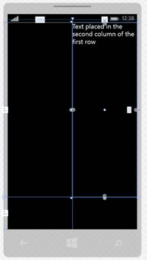
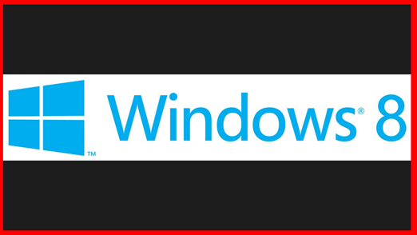
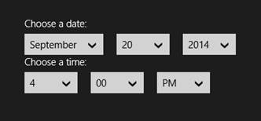
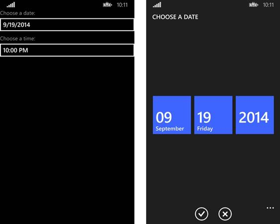
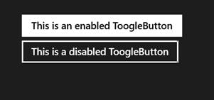
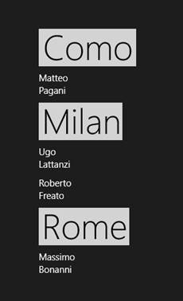
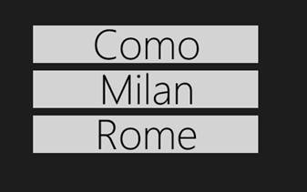
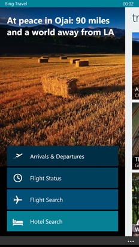
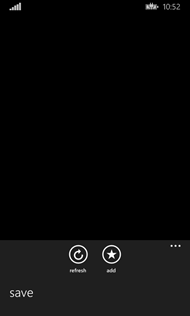
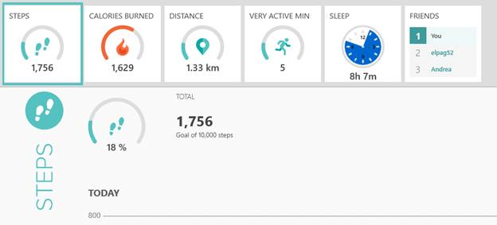

# 第 3 章创建用户界面:控件

Windows 运行时提供了一组丰富的本机控件，可用于定义页面的视觉布局。在创建通用视窗应用时，我们需要考虑的是，我们正在开发一个针对两个不同平台的应用，尽管有相似之处，但它们提供了不同的用户体验，这主要是由于不同的外形因素。

因此，在本章中，我们将详细了解三种不同的控制类别:

*   **常见**:这些控件在 Windows 和 Windows Phone 上都提供了相同的视觉布局和用户体验。
*   **优化**:这些控件在两个平台上都有相同的行为，但是它们提供了不同的视觉体验，以更好地匹配平台的视觉体验。
*   **签名**:此类别包括仅在特定平台上可用的所有控件。

本章中描述的大多数控件都属于通用类别:否则，每次都会指定适当的类别。

## 布局控件

布局控件是特殊的控件，大多数情况下在页面上不可见。它们的目的是定义页面的布局，它们通常充当其他控件的容器。

### 堆叠面板

`StackPanel`控件可用于将嵌套控件上下放置，这将自动适应所有可用空间。


图 11:堆栈面板控件

您也可以选择水平对齐嵌套控件，方法是将`Orientation`属性设置为`Horizontal`，如下例所示:

```cs
          <StackPanel Orientation="Horizontal">
              <TextBlock Text="First Text" />
              <TextBlock Text="Second Text" />
          </StackPanel>

```

### 网格

`Grid`控件用于创建表格布局，其中嵌套控件以行和列的形式组织。下面是一个示例代码:

```cs
          <Grid>
              <Grid.RowDefinitions>
                  <RowDefinition Height="50" />
                  <RowDefinition MaxHeight="100" />
              </Grid.RowDefinitions>
              <Grid.ColumnDefinitions>
                  <ColumnDefinition Width="200" />
                  <ColumnDefinition Width="*" />
              </Grid.ColumnDefinitions>

              <TextBlock Text="Text placed in the first row of the second column" Grid.Row="0" Grid.Column="1" />
          </Grid>

```

布局使用`RowDefinitions`和`ColumnDefinitions`属性定义。根据您想要创建的行数和列数，每个元素可以包含一个或多个`RowDefinition`或`ColumnDefinition`元素。对于每个表格元素，您可以指定固定的高度或宽度，或者使用相对值，如“*”以使行/列自动适应其父容器，或“自动”，使行/列适应其内容。在设计 Windows Store 应用的用户界面时，相对值非常常见，因为布局可以自动适应屏幕大小和设备的分辨率。

要定义放置控件的单元格，需要使用两个特殊的附加属性，称为`Grid.Row`和`Grid.Column`，它们可以添加到任何控件中。这些属性只包含放置控件的行号和列号，从 0 开始作为基索引(因此，如果定义了两列，它们将由索引 0 和 1 标识)。



图 12:网格控件

### 画布

`Canvas`控件将最大的灵活性留给了开发人员，因为它使用固定的位置。使用可应用于任何控件的附加属性`Canvas.Top`和`Canvas.Left`，您可以从左上角开始设置控件应该放置的确切距离(以像素为单位)。

但是，您需要小心使用该控件:由于它提供了固定的放置位置，因此它无法根据屏幕的大小和分辨率自动调整内容，这使得很难创建在小平板电脑和大显示器上都能看到的令人愉快的布局。

```cs
          <Canvas Width="640" Height="480" Background="White">
              <Rectangle Canvas.Left="30" Canvas.Top="30" Fill="Red" Width="200" Height="200" />
          </Canvas>

```

前面的示例显示了放置在从左上角开始的坐标 30，30 处的`Rectangle`控件。

### 变量报表网格

`VariableSizedWrapGrid`控件能够自动将布局拆分为多行多列:与`Grid`控件不同，您不必手动指定要创建的行数和列数，只需设置一行或一列中要放置的最大项目数及其大小。

这里有一个例子可以帮助你理解它是如何工作的:

```cs
          <VariableSizedWrapGrid MaximumRowsOrColumns="2" ItemHeight="200" ItemWidth="200">
              <Rectangle Fill="Red" />
              <Rectangle Fill="Blue" />
              <Rectangle Fill="Orange" />
              <Rectangle Fill="Green" />
              <Rectangle Fill="Brown" />
          </VariableSizedWrapGrid>

```

如您所见，我们已经设置了单个项目的大小(使用`ItemHeight`和`ItemWidth`属性)以及要创建的最大行数和列数(使用`MaximumRowsOrColumns`属性)。在`VariableSizedWrapGrid`控件中，我们放置了五个`Rectangle`控件。结果将是，由于我们已经设置了两个作为最大项目数，它们将被自动拆分为两行。


图 13:放置在 VariableSizedWrapGrid 控件中的一组矩形控件

作为默认行为，嵌套项被分成行:如图 13 所示，控件将五个矩形对齐成两行。如果要更改此行为并基于列拆分项目，可以将`Orientation`属性设置为`Horizontal`，如下例所示:

```cs
          <VariableSizedWrapGrid MaximumRowsOrColumns="2" ItemHeight="200" ItemWidth="200" Orientation="Horizontal">
              <Rectangle Fill="Red" />
              <Rectangle Fill="Blue" />
              <Rectangle Fill="Orange" />
              <Rectangle Fill="Green" />
              <Rectangle Fill="Brown" />
          </VariableSizedWrapGrid>

```

### 滚动查看器

`ScrollViewer`控件像前面的控件一样充当容器，但它并不试图安排嵌套控件的布局。这意味着它需要与其他布局控件结合使用。

当您需要显示比屏幕尺寸占用更多空间的内容时，可以使用`ScrollViewer`控件。以下示例显示了如何管理不适合屏幕的长文本。由于`ScrollViewer`控制，用户将能够向下滚动文本以继续阅读。

```cs
          <ScrollViewer>
                  <TextBlock TextWrapping="Wrap" Text="This can be a long text" />
          </ScrollViewer>

```

### 边框

`Border`控件能够将嵌套控件包装在边框内。通过使用`BorderThickness`和`BorderBrush`属性，您可以设置边框的厚度和颜色。以下示例显示了一个包裹在红色边框内的`Image`控件，厚度为 5 像素:

```cs
          <Border BorderThickness="5" BorderBrush="Red">
              <Image Source="/Assets/Image.jpg"/>
          </Border>

```

作为默认行为，`BorderThickness`值应用于边框的每一侧。但是，您也可以通过为每条边指定不同的厚度(按以下顺序:左、上、右、下)来自定义它，如下例所示。

```cs
          <Border BorderThickness="10, 15, 20, 15" BorderBrush="Red">
              <Image Source="/Assets/Image.jpg"/>
          </Border>

```



图 14:每边厚度不同的边框控件

## 输出控制

在这个类别中，我们将看到所有用于向用户显示信息的控件，如文本、图像等。

### 文字区块

`TextBlock`控件最广泛地用于显示页面中的文本。最重要的属性叫做`Text`，包含将要显示的文本。此外，得益于`FontSize`(更改尺寸)和`FontStyle`(更改字体类型)等属性，您可以自定义文本的外观。另一个经常使用的属性叫做`TextWrapping`；当它设置为`Wrap`时，它会确保文本被多行包装，以防太长。

```cs
          <TextBlock Text="This is a long text" TextWrapping="Wrap" />

```

另一个有趣的属性叫做`TextTrimming`。启用此功能后，如果文本太长，会自动修剪，并在末尾添加省略号，这样用户就可以理解文本被剪掉了。您可以应用两种修剪类型:`CharacterEllipsis`(文本在字符级剪切)或`WordEllipsis`(文本在单词级剪切)。

```cs
          <TextBlock Text="This is a trimmed text" TextTrimming="CharacterEllipsis" />

```

借助`Run`控件，您还可以将不同的样式应用于文本的不同部分，而无需将其拆分为多个`TextBlock`控件。在`TextBlock`控件内添加一个或多个`Run`控件就足够了:每个控件都包含一部分文本。如果您想手动将文本拆分成多行，也可以使用`LineBreak`控件。

```cs
          <TextBlock>
              <Run Text="First line" />
              <LineBreak />
              <Run Text="Second line in bold" FontWeight="Bold" />
          </TextBlock>

```

### 法官文本块

`RichTextBlock`控件是`TextBlock`更强大的版本，因为它为开发人员提供了更多的灵活性。您可以通过以下方式创建复杂的布局:

*   使用`Paragraph`控件将文本拆分为多个段落。
*   使用标签如`Bold`、`Italic`或`Underline`改变文本部分的样式。
*   使用`InlineUIContainer`控件添加其他 XAML 控件。

让我们看一个例子:

```cs
          <RichTextBlock>
              <Paragraph>
                  <Bold>This is a bold text</Bold>
              </Paragraph>
              <Paragraph>
                  <Italic>This is an italic text</Italic>
              </Paragraph>
              <Paragraph>
                  <Underline>This is an underlined text</Underline>
              </Paragraph>
              <Paragraph>
                  <InlineUIContainer>
                      <Image Source="/Assets/image.jpg" Width="200" />
                  </InlineUIContainer>
              </Paragraph>
          </RichTextBlock>

```

`RichTextBlock`控件包含多个`Paragraph`控件，每个控件都有一些以不同方式格式化的文本。此外，我们还使用了`InlineUIContainer`控件在文本底部显示图像。


图 RichTextBlocx 控件

### 图像

`Image`控件用于在页面中显示图像。使用`Source`属性设置图像路径，该属性支持不同类型的源:图像可以存储在远程地址、应用包或本地存储中。在第 5 章中，我们将详细了解使用 URI 地址访问各种存储的不同方式。

以下示例代码显示了显示远程图像的`Image`控件:

```cs
          <Image Source="http://www.website.com/image.png" />

```

`Image`控件还提供了对裁剪功能的内置支持，因此您可以轻松显示图像的较小部分。此功能是使用`Clip`属性实现的，该属性接受`RectangleGeometry`控件，该控件定义了裁剪区域，如下例所示:

```cs
          <Image Source="http://www.website.com/image.png">
              <Image.Clip>
                  <RectangleGeometry Rect="0, 0, 100, 100" />
              </Image.Clip>
          </Image>

```

裁剪由四个值定义:前两个值标识区域起点的 X 和 Y 坐标(0，0 表示图像的左上角)，而另外两个值表示裁剪区域的大小(在示例中，矩形的大小为 100 x 100)。

另一个重要属性是`Stretch`，用于定义图像将如何填充可用空间:

*   `Uniform`(默认值):通过保持原始比例，调整图像大小以适合控件的大小，使其看起来不失真。
*   `Fill`:图像被拉伸以使用所有可用空间，即使这意味着忽略比例并在控件具有不同大小时创建扭曲效果。
*   `UniformToFill`:是之前模式的组合。图像会自动裁剪，以创建一个新图像，该图像与原始图像保持相同的比例，同时填充所有可用空间。
*   `None`:图像使用原始尺寸显示，与控件的尺寸无关。

## 输入控件

在这个类别中，我们将看一下用于接收用户输入的主要控件。

### 文本框和密码框

`TextBox`控件是从用户获取文本输入的最简单的控件:它的工作方式类似于`TextBlock`控件，只是`Text`属性不仅用于设置要显示的文本，还用于抓取用户插入的文本。

控件提供的一个有用的属性叫做`PlaceholderText`，它定义了一个占位符文本，可以显示在框内作为对用户的提示，这样她就可以更好地理解我们期望哪种类型的输入。一旦用户开始在框中键入，占位符文本就会消失。

另一个需要记住的重要场景是，视窗商店应用通常与触摸界面一起使用。用户将使用虚拟键盘插入文本，而不是真正的键盘。作为开发人员，我们有机会定制虚拟键盘，以便针对我们要求用户输入的类型进行优化。这种定制是使用`InputScope`属性实现的，该属性可以采用许多值，例如:

*   `Url`显示为输入网址而优化的键盘。
*   `Number`显示为输入数字而优化的键盘。
*   `EmailSmtpAddress`显示优化为输入邮件地址的键盘。

我们还可以启用或禁用自动校正功能(使用`IsSpellCheckEnabled`属性)或文本预测功能，当用户在键盘上打字时(使用`IsTextPredictionEnabled`属性)，该功能会向用户建议单词。

下面是定义`TextBox`控件的示例代码:

```cs
          <TextBox IsSpellCheckEnabled="True" IsTextPredictionEnabled="True" PlaceholderText="Placeholder Text" Text="Input text" />

```

视窗运行时还提供了一个名为`PasswordBox`的自定义`TextBox`控件。它的工作原理与`TextBox`完全一样，但是默认情况下，它会用点替换插入的文本，这样用户的输入在屏幕上就看不到了。可以想象，它非常适合我们需要敏感数据的场景，比如密码或信用卡号。由于文本是自动隐藏的，`PasswordBox`控件没有提供许多方法将其自定义为`TextBox`控件。唯一重要的可用选项叫做`IsPasswordRevealButtonEnabled`；当设置为`True`时，它会在框尾增加一个按钮，按下时会临时显示文本，这样用户就可以看到自己是否插入了正确的密码。

### 日期选择器和时间选择器

`DatePicker`和`TimePicker`控件用于管理应用中的日期和时间。这些控件是优化类别的一部分:它们在两个平台上朝着相同的结果工作，但是它们有不同的视觉布局。在 Windows 中，它们显示为一系列下拉菜单，而在 Windows Phone 中，它们将触发导航到一个新的页面，带有多组框，每个框代表日期或时间的一部分。



图 16:Windows 8.1 中的日期选择器和时间选择器控件



图 17:Windows Phone 8.1 中的日期选择器和时间选择器控件

作为默认行为，`DatePicker`控件显示所有日期字段，即日、月和年。可以使用名为`YearVisible`、`MonthVisible`或`DayVisible`的属性隐藏它们。如果一个或多个字段被隐藏，控件将自动向应用返回当前值(例如，如果隐藏年份，控件将返回当前年份)。

```cs
          <DatePicker x:Name="Date" YearVisible="False" />

```

您也可以使用`MinYear`和`MaxYear`属性来定义日期范围，这对于许多场景都很有用，例如询问用户的生日。在这种情况下，显示 1900 年之前的年份或晚于当年的年份将是无用的。但是这些属性不能在 XAML 设置，只能在后面的代码中设置，因为它们的类型是`DateTimeOffset`，在 XAML 无法表达。

```cs
          protected override void OnNavigatedTo(NavigationEventArgs e)
          {
              DateTime minYear = new DateTime(1900, 1, 1);
              Date.MinYear = new DateTimeOffset(minYear);
              Date.MaxYear = new DateTimeOffset(DateTime.Now);
          }

```

如果您想在后面的代码中检索用户选择的日期，您需要使用`Date`属性，如下例所示，它使用弹出消息显示日期:

```cs
          private async void OnGetDateClicked(object sender, RoutedEventArgs e)
          {
              DateTimeOffset selectedDate = Birthday.Date;
              MessageDialog dialog = new MessageDialog(selectedDate.ToString());
              await dialog.ShowAsync();
          }

```

`TimePicker`控件的工作方式类似，但与`DatePicker`控件不同，它仅由两个元素组成:小时和分钟。您可以使用`MinuteIncrement`属性自定义时间范围，这样它将只显示指定的范围，而不是显示分钟字段的所有可能值(从 0 到 59)。

例如，让我们看看下面的实现:

```cs
          <TimePicker MinuteIncrement="15" />

```

通过使用前面的 XAML 代码，分钟下拉列表将只显示值 00、15、30 和 45，而不是从 0 到 59 的所有值。

用户在`TimePicker`控件中选择的值使用`TimeSpan`对象存储在`Time`属性中。以下示例显示了一种方法，该方法使用弹出消息向用户显示转换为小时的选定时间:

```cs
          private async void OnGetDateClicked(object sender, RoutedEventArgs e)
          {
              TimeSpan timeSpan = StartTime.Time;
              MessageDialog dialog = new MessageDialog(timeSpan.TotalHours.ToString());
              await dialog.ShowAsync();
          }

```

这两个控件还支持使用`Header`属性设置显示在控件上方的标题。

### 按钮和切换按钮

`Button`控件是与用户交互的最简单的控件:当它被按下时，它会引发`Click`事件，您可以在后面的代码中进行管理。按钮的内容由`Content`属性定义，它可以包含一个简单的文本，如下例所示:

```cs
          <Button Content="Click me" Click="OnButtonClicked" />

```

`Content`属性也可以用扩展语法表示:在这种情况下，您可以使用任何 XAML 控件来定义按钮的布局。以下示例显示了如何使用图像定义`Button`控件:

```cs
          <Button Click="OnButtonClicked">
              <Button.Content>
                  <Image Source="image.png" />
              </Button.Content>
          </Button>

```

Windows Runtime 还引入了一种新的按钮控件，叫做`ToggleButton`。它的工作和行为就像一个普通的按钮，但它也能够管理两种不同的状态:启用和禁用。因此，该控件还提供了一个名为`IsChecked`的属性，其类型为`Boolean`:当按钮被启用时，其值为`true`；否则，价值就是`false`。

下面的示例代码显示了控件的简单用法:

```cs
          <ToggleButton Content="This is a ToogleButton" IsChecked="True" />

```



图 18:ToggleButton 控件可以呈现的两种不同状态

### 单选按钮和复选框

`RadioButton`和`CheckBox`控件都用于为用户提供多种选择。它们有许多共同的特点，例如:

*   显示在控件附近的文本是使用`Content`属性设置的。
*   要检查控件是否已被选中，您需要使用`IsChecked`属性。
*   如果想在用户点击控件时拦截，可以使用`Checked`和`Unchecked`事件。

`RadioButton`和`CheckBox`控件的最大区别在于`RadioButton`可以定义为一个组的一部分。在这种情况下，用户只能启用其中一个。如果他们尝试启用另一个控件，先前启用的控件将自动停用。相反，通过`CheckBox`控件，用户可以根据自己的喜好启用任意多个选项。

`RadioButton`的分组是使用`Group`属性实现的:通过为一组`RadioButton`控件分配相同的值，用户一次只能启用其中一个控件。下面是如何使用这两种控件的示例:

```cs
          <StackPanel>
              <CheckBox Content="First option" />
              <CheckBox Content="Second option" />
              <CheckBox Content="Third option" />

              <RadioButton Content="First option" GroupName="Options" />
              <RadioButton Content="Second option" GroupName="Options" />
              <RadioButton Content="Third option" GroupName="Options" />
          </StackPanel>

```

## 显示运行状态

开发应用时，一个非常常见的要求是向用户显示正在进行的操作的状态。我们需要警告他们有事情正在发生，在操作完成之前，应用可能还没有完全准备好使用。Windows 运行时包括两个控件来实现这个目标。

### 前进

`ProgressRing`控件用于加载阻止用户与应用交互的操作。在操作完成之前，用户没有其他事情可以做，所以他只需要等待(例如，新闻阅读器正在加载最新的新闻，并且在操作完成之前，用户没有任何内容可以与之交互)。控件只是显示一个旋转环，它会通知用户操作正在进行。

使用这个控件很简单:动画由`IsActive`属性控制，类型为`Boolean`。当其值为`true`时，进度环将旋转；到了`false`的时候，反而进度环会被隐藏。通常，你会在手术开始前展示出来；然后，一旦工作完成，你就会把它藏起来。以下是该控件的 XAML 声明示例:

```cs
          <ProgressRing x:Name="Progress" />

```

相反，下面是您如何使用`ProgressRing`控件理想地管理代码加载操作(例如，从互联网下载一些数据):

```cs
          protected override void OnNavigatedTo(NavigationEventArgs e)
          {
              Progress.IsActive = true;
              //start loading the data
              Progress.IsActive = false;
          }

```

### ProgressBar

与`ProgressRing`控件不同的是，`ProgressBar`控件可用于操作发生在后台的场景中，即使操作正在进行中，用户也能够保持与应用的交互。`ProgressBar`控件呈现有一个使用`Value`属性填充的条:您可以指定一个从 0(空条)到 100(满条)的数值。此功能使控件对于您可以准确确定其状态的操作也很有用，例如从互联网下载文件。

例如，在下载操作期间，您可以确定总大小文件中已经下载了多少字节，并计算要在`Value`属性中设置的百分比。这样，用户可以持续更新下载状态。

`ProgressBar`控件也可以用来通知用户正在进行操作，而不显示确切的状态:通过将`IsIndeterminate`属性设置为`true`，实际上，条将被一系列的点代替，这些点将从屏幕的左侧持续移动到右侧。

```cs
          <ProgressRing x:Name="Progress" IsIndeterminate="True" />

```

## 显示数据集合

移动应用中最常见的需求之一是显示数据集合:我们已经在第 2 章中看到了如何使用绑定和数据模板轻松实现这个场景。在本节中，我们将看到 Windows 运行时中最重要的控件来显示集合。

### GridView 和 ListView

`GridView`和`ListView`是在 Windows Store 应用中最常用于显示数据集合的两个控件，因为它们能够提供符合平台指南的外观和感觉。两个控件都提供相同的功能和属性；主要区别在于`GridView`控件可以使用网格结构水平滚动，而`ListView`控件使用传统的列表呈现，用户可以从上到下滚动。

#### 显示平面集合

使用这些控件的最简单方法是显示平面数据集合。在这种情况下，它们的行为就像显示列表的其他标准控件一样，这意味着:

*   您需要为`ItemTemplate`属性定义一个`DataTemplate`，该属性定义用于呈现集合中每个元素的布局。
*   您需要将想要显示的数据集合分配给`ItemsSource`属性。

您需要使用稍后将详细介绍的方法之一来管理用户选择的项目。以下 XAML 代码显示了使用`ListView`控件显示的平面集合的示例定义:

```cs
          <ListView x:Name="List" SelectionChanged="List_OnSelectionChanged">
              <ListView.ItemTemplate>
                  <DataTemplate>
                      <StackPanel>
                          <TextBlock Text="{Binding Path=Name}" />
                          <TextBlock Text="{Binding Path=Surname}" />
                      </StackPanel>
                  </DataTemplate>
              </ListView.ItemTemplate>
          </ListView>

```

该列表的`ItemTemplate`被配置为显示具有两个属性的对象集合，称为`Name`和`Surname`。以下是此对象的示例定义:

```cs
          public class Person
          {
              public string Name { get; set; }
              public string Surname { get; set; }
          }

```

下面是在后面的代码中，我们如何创建一个`Person`对象的样本集合，并将其分配给`ListView`控件:

```cs
          protected override void OnNavigatedTo(NavigationEventArgs e)
          {
              List<Person> people = new List<Person>
              {
                  new Person
                  {
                      Name = "Matteo",
                      Surname = "Pagani"
                  },
                  new Person
                  {
                      Name = "Angela",
                      Surname = "Olivieri"
                  }
              };

              List.ItemsSource = people;
          }

```

#### 显示分组集合

`ListView`和`GridView`控件提供的最有趣的特性是分组集合支持:您将能够显示按不同类别分组的数据集合。用户不仅可以滚动列表，还可以快速从一个类别跳到另一个类别。

Windows 和 Windows Phone 都提供了许多这种方法的例子。例如，如果您打开“人员”应用，您会注意到联系人根据姓名的首字母分组在不同的类别中。轻按一封信，就会打开一个显示所有可用信件的新视图，这样用户就可以快速地从一组联系人跳到另一组联系人。

让我们看一个真实的例子，通过稍微改变我们之前定义的`Person`类:

```cs
          public class Person
          {
              public string Name { get; set; }
              public string Surname { get; set; }
              public string City { get; set; }
          }

```

我们添加了一个名为`City`的新属性；我们将使用它来按照人们居住的城市对我们收集的人进行分组。

为了实现我们的目标，我们需要引入一个由 Windows Runtime 提供的新类，称为`CollectionViewSource`，它充当数据收集和显示数据的控件(在我们的例子中是`GridView`或`ListView`控件)之间的代理。我们将把控件的`ItemsSource`属性连接到这个代理类，而不是直接连接到我们的集合，这个代理类提供了许多高级功能，比如自动分组支持。

`CollectionViewSource`在 XAML 可以定义为常规资源。以下示例显示了定义为页面资源的`CollectionViewSource`对象:

```cs
          <Page.Resources>
              <CollectionViewSource x:Name="People" IsSourceGrouped="True" />
          </Page.Resources>

```

如您所见，由于`IsSourceGrouped`属性，我们能够轻松地指定存储在该集合中的数据将被分组。下一步是将我们的数据连接到这个代理类。该过程类似于我们看到的平面列表，只是这次我们需要指定组标准。多亏了 LINQ 和`GroupBy()`分机，我们可以轻松做到。这里有一个例子:

```cs
          protected override void OnNavigatedTo(NavigationEventArgs e)
          {
              List<Person> people = new List<Person>
              {
                  new Person
                  {
                      Name = "Matteo",
                      Surname = "Pagani",
                      City = "Como"
                  },
                  new Person
                  {
                      Name = "Ugo",
                      Surname = "Lattanzi",
                      City = "Milan"
                  },
                  new Person
                  {
                      Name = "Roberto",
                      Surname = "Freato",
                      City = "Milan"
                  },
                  new Person
                  {
                      Name = "Massimo",
                      Surname = "Bonanni",
                      City = "Rome"
                  }
              };
              var groups = people.GroupBy(x => x.City);
              People.Source = groups;
          }

```

我们通过对原始集合应用`GroupBy()`扩展方法，按照名为`City`的属性对集合进行了分组。然后，我们将得到的分组集合分配给我们之前在页面中定义为资源的`CollectionViewSource`对象的`Source`属性。

我们已经完成了代码的工作，但是我们的目标还没有实现，因为我们需要定义集合的视觉布局。默认情况下，实际上`GridView`或`ListView`控件不知道如何可视化显示组:`ItemTemplate`属性只是定义了单个项目的外观，而不是整个组的呈现方式。因此，我们需要对控件的 XAML 定义进行一些更改。

以下示例显示了一个`GridView`控件，该控件被配置为显示我们的分组集合:

```cs
          <GridView ItemsSource="{Binding Source={StaticResource People}}">
              <GridView.ItemTemplate>
                  <DataTemplate>
                      <StackPanel>
                          <TextBlock Text="{Binding Path=Name}" />
                          <TextBlock Text="{Binding Path=Surname}" />
                      </StackPanel>
                  </DataTemplate>
              </GridView.ItemTemplate>
              <GridView.GroupStyle>
                  <GroupStyle HidesIfEmpty="True">
                      <GroupStyle.HeaderTemplate>
                          <DataTemplate>
                              <Border Background="LightGray">
                                  <TextBlock Text="{Binding Key}" Foreground="Black" Margin="10" Style="{StaticResource HeaderTextBlockStyle}"/>
                              </Border>
                          </DataTemplate>
                      </GroupStyle.HeaderTemplate>
                  </GroupStyle>
              </GridView.GroupStyle>
          </GridView>

```

您会注意到的第一件事是我们正在以不同的方式设置`ItemsSource`属性:由于`CollectionViewSource`对象已经被定义为资源，我们使用`StaticResource`标记扩展来分配它。

然后我们需要设置列表的不同视觉样式:

*   第一个不应该是一个惊喜:就像我们管理平面列表一样，我们定义了`ItemTemplate`，这是用于渲染集合中每一个项目的模板。我们使用的是之前看到的同一个，它显示了这个人的名字和姓氏。
*   第二个是`GroupStyle`元素，它定义了组的行为。通过将`HidesIfEmpty`属性设置为`True`，我们确保如果组中没有元素，则不会显示该组。
*   `GroupStyle`控件提供了一个名为`HeaderTemplate`的重要属性:它是用于呈现组标题的模板，显示在每个组的开头。这个目标通过增加一个连接到`Key`场的`TextBlock`控制器来实现。当我们使用`GroupBy()`方法对集合进行分组时，我们基本上已经为每个组(用户的城市)创建了另一个具有一个元素的集合。每个元素包含属于该组(居住在该城市的人)的项目列表，并有一个带有该组名称的关键字(T5)属性。有了这个`DataTemplate`，我们将简单地显示一个带有城市名称的文本，跟随着住在那里的人的名单。

下图显示了前面的代码是如何在实际应用中呈现的。


图 19:一个 GridView 控件显示一个分组的集合

如前所述，`ListView`控件的工作方式完全相同:只需通过替换对`GridView`控件的所有引用来更改之前的代码，我们就能够将网格变成传统的垂直列表，如下图所示:



图 20:使用列表视图控件显示的同一个集合

#### 管理项目选择

处理数据集合时，最常见的需求是管理选择:用户点击其中一个项目，我们希望检测哪个项目已被选中，以便我们可以执行其他操作(如将用户重定向到详细信息页面)。管理选择有四种方式；您可以通过设置`SelectionMode`属性来选择您最喜欢的一个:

*   `Single`(默认):用户只能选择一个项目，高亮显示，直到选择另一个项目。
*   `Multiple`:该模式允许用户选择多个项目。每次她点击一个项目，它就会自动添加到所选项目的列表中。
*   `Extended`:是前面两种模式的组合。轻按一下会触发标准选择，而用鼠标右键单击或向屏幕底部轻扫项目会将其添加到选定项目列表中。
*   `None`:该模式禁用选择。没有可选择的项目，不触发`SelectionChanged`事件。

除了`None`以外，每隔一个模式，当用户点击一个项目时，总是会触发`SelectionChanged`事件。唯一的区别是，在单次选择的情况下，我们可以只使用控件的`SelectedItem`属性，该属性包含所选项。否则，在多重选择的情况下，我们可以使用`SelectedItems`属性，这是一个包含所有标记项目的集合。

以下示例显示了当触发`SelectionChanged`事件时如何使用`SelectedItem`属性以弹出窗口显示所选人员的姓名:

```cs
          private async void List_OnSelectionChanged(object sender, SelectionChangedEventArgs e)
          {
              Person selectedPerson = List.SelectedItem as Person;
              if (selectedPerson != null)
              {
                  MessageDialog dialog = new MessageDialog(selectedPerson.Name);
                  await dialog.ShowAsync();
              }
          }

```

需要强调的是，由于`GridView`或`ListView`控件可以显示任何数据集合，`SelectedItem`属性是通用的`object`。在访问它的属性之前，我们需要将其转换为我们期望的类型(在我们的例子中，它是一个`Person`对象的集合)。

相反，下面的示例显示了一个类似的场景，但是启用了多个选择。在这种情况下，我们向用户显示他在列表中选择的项目数。

```cs
          private async void List_OnSelectionChanged(object sender, SelectionChangedEventArgs e)
          {
              int selectedItems = List.SelectedItems.Count;
              MessageDialog dialog = new MessageDialog(selectedItems.ToString());
              await dialog.ShowAsync();
          }

```

`GridView`和`ListView`控件还提供了一种管理选择的替代方法，当我们不对所选项目执行任何特定操作时，这确实很有用，但是我们只想，例如，当项目被单击时，将用户重定向到另一个页面。在这种模式下，项目被视为按钮:当你点击其中一个按钮时，一个名为`ItemClick`的事件将被触发，它将包含已被选择的项目作为参数。

要启用此模式，您必须将`IsItemClickEnabled`属性设置为`True`，然后订阅`ItemClick`活动。通常，当您启用此模式时，将`SelectionMode`设置为`None`也很有用，以避免两种选择模式重叠并同时触发`ItemClick`和`SelectionChanged`事件。

在后面的代码中管理`ItemClick`事件真的很容易，您可以在下面的示例中看到:

```cs
          private async void List_OnItemClick(object sender, ItemClickEventArgs e)
          {
              Person person = e.ClickedItem as Person;
              if (person != null)
              {
                  MessageDialog dialog = new MessageDialog(person.Name);
                  await dialog.ShowAsync();
              }
          }

```

事件处理程序的参数(类型为`ItemClickEventArgs`)包含一个名为`ClickedItem`的属性，引用了所选项。像往常一样，由于控件可以显示任何类型的数据，`ClickedItem`属性包含一个通用对象，因此我们需要在使用它之前执行强制转换。

### 语义缩放

语义缩放是 Windows 和 Windows Phone 提供的原生体验的一部分，它为用户提供了一种以两种不同方式浏览数据集合的方法:传统视图，包含所有细节(就像我们刚刚看到的讨论`GridView`和`ListView`控件的视图)，以及概述视图，快速浏览所有可用的组，允许用户快速从一个组跳到另一个组。

语义缩放在两个平台上的实现方式相同，但激活方式不同:在 Windows 8.1 上，它通常是通过在触摸屏上用两个手指缩小或点击右下角显示的“ **-** ”符号来触发的，而在 Windows Phone 8.1 上，它通常是通过点击列表中某个群组的标题来激活的。

为了实现语义缩放，Windows 运行时提供了一个名为`SemanticZoom`的控件，很容易理解:

```cs
          <SemanticZoom>
              <SemanticZoom.ZoomedInView>
                  <!-- standard visualization -->
              </SemanticZoom.ZoomedInView>
              <SemanticZoom.ZoomedOutView>
                  <!-- groups visualization -->
              </SemanticZoom.ZoomedOutView>
          </SemanticZoom>

```

`SemanticZoom`控件能够管理两种不同的状态，由两个特定的属性表示:`ZoomedInView`定义显示传统列表的布局，以及所有的细节。`ZoomedOutView`则定义了显示所有组的布局。在这些属性中，您不能定义任何任意的 XAML:只有支持`ISemanticZoomInformation`界面的控件才能正常使用该功能。Windows Runtime 提供了三个支持该界面的本机控件:`GridView`、`ListView`和`Hub`。

当谈到管理`ZoomedInView`时，与我们所了解的`GridView`或`ListView`控制相比，没有什么区别。在这个视图中，我们需要管理传统的列表，因此我们将创建一个数据集合，将其定义为`CollectionViewSource`对象，并将其连接到控件的`ItemsSource`属性。`ZoomedInView`属性将包含一个类似于以下代码的 XAML 代码块:

```cs
          <Page.Resources>
              <CollectionViewSource x:Name="People" IsSourceGrouped="True" />
          </Page.Resources>

          <SemanticZoom>
              <SemanticZoom.ZoomedInView>
                  <GridView ItemsSource="{Binding Source={StaticResource People}}">
                      ...
                  </GridView>
              </SemanticZoom.ZoomedInView>
          </SemanticZoom>

```

如您所见，`GridView`控件简单地连接到`CollectionViewSource`对象，该对象已被定义为页面资源。

然而`ZoomedOutView`需要以不同的方式管理:当它被启用时，事实上，我们不需要显示集合中的所有项目，而只需要显示数据被分成的组。为了实现我们的目标，`CollectionViewSource`提供了一个名为`CollectionGroups`的属性，它包含了数据被拆分成的所有组。你还记得我们之前看到的样本，上面有一份按城市分组的人员名单吗？在我们的例子中，`CollectionGroups`属性将只包含城市列表。

以下是`ZoomedOutView`属性的示例定义:

```cs
          <SemanticZoom>
              <SemanticZoom.ZoomedOutView>
                  <GridView ItemsSource="{Binding Source={StaticResource People}, Path=CollectionGroups}">
                      ...
                  </GridView>
              </SemanticZoom.ZoomedOutView>
          </SemanticZoom>

```

我们再次使用`GridView`控件来显示组列表，但是我们没有将`ItemsSource`属性直接与`CollectionViewSource`对象绑定，而是将其绑定到特定的`CollectionGroups`属性。

最后一步是定义`ZoomedOutView`模式的视觉布局。我们使用的是标准的`GridView`控件，所以我们只需要用适当的`DataTemplate`定义`ItemTemplate`属性，如下例所示:

```cs
          <SemanticZoom>
              <SemanticZoom.ZoomedOutView>
                  <GridView ItemsSource="{Binding Source={StaticResource People},Path=CollectionGroups}">
                      <GridView.ItemTemplate>
                          <DataTemplate>
                              <Border Background="LightGray" Width="300" Padding="5">
                                  <TextBlock Text="{Binding Group.Key}" Foreground="Black" TextAlignment="Center" Style="{StaticResource HeaderTextBlockStyle}" />
                              </Border>
                          </DataTemplate>
                      </GridView.ItemTemplate>
                  </GridView>
              </SemanticZoom.ZoomedOutView>
              <SemanticZoom.ZoomedInView>
                  <GridView ItemsSource="{Binding Source={StaticResource People}}">
                      ...
                  </GridView>
              </SemanticZoom.ZoomedInView>
          </SemanticZoom>

```

这是一个标准`DataTemplate`；唯一需要强调的是`TextBlock`控件连接到一个名为`Group.Key`的属性，它包含我们要显示的组的名称(在我们的例子中是城市)。

下图显示了当您从标准列表中缩小时，在 Windows 8.1 应用中发生的情况:



图 21:使用语义缩放控件显示的组列表

### 动画视图

`FlipView`控件提供了另一种显示项目集合的方式，当您想要将用户的注意力集中在所选项目上时，例如在照片库中，这种方式非常有用。事实上，当你使用`FlipView`控件时，只有选中的项目是可见的，它占据了所有可用的空间。用户需要向左或向右滑动(或使用只有窗口在两侧显示的按钮)来显示集合中的其他项目。

除了这个差异之外，`FlipView`控件的行为类似于`GridView`或`ListView`控件:

*   您需要设置`ItemTemplate`属性来定义所选项目的布局。
*   您需要将项目集合分配给`ItemsSource`属性。
*   您可以订阅`SelectionChanged`事件，以便在每次用户向左或向右滑动以显示另一个项目时得到通知。
*   如果需要发现当前显示的是哪个项目，可以使用`SelectedItem`属性。

以下 XAML 代码显示了用于显示图像库的`FlipView`控件的示例定义:

```cs
          <FlipView x:Name="Images">
              <FlipView.ItemTemplate>
                  <DataTemplate>
                      <Grid>
                          <Image Source="{Binding Image}" Stretch="UniformToFill"/>
                          <Border Background="#A5000000" Height="80" VerticalAlignment="Bottom">
                              <TextBlock Text="{Binding Title}" FontFamily="Segoe UI" FontSize="26" Foreground="#CCFFFFFF" Padding="15,20"/>
                          </Border>
                      </Grid>
                  </DataTemplate>
              </FlipView.ItemTemplate>
          </FlipView>

```

## 轮毂

`Hub`控件是 Windows 运行时中最重要的控件之一，因为它经常被用来定义应用的主页。`Hub`控件由不同的部分组成，一个挨着一个放置:用户可以向左或向右滑动屏幕来查看上一个或下一个部分。为了帮助用户理解小节的概念，一个小节不会占据页面的全部空间；右边的空白处用来显示下一部分的一瞥，这样用户就可以理解还有更多内容要看和发现。

通常情况下，`Hub`控件不是用来包含大量数据的，而是用来提供数据的子集，并提供对应用不同部分的快速访问。例如，在新闻阅读器应用中，您不会使用`Hub`控件来显示所有可用的新闻；该职责可以分配给应用的特定页面。然而，`Hub`控件的一部分可以只显示最近的新闻，然后提供一个链接来查看所有的新闻。



图 22:在 Windows Phone 的 Windows 商店应用中使用的集线器控件

以下是`Hub`控件的定义示例:

```cs
          <Hub Header="Page title">
              <HubSection Header="First section">
                  <DataTemplate>
                      <Image Source="/Assets/image.png" />
                  </DataTemplate>
              </HubSection>
              <HubSection Header="Second section">
                  <DataTemplate>
                      <StackPanel>
                          <TextBlock Text="Some content" />
                      </StackPanel>
                  </DataTemplate>
              </HubSection>
          </Hub>

```

`Hub`控件可以包含一个标题，显示在顶部；它是使用`Header`属性设置的，该属性接受一个简单的字符串。您也可以通过使用`HeaderTemplate`属性定义新模板来完全自定义标题。

正如我们之前提到的，`Hub`控件被分成不同的部分；它们中的每一个都由`HubSection`控制器识别。每个部分都有一些独特的功能:

*   `HubSection`控件提供了一个名为`Header`的属性，该属性包含该部分的标题，并显示在每个部分的顶部。
*   使用`DataTemplate`定义该部分的内容。需要强调的是，尽管有这种行为，`Hub`控件不能显示数据集合；事实上，你可以看到`ItemsSource`的财产不见了。

与定义简单页面的布局相比，选择使用`DataTemplate`来定义部分的外观和感觉有一些挑战。事实上，由于它是一个`DataTemplate`，我们不能简单地使用`x:Name`属性给控件分配一个名称，然后在后面的代码中访问它。这些控件不是页面的一部分，而是包含在连接到`HubSection`的`DataTemplate`中。

让我们看一个真实的例子来更好地理解这个问题。采用以下 XAML 代码:

```cs
          <Hub>
              <HubSection Header="First section">
                  <DataTemplate>
                      <TextBlock x:Name="Name" />
                  </DataTemplate>
              </HubSection>
          </Hub>

```

通常，如果您想从代码中更新`TextBlock`的内容，您应该编写一个类似于下面的事件处理程序:

```cs
          private void OnButtonClicked(object sender, RoutedEventArgs e)
          {
              Name.Text = "Matteo";
          }

```

但是这段代码不会编译，因为关键字`Name`标识的`TextBlock`控件是在一个`DataTemplate`里面定义的，不能直接访问。解决方案是使用绑定，正如我们在第 2 章中了解到的。

之前的`Hub`控制定义需要按照以下方式进行更改:

```cs
          <Hub x:Name="MainHub">
              <HubSection Header="First section">
                  <DataTemplate>
                      <TextBlock Text="{Binding Name}" />
                  </DataTemplate>
              </HubSection>
          </Hub>

```

我们还需要更改后面代码中的代码，以正确设置控件的`DataContext`，这样它就可以找到一个名为`Name`的属性来解析绑定表达式:

```cs
          public MainPageView()
          {
              this.InitializeComponent();
              Person person = new Person();
              person.Name = "Matteo";
              MainHub.DataContext = person;
          }

```

`Hub`控件支持的另一个特性是交互式标题:当我们启用它时，用户可以点击`HubSection`的标题，这样我们就可以执行额外的操作或导航。例如，一个部分可以只显示几个新闻项目，但是通过点击标题，用户可以被重定向到应用的另一个页面，在那里她可以阅读所有可用的新闻。

要启用此功能，您需要在每个想要以这种方式管理的`HubSection`控件上将`IsHeaderInteractive`属性设置为`true`；然后，您需要订阅由`Hub`控制中心直接提供的`SectionHeaderClick`。

以下示例显示了一个`Hub`控件，其中第一部分已被配置为支持交互式标题:

```cs
          <Hub SectionHeaderClick="Hub_OnSectionHeaderClick">
              <HubSection Header="First section" IsHeaderInteractive="True">
                  <DataTemplate>
                      <Image Source="/Assets/image.jpg" />
                  </DataTemplate>
              </HubSection>
              <HubSection Header="Second section">
                  <DataTemplate>
                      <StackPanel>
                          <TextBlock Text="Some content" />
                      </StackPanel>
                  </DataTemplate>
              </HubSection>
          </Hub>

```

下面的代码展示了如何管理`SectionHeaderClick`事件，这样我们就可以在每次用户点击标题时得到通知:

```cs
          private async void Hub_OnSectionHeaderClick(object sender, HubSectionHeaderClickEventArgs e)
          {
              MessageDialog dialog = new MessageDialog(e.Section.Header.ToString());
              await dialog.ShowAsync();
          }

```

事件处理程序提供一个参数(类型为`HubSectionHeaderClickEventArgs`)，该参数包含一个名为`Header`的属性，该属性是触发事件的`HubSection`控件。您可以使用它来了解哪个部分被点击，并执行适当的导航。在前面的示例中，我们只是用弹出消息显示所选部分的标题。

## 枢轴(仅限 Windows Phone)

`Pivot`控件是一个签名控件，因为它只在 Windows Phone 上可用。用户体验类似于其他平台中选项卡控件提供的体验；`Pivot`被分成不同的部分，用户可以通过向左或向右滑动屏幕来查看。然而，在这种情况下，每个部分都将适合页面的整个大小。为了帮助用户理解还有其他部分，顶部栏将显示其他部分的名称，当前部分用不同的颜色突出显示。

`Pivot`控制通常用于两种情况:

*   您需要向用户显示相同的信息，但涉及不同的上下文。Mail 应用就是一个很好的例子:所有 pivot 的部分显示相同的信息(电子邮件)，但是被不同的参数过滤(如未读、更高优先级等)。).
*   您需要向用户显示不同的信息，但与相同的上下文相关。People 应用就是一个很好的例子:当你点击一个联系人时，你可以看到所有的细节，比如电话号码、社交网络上发布的照片、最新的互动等等。所有这些信息都存储在页面的不同部分。


图 23:在 Windows Phone 的人员应用中使用的透视控件

以下示例显示了如何在 XAML 页面中使用`Pivot`控件:

```cs
          <Pivot Title="Page title">
              <PivotItem Header="First header">
                  <StackPanel>
                      <TextBlock Text="Some content" />
                  </StackPanel>
              </PivotItem>
              <PivotItem Header="Second section">
                  <StackPanel>
                      <TextBlock Text="Some other content" />
                  </StackPanel>
              </PivotItem>
          </Pivot>

```

`Pivot`控件有一个名为`Title`的属性，它定义了页面的标题。相反，每个部分都由一个`PivotItem`控件标识，该控件嵌套在主`Pivot`控件中。每个可以有自己的标题，这是显示在顶部栏的标题；要设置的属性称为`Header`。

除了这些特性之外，`PivotItem`控件充当了一个简单的容器:您可以在其中放置任何其他您想要的 XAML 控件，当当前节处于活动状态时，这些控件将呈现在页面中。

`Pivot`控件也可用于创建引导程序(如配置向导)。它提供了一个名为`IsLocked`的属性，当它被设置为`true`时，阻止用户移动到另一个部分。例如，通过这种方式，只有当用户填写了当前部分的所有必填字段时，您才能解锁下一部分。

## 管理应用栏:命令栏和应用栏

应用栏概念被 Windows 和 Windows Phone 应用广泛使用。它是一个栏，通常隐藏在 Windows 8.1 中，提供一些特定的功能来与当前上下文交互，或者在应用中导航。

应用栏可以放置在两个不同的位置，由`Page`类提供的两个属性来标识:

*   `BottomAppBar`用于定义放置在屏幕底部的应用栏。它通常包含一些用于与当前页面内容交互的命令。
*   `TopAppBar`用于定义放置在屏幕顶部的应用栏。它为用户提供了对应用不同部分的快速访问。这样，用户可以移动到另一个部分，而无需返回主页。此属性仅在 Windows 中可用。

窗口运行时包括两个不同的控件来管理应用栏。让我们详细看看它们是如何工作的。

### 可订购

当您想要管理放置在页面底部的应用栏以向用户提供一些上下文功能时，`CommandBar`控件是理想的选择。这是一种简单的方法来定义一个带有一组按钮的栏，用户可以按下这些按钮来触发一些功能。

包含在一个`CommandBar`中的控件可以被分成两个不同的部分，用两个不同的属性进行管理:`PrimaryCommands`和`SecondaryCommands`。`CommandBar`控件属于优化家族；它在两个平台上的工作方式相同，但外观和感觉不同。让我们看看主要的区别:

*   在窗口中，两个不同的部分定义了屏幕上放置控件的一侧。主命令位于屏幕右侧，而辅助命令位于左侧。
*   在 Windows Phone 中，应用栏最多可以包含四个按钮，它们是主要命令。它们总是可见的，并且用文本和图标呈现。辅助命令最初是隐藏的；只有当用户通过从屏幕底部滑动或点击应用栏右侧的省略号来扩展应用栏时，它们才会显示。辅助命令只是文本命令；它们没有像主命令那样的图标。

尽管存在这些差异，但是`CommandBar`控件在两个平台上都是用相同的 XAML 代码定义的:

```cs
          <Page
              x:Class="SampleApp.MainPage"

              xmlns:x="http://schemas.microsoft.com/winfx/2006/xaml"
              xmlns:d="http://schemas.microsoft.com/expression/blend/2008"
              xmlns:mc="http://schemas.openxmlformats.org/markup-compatibility/2006"
              mc:Ignorable="d"
              Background="{ThemeResource ApplicationPageBackgroundThemeBrush}">

              <Page.BottomAppBar>
                  <CommandBar>
                      <CommandBar.PrimaryCommands>
                          <!-- primary commands -->
                      </CommandBar.PrimaryCommands>
                      <CommandBar.SecondaryCommands>
                          <!-- secondary commands -->
                      </CommandBar.SecondaryCommands>
                  </CommandBar>
              </Page.BottomAppBar>

              <Grid>
                  <!-- page content -->
              </Grid>
          </Page>

```

在`CommandBar`中，您可以定义三种不同类型的命令(即使两个平台只支持其中一种)

*   一个按钮，由`AppBarButton`类标识。
*   由`AppBarToggleButton`类标识的切换按钮(能够保持开/关状态)。此控件仅在 Windows 上受支持。
*   分隔符，用于将命令分组到不同的部分。由`AppBarSeparator`类标识，仅在 Windows 中可用。

按钮的视觉布局由两个重要属性定义:`Label`和`Icon`。标签是显示在按钮下方的文本。`Icon`是显示在按钮内部的图像，它的工作方式与标准的`Image`控件不同。默认情况下，事实上，您不能简单地指定图像路径，而是属于 Segoe UI 字体系列的符号之一。您可以在 MSDN 文档中找到所有可用符号的列表:[http://s.qmatteoq.com/AppBarSymbols](http://s.qmatteoq.com/AppBarSymbols)。

以下示例显示了带有`Save`图标的`AppBarButton`控件:

```cs
          <Page.BottomAppBar>
              <CommandBar>
                  <CommandBar.PrimaryCommands>
                      <AppBarButton Label="Save" Icon="Save" />
                  </CommandBar.PrimaryCommands>
              </CommandBar>
          </Page.BottomAppBar>

```

如果找不到合适的图标，仍然可以使用自己的图像作为图标，方法是使用扩展语法定义`Icon`属性，如下例所示:

```cs
          <Page.BottomAppBar>
              <CommandBar>
                  <CommandBar.PrimaryCommands>
                      <AppBarButton Label="Save">
                          <AppBarButton.Icon>
                              <BitmapIcon UriSource="/Assets/image.png" />
                          </AppBarButton.Icon>
                      </AppBarButton>
                  </CommandBar.PrimaryCommands>
              </CommandBar>
          </Page.BottomAppBar>

```

在 Windows Phone 应用中，如果控件被定义为辅助命令，则`Icon`属性将被忽略；只会显示在`Label`属性中设置的文本。

当涉及到管理用户与应用栏命令的交互时，与常规的`Button`控件相比没有区别。事实上，它们公开了一个`Click`事件，当按钮被点击时，您可以在后面的代码中订阅来执行一些操作。以下代码显示了一个完整的`CommandBar`示例:

```cs
          <Page.BottomAppBar>
              <CommandBar>
                  <CommandBar.PrimaryCommands>
                      <AppBarButton Label="refresh" Click="OnButton1Clicked" Icon="Refresh" />
                      <AppBarSeparator />
                      <AppBarToggleButton Label="add" Click="OnButton2Clicked" Icon="Favorite" />
                  </CommandBar.PrimaryCommands>
                  <CommandBar.SecondaryCommands>
                      <AppBarButton Label="save" Click="OnButton3Clicked" Icon="Save" />
                  </CommandBar.SecondaryCommands>
              </CommandBar>
          </Page.BottomAppBar>

```

以下图像显示了此代码在 Windows 和 Windows Phone 上的不同呈现方式。


图 24:在窗口上呈现的命令栏



图 25:在 Windows Phone 上呈现的命令栏

### 应用栏(仅限窗口)

`AppBar`控件仅在 Windows 上可用，它为开发人员提供了最大的灵活性。与`CommandBar`不同，在这里您只能添加一些特定的控件，它可以包含任何其他 XAML 控件，以便您可以定义自己的布局。因此，当您想要创建一个位于屏幕顶部的导航栏时，通常会用到它。

以下示例显示了定义`AppBar`控件的 XAML:

```cs
          <Page.TopAppBar>
              <AppBar>
                  <StackPanel Orientation="Horizontal">
                      <Border Width="150" Height="150" Background="DarkGray" Margin="20, 0, 20, 0">
                          <Button Content="Section 1" HorizontalAlignment="Center" VerticalAlignment="Center" Style="{StaticResource TextBlockButtonStyle}" Click="OnSection1Clicked" />
                      </Border>
                      <Border Width="150" Height="150" Background="DarkGray" Margin="20, 0, 20, 0">
                          <Button Content="Section 2" HorizontalAlignment="Center" VerticalAlignment="Center" Style="{StaticResource TextBlockButtonStyle}" Click="OnSection2Clicked" />
                      </Border>
                      <Border Width="150" Height="150" Background="DarkGray" Margin="20, 0, 20, 0">
                          <Button Content="Section 3" HorizontalAlignment="Center" VerticalAlignment="Center" Style="{StaticResource TextBlockButtonStyle}" Click="OnSection3Clicked" />
                      </Border>
                  </StackPanel>
              </AppBar>
          </Page.TopAppBar>

```

如你所见，没有什么特别值得强调的；在`AppBar`控制内，你可以放置任何你想要的 XAML 控制。在前面的示例中，应用栏包含三个按钮(位于方形边框内)，用于导航到应用的三个不同部分。



图 26:位于应用顶部的应用栏，用于提供快速导航控件

## 状态栏(仅限 Windows Phone)

`StatusBar`是另一个仅在 Windows Phone 中可用的签名控件。这不是真正的控制；它是放置在顶部的系统托盘，操作系统在这里显示一些重要信息，比如时间、信号强度等。Windows 运行时允许开发人员与此栏交互以执行其他操作。

您不能像在 Windows Phone 8 和 Silverlight 中那样，直接从 XAML 与状态栏交互。我们需要在后面的代码中通过使用`StatusBar`类(部分`Windows.UI.ViewManagement`命名空间)来管理它，该类提供了一个名为`GetForCurrentView()`的方法，该方法返回对 bar 的引用。

以下是引用当前栏后可以执行的一些主要操作:

### 隐藏和显示状态栏

作为开发人员，您可以隐藏状态栏，这样应用就可以使用屏幕上的所有可用空间。如果您的应用使用自定义主题，该功能也很有用，因为默认情况下，它会保持手机的相同主题颜色(黑色或白色)，所以与顶部栏混合在一起看起来会很糟糕。

但是，您在使用该功能时必须谨慎:隐藏状态栏意味着一些重要信息将被隐藏，除非用户决定从屏幕顶部下拉操作中心。例如，如果您的应用大量使用数据连接，隐藏状态栏不是一个好主意。如果有任何问题，如果是由网络问题(例如，没有蜂窝信号)引起的，用户将无法立即注意到。

要隐藏状态栏，可以调用`HideAsync()`方法，如下例所示:

```cs
          private async void OnChangeSystemTrayClicked(object sender, RoutedEventArgs e)
          {
              StatusBar statusBar = StatusBar.GetForCurrentView();
              await statusBar.HideAsync();
          }

```

如果想再次显示，只需调用`ShowAsync()`方法:

```cs
          private async void OnChangeSystemTrayClicked(object sender, RoutedEventArgs e)
          {
              StatusBar statusBar = StatusBar.GetForCurrentView();
              await statusBar.ShowAsync();
          }

```

### 改变外观和感觉

如果你不想隐藏状态栏，但你仍然不想让你的应用看起来很糟糕，因为状态栏的颜色与你的主题不太协调，`StatusBar`控件提供了更多的选择。

一种方法是改变条的不透明度。您将能够使其透明，以便各种指标(时间、信号强度等。)仍然可见，但会显示在应用的主题上，不会干扰它。为了实现这个目标，您需要使用您喜欢的不透明度值来设置`BackgroundOpacity`属性，如下例所示:

```cs
          private void OnChangeSystemTrayClicked(object sender, RoutedEventArgs e)
          {
              StatusBar statusBar = StatusBar.GetForCurrentView();
              statusBar.BackgroundOpacity = 0.4;
          }

```

另一种方法与我们之前看到的`BackgroundOpacity`属性结合使用，通过设置`BackgroundColor`属性来更改背景颜色，如下例所示:

```cs
          private void OnChangeSystemTrayClicked(object sender, RoutedEventArgs e)
          {
              StatusBar statusBar = StatusBar.GetForCurrentView();
              statusBar.BackgroundOpacity = 1.0;
              statusBar.BackgroundColor = Colors.Red;
          }

```

### 显示进度条

在本章前面，我们学习了如何使用`ProgressBar`和`ProgressRing`等控件向用户显示运行操作的状态。然而，在 Windows Phone 上还有另一种选择:您可以在屏幕顶部的状态栏中显示进度条，而不是在页面内部显示进度条。在这种情况下，您需要使用`ProgressIndicator`控件，它和`ProgressBar`控件一样，支持两种动画。默认为不确定动画，用于跟踪您无法确定确切持续时间的操作。否则，如果要显示标准进度条，可以用介于`0`(空条)和`1`(满条)之间的值填充`ProgressValue`属性。

无论您选择什么行为，您也可以使用显示在进度条下方的`Text`属性添加文本，如下例所示:

```cs
          private async void OnChangeSystemTrayClicked(object sender, RoutedEventArgs e)
          {
              StatusBar statusBar = StatusBar.GetForCurrentView();
              statusBar.ProgressIndicator.Text = "Loading...";
              await statusBar.ProgressIndicator.ShowAsync();
          }

```

一旦您配置了由`StatusBar`控件公开的`ProgessIndicator`属性，您可以通过调用`ShowAsync()`方法来显示它，或者通过使用`HideAsync()`方法来隐藏它。