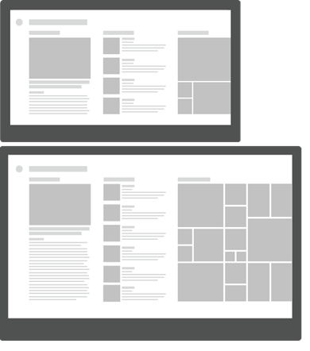
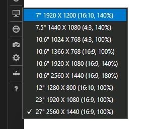
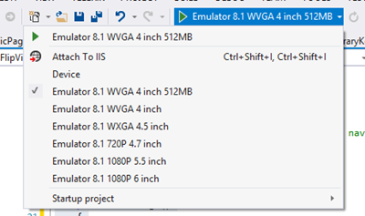

# 第 4 章核心概念:分辨率、导航和应用的生命周期

## 管理分辨率和屏幕尺寸

视窗商店应用程序的一个显著特点是，它们可以在多种设备上运行，包括智能手机、平板电脑和传统电脑。然而，它们都提供不同的外形和屏幕尺寸。在视窗生态系统中，智能手机的屏幕通常从 3.5 英寸到 6 英寸不等，而平板电脑的屏幕从 7 英寸到 12 英寸不等。另一方面，台式电脑可以连接到 30 英寸或更大的显示器。

因此，当我们创建应用程序的用户界面时，我们不能使用固定的布局；我们需要记住，布局应该能够自动适应设备的外形，并提供良好的 UI，无论应用程序在哪种设备上运行。

Windows 和 Windows Phone 几乎都支持任何屏幕尺寸和分辨率，通常分为两类:长宽比为 15:9 的设备(如 WXGA 或 WVGA 分辨率)和长宽比为 16:9 的设备(如 720p 和 1080p 分辨率)。

但是，您不能依赖这些固定值来定义您的布局，因为这些分辨率在未来可能会发生变化(因为 Windows Runtime 在支持不同分辨率和屏幕大小方面比 Silverlight 灵活得多)。在这一节中，我们将探讨设计一种布局的最佳策略，这种布局可以适当地适应几乎任何设备。

### 缩放如何工作

Windows 和 Windows Phone 提供了本机缩放系统，能够根据屏幕大小和分辨率自动调整页面布局。由于 XAML 框架，这是可能的，这是一种基于矢量的技术。XAML 控件由一系列点和线表示。这样，当设备的分辨率增加时，操作系统能够在不损失质量的情况下增加页面中元素的大小。

这种增加是通过使用比例因子来实现的，该比例因子被计算为像素大小和屏幕实际大小之间的比率。与 Silverlight 在 Windows Phone 8.0 中应用的缩放系统相比，这是一个巨大的进步，后者仅根据分辨率进行计算。缺点是页面的布局不能自动适应屏幕的大小。例如，在大型设备(如平板电脑)上，内容的密度与在小型设备上显示的密度相同。唯一的区别是页面中的元素更大(比如，更大的字体、更大的按钮、更大的图像等等)。).最终，UX 受到了损害，因为该应用程序无法利用更大设备提供的更大空间。

视窗运行时提供了许多不同的比例因子。根据分辨率和屏幕大小，页面中显示的 XAML 元素乘以一个固定值，这使得内容更容易阅读，用户也更容易与之交互。

Windows 8.1 提供的标准比例因子有:

*   1.0 是基本比例因子，最低分辨率为 1024x768 的设备支持该比例因子
*   1.4 引入了 140%的比例因子，最小分辨率为 1440x1080 的设备支持该比例因子
*   1.8 引入了 180%的比例因子，最小分辨率为 1920x1440 的设备支持该比例因子

Windows Phone 8.1 使用以下比例因子:

*   1.0 是基本比例因子，适用于 Windows Phone 设备支持的最小分辨率，即 384x640
*   1.4 引入了 140%的比例因子
*   2.4 引入了 240%的比例因子，并将其应用于大屏幕尺寸和高分辨率的平板电脑等设备

|  | 注意:需要强调的是，前面列表中提到的最低分辨率只是一个指示。例如，分辨率为 1440x1080 的设备没有必要有 1.4 倍的工厂，因为它也是根据屏幕大小等其他参数计算的。Surface Pro 就是这种行为的一个很好的例子；它的分辨率为 1920x1080，但由于它是 10 英寸的设备，因此它的比例因子为 1.4。 |

视窗运行时提供了一个名为`DisplayProperties`的类，由于`ResolutionScale`属性，它对于确定应用的比例因子非常有用。以下代码示例向用户显示了应用于其设备的当前比例因子:

```cs
          protected override void OnNavigatedTo(NavigationEventArgs e)
          {
              ResolutionScale scale = DisplayProperties.ResolutionScale;
              string description = string.Empty;
              switch (scale)
              {
                  case ResolutionScale.Scale100Percent:
                      description = "Scale factor: 100";
                      break;
                  case ResolutionScale.Scale140Percent:
                      description = "Scale factor: 140";
                      break;
                  case ResolutionScale.Scale180Percent:
                      description = "Scale factor: 180";
                      break;
              }

              ScaleFactor.Text = description;
          }

```

### 管理布局

当涉及到定义应用程序的布局时，XAML 框架帮助了我们。由于这是一种基于矢量的技术，它能够自动适应屏幕的大小和分辨率，而不会降低质量。然而，这并不意味着没有任何注意事项要记住。最重要的一点是避免给控件分配固定的大小。事实上，当您给控件一个固定的大小时，它不能自动填充可用空间。因此，在定义布局时，避免使用`Canvas`和`Border`等控件非常重要，因为它们使用绝对定位。内容不能自动适应容器，而是通过使用`Top`和`Left`等属性放置在固定位置。相反，`Grid`控件是您可以用来定义流体布局的最佳容器。正如我们在第 3 章中看到的，您可以定义大小能够自动适应内容的行和列。



图 27:流畅的布局示例:在更大的屏幕上，应用程序能够比在更小的屏幕上显示更多的内容

然而，在某些情况下，这种方法会导致一些问题，尤其是在游戏中。例如，让我们考虑一个象棋游戏。无论设备大小，棋盘上的方块数都是固定的。在这种情况下，如果屏幕更大，我们不需要显示更多的内容，我们只需要以更大的尺寸显示内容。在这些情况下，我们可以使用`ViewBox`控件，该控件能够根据屏幕大小自动缩放内容。在更大的设备上，内容看起来会更大，但内容的密度总是相同的。

使用该控件很容易:只需在其中包装您想要自动缩放的 XAML 控件，如下例所示:

```cs
          <Viewbox>
              <StackPanel>
                  <TextBlock Text="Some text" />
                  <TextBlock Text="Some other text" />
              </StackPanel>
          </Viewbox>

```

### 管理图像

当处理图像时，我们没有 XAML 框架提供的灵活性。事实上，图像被渲染为位图，而不是矢量，因此图像大小增加得越多，质量损失就越大。为了管理图像，Windows Store 应用程序提供了一种命名约定，极大地帮助开发人员支持所有设备。您将需要添加不同版本的图像(具有不同的分辨率)，并且窗口运行时将根据设备的比例因子自动选择最佳版本。

例如，假设您有一个分辨率为 100x100 的图像。为了适当地支持所有可能的屏幕尺寸和分辨率，我们还必须向项目中添加分辨率为 140×140(对于 1.4 比例因子)的相同图像、分辨率为 180×180(对于 1.8 比例因子)的图像和分辨率为 240×240(对于 2.4 比例因子)的图像。有两种方法来管理这个场景，它们都产生相同的结果。这取决于你选择哪一个最适合你的需求和你的编码习惯。

第一种方法是将图像包含在同一个文件夹中，但名称以不同的后缀结尾。例如，如果原始图像名为**logo.png**，则需要添加以下文件:

*   **logo.scale-100.png**为 1.0 比例因子
*   **logo.scale-140.png**为 1.4 比例因子
*   **logo.scale-180.png**为 1.8 的比例因子
*   **logo.scale-240.png**为 2.4 比例因子

第二种方法要求您始终使用相同的文件名，但将其存储在不同的文件夹中。例如，如果原始图像名为**logo.png**，则必须使用以下文件夹组织项目:

*   **/scale-100/logo.png** 为 1.0 比例因子
*   **/scale-140/logo.png** 为 1.4 比例因子
*   **/比例尺-180/logo.png** 为 1.8 比例因子
*   **/scale-240/logo.png** 为 2.4 比例因子

最需要强调的是，这种方法对开发人员来说是完全透明的。您只需将图像的基本名称分配给控件，Windows 运行时就会为您挑选最佳图像。例如，要使用`Image`控件显示上一张名为**logo.png**的图像，您只需声明以下代码:

```cs
          <Image Source="/Assets/logo.png" />

```

Windows Store 应用程序将根据当前比例因子自动使用正确版本的图像。

### 管理外部映像

当然，前面的方法只适用于作为 Visual Studio 项目一部分的图像。如果图像是从网络上下载的，您将不得不手动管理图像的不同版本。你可以依靠我们之前看到的`DisplayProperties`类提供的`ResolutionScale`属性来实现这个目标；您将能够检索适当的比例因子，并为您的设备下载适当的图像。

### 管理视觉资产

我们刚才讨论的关于图像的方法也适用于任何视窗商店应用程序所需的标准视觉资产(如图标、图块等)。).如果你读过第 2 章，你会记得应用程序的标准视觉资产是在清单文件中定义的，在一个叫做**视觉资产**的特定部分。您会注意到，对于该部分中请求的每个图像，您将能够加载它们的多个版本，以支持不同的比例因子。当您定义要使用的图像时，可视化清单编辑器将帮助您理解要使用的正确分辨率。例如，如果您查看 Windows 清单文件中的闪屏部分，您会注意到，在每个图像下，都会报告每个特定比例因子所需的正确分辨率:

*   比例因子为 1.0 的基础图像的分辨率应为 620x300
*   比例因子为 1.4 的图像分辨率应为 868x420
*   比例因子为 1.8 的图像应该具有 1116x540 的分辨率

让我们详细看看清单文件中需要的不同类型的图像。

#### 平铺图像和徽标

本部分用于定义应用的徽标。需要多种格式，每种格式都对应于一个特定的用例。让我们详细看看它们:

*   小方块磁贴在 Windows 和 Windows Phone 中的管理方式不同。在 Windows 上，图像在标题为**正方形 70x70 徽标**的部分中定义。在视窗手机上，它被定义在**方块 71x71 标志**部分。
*   **正方形 150x150 标志**是用于标准正方形瓷砖的图像。
*   **Wide310x150 Logo** 是用于宽矩形瓷砖的图像。
*   **正方形 310x310 徽标**是仅在 Windows 上可用的部分。这是 Windows Phone 上没有的用于大方形磁贴的图像。
*   在操作系统中，有些页面需要较小的徽标(例如在应用程序列表中)。同样，大小因平台而异。在 Windows 上，它是在**方块 30x30 标志**部分定义的。在 Windows Phone 上，它是在**方形 44x44 徽标**部分定义的。

#### 徽章标志

Windows Store 应用程序还可以在锁定屏幕上与用户交互，当用户不积极使用设备时会显示锁定屏幕。最常见的场景是通知。我们可以提醒用户在应用程序中发生了一些事情(例如，用户收到了新的电子邮件)，而不会强制他们解锁他或她的设备。在本节中，您将能够定义用于显示此类通知的图像。这个图像的主要要求是它必须是单色的，并且有透明的背景。

#### 闪屏

应用程序加载时，闪屏图像会显示给用户。加载完成后，闪屏会隐藏，应用程序的第一页会显示出来。在这两个平台上如何实现闪屏有一个重要的区别:

*   在 Windows 8.1 中，闪屏图像显示在屏幕中央，它不会填满所有可用空间(事实上，请求的分辨率为 620x300，低于任何 Windows 设备支持的任何分辨率)。因此，您还可以设置一个背景颜色来填充剩余的空间。为了获得最佳效果，颜色与用作闪屏的图像颜色相匹配非常重要。
*   在 Windows Phone 8.1 中，闪屏图像使用整个屏幕空间，因此缺少背景颜色属性。

### 如何测试缩放

要测试您是否正确管理了应用程序的布局和图像，以便它能够良好运行(无论应用程序在哪个设备上运行)，这可能会很棘手。您需要访问许多设备，每个设备都有不同的分辨率和屏幕大小。幸运的是，Visual Studio 2013 提供了一些工具，可以帮助开发人员模拟不同的比例因子。

当涉及到 Windows 应用程序时，您可以使用我们在第 1 章中描述的模拟器。事实上，它在工具栏中提供了一个选项，可以更改模拟器的当前分辨率和屏幕大小。



图 28:视窗模拟器提供的不同分辨率和屏幕尺寸

说到 Windows Phone，Visual Studio 为您提供了从“调试”下拉菜单运行不同版本模拟器的机会，如下图所示:



图 29:Visual Studio 2013 中可用的不同模拟器

## Windows 商店应用程序并行(仅限 Windows)

Windows 中最有趣的功能之一是，用户可以通过并排放置来同时运行多个 Windows Store 应用程序。在大多数情况下，用户可以并排放置两个应用程序，但数量不是固定的，它取决于设备的分辨率和屏幕大小。这个场景只有 Windows 支持。智能手机通常提供更小的屏幕，因此会给 UX 带来贫困。

作为开发人员，学会管理这个特性很重要。在任何时候，用户可以调整我们的应用程序的大小，我们需要准备好提供一个好的 UX 在任何大小。在从 Windows 8.0 过渡到 Windows 8.1 的过程中，这一 Windows 功能发生了深刻的变化。事实上，在第一个 Windows 8 版本中，我们只需要管理三种不同的状态:

*   **抓拍:**该应用程序使用大约 1/3 的屏幕
*   **填充**:该应用使用了大约 2/3 的屏幕，因此可以与快照应用并排放置
*   **全屏**:应用程序使用屏幕上的全部可用空间正常运行

相反，在 Windows 8.1 中，只要设备支持至少 1024x768 的分辨率，用户几乎可以为应用分配任何大小。Windows Store 应用程序可以采用的新最小尺寸是 500 像素；但是，作为开发人员，我们仍然可以通过将清单文件(在**应用程序**部分)中的**最小宽度**属性设置为 320 像素来启用旧的捕捉模式。选择取决于开发者。根据应用程序显示的内容类型，你必须问自己，即使有这么小的窗口，你是否也能显示内容，或者是否会变得无用或不可读。

例如，推特客户端是一种可以很好地支持快照视图的应用程序。这样，用户可以将他或她的时间线拉到一边，例如，在关注推特的同时继续上网。这是因为时间线是一种不需要太多空间就能正确呈现的内容类型。另一方面，一个游戏通常不能很好地支持快照视图，因为它很难在这么小的尺寸下玩。

无论我们是否希望启用快照视图，作为开发人员和设计人员，我们都需要遵循我们在讨论管理不同分辨率和屏幕尺寸时学到的相同规则:保持布局流畅。布局越流畅，越能适应窗口的大小。然而，在某些情况下，这种方法是不够的。在某些情况下，如果窗口的大小减少太多，页面的内容可能会变得太小而没有意义。

我们在第 3 章中描述的视觉状态为这个问题提供了一个解决方案。我们将定义不同的视觉状态，每个视觉状态都将反映应用程序可以呈现的各种状态。当我们到达一个不再适合正确显示内容的窗口大小时，我们将深刻地改变页面的布局。作为一个例子，我们将使用我们在第 3 章中谈到的关于`GridView`和`ListView`控件的相同场景:一组按他们居住的城市分组的人。

让我们来看看页面的外观:

```cs
          <Page
          x:Class="App1.MainPage"

          xmlns:x="http://schemas.microsoft.com/winfx/2006/xaml"
          xmlns:local="using:App1"
          xmlns:d="http://schemas.microsoft.com/expression/blend/2008"
          xmlns:mc="http://schemas.openxmlformats.org/markup-compatibility/2006"
          mc:Ignorable="d">

              <Page.Resources>
                  <CollectionViewSource x:Name="People" IsSourceGrouped="True" />

                  <DataTemplate x:Key="PeopleTemplate">
                      <StackPanel Width="300">
                          <TextBlock Text="{Binding Path=Name}" />
                          <TextBlock Text="{Binding Path=Surname}" />
                      </StackPanel>
                  </DataTemplate>

                  <DataTemplate x:Key="HeaderTemplate">
                      <Border Background="LightGray">
                          <TextBlock Text="{Binding Key}" Foreground="Black" Margin="10" Style="{StaticResource HeaderTextBlockStyle}"/>
                      </Border>
                  </DataTemplate>
              </Page.Resources>

              <Grid Background="{ThemeResource ApplicationPageBackgroundThemeBrush}">
                  <VisualStateManager.VisualStateGroups>
                      <VisualStateGroup>
                          <VisualState x:Name="DefaultLayout" />
                          <VisualState x:Name="MinimalLayout">
                              <Storyboard>
                                  <ObjectAnimationUsingKeyFrames Storyboard.TargetName="GridPeople" Storyboard.TargetProperty="Visibility">
                                      <DiscreteObjectKeyFrame KeyTime="0" Value="Collapsed" />
                                  </ObjectAnimationUsingKeyFrames>
                                  <ObjectAnimationUsingKeyFrames Storyboard.TargetName="ListPeople" Storyboard.TargetProperty="Visibility">
                                      <DiscreteObjectKeyFrame KeyTime="0" Value="Visible" />
                                  </ObjectAnimationUsingKeyFrames>
                              </Storyboard>
                          </VisualState>
                      </VisualStateGroup>
                  </VisualStateManager.VisualStateGroups>
                  <GridView ItemsSource="{Binding Source={StaticResource People}}" x:Name="GridPeople" ItemTemplate="{StaticResource PeopleTemplate}">
                      <GridView.GroupStyle>
                          <GroupStyle HidesIfEmpty="True" HeaderTemplate="{StaticResource HeaderTemplate}" />
                      </GridView.GroupStyle>
                  </GridView>
                  <ListView ItemsSource="{Binding Source={StaticResource People}}" Visibility="Collapsed" x:Name="ListPeople" ItemTemplate="{StaticResource PeopleTemplate}">
                      <ListView.GroupStyle>
                          <GroupStyle HidesIfEmpty="True" HeaderTemplate="{StaticResource HeaderTemplate}" />
                      </ListView.GroupStyle>
                  </ListView>
              </Grid>
          </Page>

```

我们在页面中添加了两个控件:一个`GridView`和一个`ListView`，两者都被配置为显示相同的数据(这就是定义为页面资源的`CollectionViewSource`)。还有，观感是一样的；它们都使用相同的模板来呈现单个项目(个人)和组标题(城市名称)。您还会注意到，默认情况下，`GridView`控件是可见的，而`ListView`控件是隐藏的(`Visibility`属性设置为`Collapsed`)。

我们工作的目标是当用户调整应用大小到某个点时，改变页面的布局，这样`GridView`就不能再完成它的工作(即正确显示数据)。当我们到达那个点时，我们将隐藏`GridView`并用`ListView`替换它。由于它采用垂直布局，因此最适合应用程序较小的情况。

为了实现我们的目标，我们在主`Grid`容器中定义了两种不同的视觉状态:第一种叫做`DefaultLayout`，它标识了基本状态(GridView 是可见的，而`ListView`是隐藏的)。第二个叫做`MinimalLayout`，它的作用正好相反(隐藏`GridView`，显示`ListView`)。

既然我们已经定义了可视状态，让我们来看看如何管理交换机后面的代码:

```cs
          public sealed partial class MainPage : Page
          {
              public MainPage()
              {
                  this.InitializeComponent();
                  this.SizeChanged += MainPage_SizeChanged;
              }

              private void MainPage_SizeChanged(object sender, SizeChangedEventArgs e)
              {
                  if (e.NewSize.Width <= 500)
                  {
                      VisualStateManager.GoToState(this, "MinimalLayout", true);
                  }
                  else
                  {
                      VisualStateManager.GoToState(this, "DefaultLayout", true);
                  }
              }
          }

```

在页面的构造函数中，我们已经订阅了`SizeChanged`事件，当用户改变应用程序的大小时会调用该事件。事件处理程序的参数包含一个名为`NewSize`的属性，该属性返回窗口的新大小。由于视窗商店应用程序只能水平调整大小，我们有兴趣检查`Width`属性的值。

现在轮到我们定义临界点，当达到临界点时，将迫使布局改变。在前面的示例中，我们将其设置为 500 像素。当达到该值时，我们使用`VisualStateManager`类公开的`GoToState()`方法启用`MinimalLayout`视觉状态。否则，如果用户决定再次调整应用的大小，并将大小增加到高于 500 像素的值，我们将恢复称为`DefaultLayout`的原始视觉状态。


图 30:两个并排运行的 Windows 商店应用程序

## 管理方向

前面描述的管理应用程序调整大小的方法也可以应用于方向管理，这不仅受到窗口的支持，也受到窗口电话的支持。事实上，在这两个平台上，设备可以水平使用(横向模式)或垂直使用(纵向模式)。管理这两个方向不是必需的，但这是一个受到用户赞赏的奖励。

Windows 商店应用程序能够自动管理方向更改。第一步是在清单文件中启用您想要支持的方向。然后，当设备改变方向时，应用程序能够自动旋转页面内容。然而，这种方法并不总是提供好的结果，因为处理视觉状态是管理方向改变的最好方法。这样，我们可以根据用户手持设备的方式手动更改应用的布局。

从 XAML 的角度来看，代码与我们在应用程序的调整大小示例中看到的相同。您定义了两种视觉状态(一种用于纵向，一种用于横向)，在这两种状态下，您将根据方向设置控件的外观。

主要区别在后面的代码；我们需要以不同的方式管理`SizeChanged`事件，如下例所示:

```cs
          public sealed partial class MainPage : Page
          {
              public MainPage()
              {
                  this.InitializeComponent();
                  this.SizeChanged += MainPage_SizeChanged;
              }
              private void MainPage_SizeChanged(object sender, SizeChangedEventArgs e)
              {
                  if (e.NewSize.Width > e.NewSize.Height)
                  {
                      VisualStateManager.GoToState(this, "DefaultLayout", true);
                  }
                  else
                  {
                      VisualStateManager.GoToState(this, "PortraitLayout", true);
                  }
              }
          }

```

当设备的方向改变时，也会触发`SizeChanged`事件。在这种情况下，我们可以使用`NewSize`参数提供的`Width`和`Height`属性来确定当前方向。如果`Width`高于`Height`，则表示该设备正在景观模式下使用；否则，它将在纵向模式下使用。通过使用`VisualStateManager`，我们根据这个条件触发合适的视觉状态。

Windows 模拟器和 Windows Phone 模拟器都可以通过为我们提供旋转设备的选项来帮助我们测试这个场景。

## Windows 商店应用程序中的导航

正如我们之前在本书中提到的，与传统桌面应用不同，Windows Store 应用是基于页面的。每个页面都显示一些内容，用户可以从一个页面导航到另一个页面来浏览应用程序。因此，视窗商店应用程序基于`Frame`概念，这是所有应用程序页面的容器。一个`Frame`可以包含一个或多个`Page`对象，这些对象以类似于网站提供的层次结构进行管理:用户有机会在不同的页面上来回移动。

### 页面的生命周期

正如我们已经看到的，每个应用程序的页面都继承自`Page`类，该类提供了一组对管理页面生命周期很重要的事件。在这本书里，我们会经常用到其中的两个:`OnNavigatedTo()`和`OnNavigatedFrom()`。第一个在用户导航到当前页面时触发；它是初始化需要在页面中显示的数据的最佳入口点之一(例如，从数据库或 web 服务中检索一些数据)。第二个是当用户从当前页面导航到另一个页面时触发的。在接下来的段落中，我们将使用这两个事件来保存和恢复页面状态，以便我们可以正确管理应用程序的生命周期。

```cs
          protected override void OnNavigatedTo(NavigationEventArgs e)
          {
              //load the data
          }
          protected override void OnNavigatedFrom(NavigationEventArgs e)
          {
              //save the data
          }

```

### 在页面间导航

由于它是页面的容器，`Frame`类提供了从一个页面导航到另一个页面的基本方法。最基本的一个叫做`Navigate()`，它接受一个类型作为参数，这个类型标识了你想把用户重定向到的页面。

例如，如果要将用户重定向到名为 MainPage.xaml 的页面，类型为`MainPage`，可以使用以下代码:

```cs
          private void OnGoToMainPageClicked(object sender, RoutedEventArgs e)
          {
              this.Frame.Navigate(typeof(MainPage));
          }

```

`Navigate()`方法还接受第二个参数，这是一个要从一个页面传递到另一个页面的对象。这在常见的主-细节场景中很有用，在这种场景中，用户点击一个页面中的元素，然后他或她被重定向到另一个页面，以查看关于所选项目的更多信息。

以下示例代码从`ListView`控件中检索所选项，并将其传递到另一页:

```cs
          private void OnGoToMainPageClicked(object sender, RoutedEventArgs e)
          {
              Person person = People.SelectedItem as Person;
              this.Frame.Navigate(typeof(MainPage), person);
          }

```

接下来，由于导航参数中存储的`Parameter`属性，我们能够在目标页面的`OnNavigateTo()`事件处理程序中检索参数，如下例所示:

```cs
          protected override async void OnNavigatedTo(NavigationEventArgs e)
          {
              Person person = e.Parameter as Person;
              MessageDialog dialog = new MessageDialog(person.Name);
              await dialog.ShowAsync();
          }

```

由于`Parameter`属性可以包含一个泛型`object`，我们需要首先执行到预期类型的转换。然而，重要的是要强调作为参数传递的对象应该是可序列化的，这意味着它可以用一个普通的字符串来表示。我们将在第五章中再次讨论这个重要的概念。

### 管理页面堆栈

Windows 商店应用程序在导航方面遵循分层方法，这与网络应用程序提供的导航非常相似。通常，用户从主页面开始，然后他或她移动到应用程序的其他页面。但是，用户也可以决定向后导航并返回到前面的页面。

即使概念相同，Windows 和 Windows Phone 也以两种不同的方式管理这一需求。事实上，Windows Phone 设备总是提供一个真实的**后退**按钮(可以是物理的，也可以是虚拟的)，这是该平台 UX 的一部分。Windows 设备不提供这样的配置，主要有两个原因:

*   平板电脑比智能手机大，所以拿着平板电脑时很难够到实体的“后退”按钮
*   Windows Store 应用程序不仅可以在平板电脑上运行，也可以在传统电脑上运行，传统电脑由标准键盘和鼠标配置控制

页面层次结构像堆栈一样管理:每次导航到新页面时，都会在堆栈顶部添加一个新项目。当您向后导航时，堆栈顶部的页面将被移除。尽管存在这种差异，但两个平台都要求开发人员通过使用`Frame`类提供的`GoBack()`按钮来正确管理向后导航。

但是，由于硬件的差异，您必须以两种不同的方式来管理它。让我们详细看看这些。

#### 管理窗口中的后退按钮

正如我们已经强调的，Windows 设备不提供真正的**后退**按钮，所以你必须在你的应用程序中管理它。标准的 Visual Studio 模板(空白模板除外)已经支持这种情况；每一页在页眉附近都包含一个`Button`控件，该控件具有以下特性:

*   它在被点击时调用框架类的`GoBack()`方法。
*   仅当`Frame`类的`CanGoBack`属性设置为`true`时才会显示。该属性检查页面堆栈的状态，并且仅当至少有一个页面可供返回时才设置为`true`。

这是一个执行此操作的示例:

```cs
          private void OnGoBackClicked(object sender, RoutedEventArgs e)
          {
              if (Frame.CanGoBack)
              {
                  Frame.GoBack();
              }
          }

```

#### 管理 Windows 电话中的“后退”按钮

Windows Phone 提供了一个专用的**后退**按钮。在 Windows Phone 8 中，作为开发人员，你不需要做任何特别的事情来正确管理它。自动地，当按下它时，用户被重定向到应用的前一页(或者在堆栈为空并且用户在应用的第一页的情况下，重定向到开始屏幕)。

这种行为在 Windows Phone 8.1 中不再自动实现。当您按下**返回**时，用户将不再被重定向到上一页，而是被重定向到以前使用过的应用程序，以保持导航与 Windows 提供的一致(因为它没有提供专用的**返回**按钮)。然而，这并不意味着这是管理**后退**按钮的正确方式。Windows Phone 用户习惯于通过使用**后退**按钮在不同的应用程序部分之间移动，微软希望保持这种方式。

因此，所有的 Visual Studio 模板(空白模板除外)都在名为`NavigationHelper`的公共文件夹中包含了一个类，该类提供了许多有用的功能——尤其是管理页面状态(我们将在本章后面详细讨论)。该类提供的功能之一是对**后退**按钮的适当支持。事实上，该类包含以下代码:

```cs
          public class NavigationHelper
          {
              private Page Page { get; set; }
              private Frame Frame { get { return this.Page.Frame; } }

              public NavigationHelper(Page page)
              {
                  this.Page = page;
                  this.Page.Loaded += (sender, e) =>
                  {
          #if WINDOWS_PHONE_APP
                      Windows.Phone.UI.Input.HardwareButtons.BackPressed += HardwareButtons_BackPressed;
          #endif
                  };
                  this.Page.Unloaded += (sender, e) =>
                  {
          #if WINDOWS_PHONE_APP
                      Windows.Phone.UI.Input.HardwareButtons.BackPressed -= HardwareButtons_BackPressed;
          #endif
                  };
              }

              private void HardwareButtons_BackPressed(object sender, Windows.Phone.
              UI.Input.BackPressedEventArgs e)
              {
                  if (this.Frame.CanGoBack)
                  {
                      e.Handled = true;
                      this.Frame.GoBack();
                  }
              }
          }

```

当类被实例化时，它订阅由属于`Windows.Phone.UI.Input`命名空间的`HardwareButtons`类提供的`BackPressed`事件。顾名思义，每次按下 Windows Phone 中的**后退**按钮时，事件都会被触发。关联的事件处理程序只是负责调用由`Frame`类提供的`GoBack()`方法。唯一需要突出显示的代码行是`e.Handled = true`。通过这样做，我们告诉操作系统，我们已经自己管理了**后退**按钮。这样，Windows Phone 就不会试图自己管理它，也不会将用户重定向到以前的应用程序。

要使用这个类，我们需要在页面构造器中创建新的`NavigationHelper`实例，如下例所示:

```cs
          public sealed partial class MainPage : Page
          {
              public MainPage()
              {
                  this.InitializeComponent();
                  NavigationHelper helper = new NavigationHelper(this);
              }
          }

```

但是，如果您要使用任何 Visual Studio 模板(空白页面除外)来创建新页面，将会自动包含以前的代码。

如果您需要以不同的方式管理**后退**按钮，只需不初始化页面中的`NavigationHelper`类并自行订阅`BackPressed`事件即可，如下例所示:

```cs
          public sealed partial class MainPage : Page
          {
              public MainPage()
              {
                  this.InitializeComponent();
                  Windows.Phone.Input.UI.HardwareButtons.BackPressed += HardwareButtons_BackPressed;
              }

              void HardwareButtons_BackPressed(object sender, BackPressedEventArgs e)
              {
                  //do something
                  e.Handled = true;
              }
          }

```

#### 避免 Windows 手机中的循环导航问题

使用页面堆栈时，需要管理的一件真正重要的事情是，当您想要将用户重定向到上一页时，始终使用`Frame`类的`GoBack()`方法；千万不要用`Navigate()`那种。

这是必需的，因为正如我们前面提到的，页面是用堆栈管理的。`GoBack()`方法移除堆栈中的顶部页面，而`Navigate()`方法在顶部添加一个新页面。结果是，如果我们使用`Navigate()`方法返回到上一页，我们创建了一个循环导航，用户在相同的两个页面之间不断移动。

我们来看一个真实的例子。假设你有一个主页面显示新闻列表的应用程序。该应用程序提供了一个设置按钮，可以将用户重定向到用户可以配置该应用程序的页面。在这个页面的底部，我们添加了一个确认按钮。点击后，设置被保存，用户被重定向回主页。

假设我们使用`Navigate()`方法执行这种向后导航到主页面。所发生的是，我们不是从堆栈中移除设置页面，而是在它的顶部添加主页面。结果是，如果用户现在按下**返回**而不是返回开始菜单(这是预期的行为，因为用户在主页面上)，用户将被重定向回设置页面，因为它已经存在于堆栈中。

管理该场景的正确方法是当用户按下**确认**时调用`GoBack()`方法。这样，设置页面将从堆栈中移除，留下主页面作为堆栈中唯一可用的页面。这样，再次按下**返回**将正确地将用户重定向到开始屏幕，退出应用程序。

### 管理页面的状态

如果您已经使用过 Windows Phone 8.0 和 Silverlight，那么在管理页面状态时，您会注意到一个非常重要的区别。在 Windows Phone 8.0 中，在页面从堆栈中移除之前，其状态会保留在内存中。这意味着，如果用户按下**返回**返回到上一页，他或她会发现该页处于与他或她先前离开时相同的状态。

这种情况在视窗商店应用程序中不再发生，无论是视窗还是视窗手机。现在，每当用户被重定向到一个页面时(无论是向前导航到一个新页面还是向后导航到已经在堆栈中的页面)，都会创建一个新的实例。这意味着状态永远不会保持。例如，如果一个页面包含一个`TextBox`控件，并且用户在其中写了一些东西，一旦他或她离开该页面，该内容将会丢失。

如果您想避免这个问题并保持之前的行为，可以在页面构造函数或 XAML 代码中将页面的`NavigationCacheMode`属性设置为`Required`或`Enabled`。这样，页面状态将始终保持不变。需要强调的是，在这种情况下，您需要正确管理数据加载，避免在页面构造函数中加载东西，因为它只在第一次请求页面时被调用。最好使用`OnNavigatedTo()`等方法，每次用户导航到页面时都会触发。这两个值有什么区别？它们都保留了页面的状态，但是`Required`使用更多的内存，因为无论已经缓存了多少其他页面，它都会缓存该页面。使用`Enabled`，页面将被缓存，但是如果达到缓存大小限制，该状态将被删除。

以下示例显示了如何设置`NavigationCacheMode`属性:

```cs
          public sealed partial class MainPage : Page
          {
              public MainPage()
              {
                  this.InitializeComponent();
                  this.NavigationCacheMode = NavigationCacheMode.Required;
              }
          }

```

## 应用的生命周期

Windows 商店应用程序和传统 Windows 桌面应用程序最大的区别之一是生命周期，这意味着应用程序在运行时可以呈现不同的状态。通常，传统桌面应用程序的生命周期非常简单，因为它们只受到运行该应用程序的硬件的限制。该应用程序被启动，它总是保持活动状态，直到用户关闭它，没有任何限制的机会，执行后台操作。

然而，这种方法并不适合移动应用，因为性能、低电池使用和响应速度是移动平台的关键因素。标准桌面应用程序提供的自由不尊重这些要求。

Windows 商店应用程序并不总是在运行；当用户切换到另一个活动(如打开另一个应用程序或移回“开始”屏幕)时，应用程序会暂停。它的状态保留在内存中，但不再运行，因此不使用任何资源(如中央处理器、网络等)。).因此，当一个应用程序被挂起时，它不能执行后台操作。为此，Windows 运行时引入了后台任务(将在第 11 章中详细介绍)。大多数情况下，暂停管理对开发人员是透明的；当用户恢复我们的应用程序时，它将简单地与其状态一起被恢复。这样，用户会发现应用程序处于他或她之前离开时的相同状态。

然而，设备(尤其是平板电脑和智能手机)并没有无限的内存。因此，操作系统能够在资源耗尽的情况下终止旧的应用程序。作为开发人员，在暂停期间保存应用程序的状态非常重要，这样我们就可以在应用程序被系统终止的情况下恢复它。目标是为用户提供流畅的体验:他或她应该总是发现应用处于他或她离开时的相同状态，无论应用是刚刚暂停还是终止。

重要的是，不要将应用程序的状态(例如，用户正在填写的表单内容以及他或她不想丢失的内容，即使他或她切换到另一个任务)与应用程序的数据(如数据库)混淆。正如我们将在第 5 章中学习的那样，应用程序的数据应该在更改后立即保存，以便在出现问题(例如应用程序意外崩溃)时最大限度地减少数据丢失。

让我们详细看看应用程序生命周期的不同状态。

### 发射

所有的视窗商店应用程序都是从一个叫做`NotRunning`的基础状态开始的，这意味着应用程序还没有启动。当应用程序从这个状态启动时，启动事件被触发，负责初始化框架和主页。一旦应用程序被初始化，它就会进入`Running`状态。

Windows Store 应用程序能够管理 App.xaml.cs 文件中定义的`App`类中的生命周期事件。具体来说，启动事件称为`OnLaunched()`。只有当应用程序从零开始初始化时才会触发，因为它还没有运行或暂停。

以下代码显示了典型的启动管理:

```cs
          protected override void OnLaunched(LaunchActivatedEventArgs e)
          {
              Frame rootFrame = Window.Current.Content as Frame;

              // Do not repeat app initialization when the Window already has content;
              // just ensure that the window is active
              if (rootFrame == null)
              {
                  // Create a frame to act as the navigation context and navigate to the first page
                  rootFrame = new Frame();

                  // TODO: change this value to a cache size that is appropriate for your application
                  rootFrame.CacheSize = 1;

                  if (e.PreviousExecutionState == ApplicationExecutionState.Terminated)
                  {
                      // TODO: Load state from previously suspended application
                  }

                  // Place the frame in the current Window
                  Window.Current.Content = rootFrame;
              }

              if (rootFrame.Content == null)
              {
                  // When the navigation stack isn't restored, navigate to the first page,
                  // configuring the new page by passing required information as a navigation
                  // parameter
                  if (!rootFrame.Navigate(typeof(MainPage), e.Arguments))
                  {
                      throw new Exception("Failed to create initial page");
                  }
              }

              // Ensure the current window is active
              Window.Current.Activate();
          }

```

前面代码最重要的部分是检查`PreviousExecutionState`属性，这是事件参数提供的属性之一。该属性可以根据应用的先前状态呈现不同的状态。通常，在启动事件中，您将能够捕捉到以下状态:

*   `NotRunning`，也就是说这是 app 第一次上线
*   `Terminated`，这意味着应用程序已经在内存中，但由于资源不足而被操作系统终止
*   `ClosedByUser`，这意味着应用程序已经在内存中，但是已经被用户终止

默认情况下，标准的`App`类代码建议管理`Terminated`状态:应用程序已经被操作系统杀死，因此作为开发人员，我们有责任恢复之前保存的状态。在本章的后面，我们将看一下正确的方法。如您所见，另外两种状态(`NotRunning`和`ClosedByUser`)未被管理:应用程序未运行或已被用户明确关闭，因此从头开始是正确的，无需恢复任何以前的状态。

### 暂停

如前所述，当用户决定执行另一项任务(如打开另一个应用程序、点击通知或返回“开始”屏幕)时，会触发暂停事件。当这样的事件发生时，操作将等待 10 秒，然后它将继续暂停应用程序。这样，万一用户改变主意，回到应用程序，它会立即恢复。

之后，app 有效暂停；它将存储在内存中(因此它将继续使用 RAM)，但它将无法执行任何其他操作，也无法使用 CPU、网络等资源。这样，用户打开的新应用程序将有机会利用设备的所有资源。

至于每一个其他应用的生命周期事件，暂停事件也在`App`类中通过使用`OnSuspending()`方法进行管理，默认情况下，该方法具有以下定义:

```cs
          private void OnSuspending(object sender, SuspendingEventArgs e)
          {
              var deferral = e.SuspendingOperation.GetDeferral();

              // TODO: Save application state and stop any background activity
              deferral.Complete();
          }

```

这个方法的主要目的是允许开发者保存应用的状态。由于我们无法知道应用程序是否会被终止，所以我们需要在每次应用程序暂停时都这样做。

之前的逻辑使用`deferral`概念，这个概念在 Windows Store 应用程序开发中广泛使用，需要用来管理异步操作。如果您回忆一下第 2 章中详细介绍的异步和等待模式的基本概念，当我们执行一个异步方法时，编译器会设置一种书签，然后方法执行终止。因此，主线程可以自由地继续管理用户界面和其他资源。当我们处理挂起事件时，这种行为会引发一个重要的问题:`OnSuspending()`方法可能会在操作完成之前被终止。`deferral`对象解决了这个问题；在调用`Complete()`方法之前，`OnSuspending()`方法的执行不会终止。

当然，为了遵循微软的指导方针，我们不能使用这种变通方法让应用程序无限期地运行。我们有五秒钟来保存应用程序的状态，否则无论保存操作是否完成，应用程序都将被强制暂停。如你所见，时间很短。如前所述，`OnSuspending()`方法的目的是保存应用的状态，以便用户看不到标准暂停和终止之间的任何差异。例如，这不是保存应用程序数据的理想场所。

### `Resuming`

当应用程序从暂停状态恢复，但没有被操作系统终止时，恢复过程就会发生。这个过程对开发者来说是完全透明的；由于应用程序仍在内存中，因此应用程序的状态会被保留，我们不需要手动恢复它。

然而，`App`类提供了一种拦截该事件的方法。由于应用程序因资源不足而终止，如果系统有足够的内存来保持其活动，应用程序可以暂停很长时间。因此，当应用程序恢复时，页面中显示的数据可能不再真实。

这是恢复事件的目的；每当应用程序从暂停状态恢复而没有终止时，它都会被触发。我们可以使用它来刷新应用程序的数据(例如，通过对 web 服务执行新的请求)。

默认情况下，`App`类不管理此事件，因此您需要在类构造函数中手动订阅它，如下例所示:

```cs
          public sealed partial class App : Application
          {
              public App()
              {
                  this.InitializeComponent();
                  this.Resuming += App_Resuming;
              }

              private void App_Resuming(object sender, object e)
              {
                  //refresh the data
              }
          }

```

### 激活

视窗运行时提供了一个合同系统，开发者可以用它将他们的应用程序集成到操作系统中。因此，可以通过不同的方式启动 Windows Store 应用程序，而不仅仅是在“开始”屏幕上点击它的磁贴。这可能是由共享请求触发的，也可能是因为用户试图打开应用程序能够管理的文件类型。在所有这些场景中，应用程序不是通过启动事件打开的，而是通过特定的激活事件打开的，激活事件通常包含请求所需的信息。

`App`类根据触发请求的事件提供了很多激活方法。比如`OnFileActivated()`方法是因为用户试图打开一个我们支持的文件，打开 app 时触发的。在第 8 章中，我们将详细了解所有可用的合同、扩展和相关的激活事件。

### 收盘

当用户明确关闭应用程序时，会触发关闭事件。在 Windows 8.1 中，这个操作是通过将应用程序从屏幕顶部拖到底部，或者用鼠标和右上角的关闭按钮关闭应用程序来执行的。在 Windows Phone 中，当用户从任务切换器关闭时触发，任务切换器通过长按**后退**按钮激活。

然而，Windows 8.1 上的关闭事件并没有真正关闭应用程序，而是将其保存在内存中，以便可以更快地重新打开，就像定期暂停一样。唯一不同的是，这一次，app 将从`ClosedByUser`状态开始。在这种情况下，我们不必恢复状态，因为用户已经关闭了应用程序，所以他或她希望从头开始，而不是恢复以前的使用。

说到 Windows Phone，与 Silverlight 中针对 Windows Phone 8.0 的行为相比，有一个重要的区别。即在应用主页面按**后退**不再关闭，只是暂停。无论用户如何访问应用程序(从任务切换器、通过再次点击图块等)，他或她都将始终能够恢复暂停的实例。).在 Windows Phone 8.0 中，这种行为是通过一个名为“快速应用程序恢复”的功能实现的。在 Windows Phone 8.1 中，默认情况下总是启用此功能。

### 管理暂停

在本章的前几节中，我们提到了在应用程序暂停时保存应用程序状态的要求，以便在终止时可以恢复。让我们详细地看一下如何做。

#### 保存页面的状态

第一个要求是保存当前页面的状态。当用户重新打开我们的应用程序时，他或她将期望以他或她离开时的相同状态返回到最后使用的页面。当应用程序终止时，页面的状态会丢失。保存我们想要维护的所有信息是我们的责任。例如，如果当前页面包含用户正在填写的表单，我们需要确保当应用程序恢复时，以前插入的数据仍然存在。为了支持这一要求，微软创建了两个类，试图简化开发人员的工作。它们不是本地的运行时应用程序接口，而是包含在由 Visual Studio 提供的每个 Windows Store 应用程序模板中(空白的除外)。使用网格应用程序或中枢应用程序模板创建一个新的应用程序就足够了，或者，使用任何页面模板(空白页面模板除外)向现有项目添加一个新页面。然后你会在一个名为 **Common** 的文件夹中找到这些类。

第一个类叫做`NavigationHelper`，它帮助开发人员正确管理页面之间的导航。在引擎盖下，它依赖于另一个名为`SuspensionManager`的类，当用户从一个页面移动到另一个页面时，该类能够自动保存页面的状态。让我们看看如何使用它们。第一步是在页面中定义一个`NavigationHelper`对象，并在页面构造器中初始化它，如下例所示:

```cs
          public sealed partial class BasicPage1 : Page
          {
              private NavigationHelper navigationHelper;

              public BasicPage1()
              {
                  this.InitializeComponent();

                  this.navigationHelper = new NavigationHelper(this);
                  this.navigationHelper.LoadState += this.NavigationHelper_LoadState;
                  this.navigationHelper.SaveState += this.NavigationHelper_SaveState;
              }

              public NavigationHelper NavigationHelper
              {
                  get { return this.navigationHelper; }
              }
          }

```

在创建了`NavigationHelper`类的实例之后，我们订阅了两个事件:

*   当用户离开当前页面时调用`SaveState`；我们要用它来保存我们需要的信息
*   `LoadState`在用户向当前页面导航时调用；我们将使用它来恢复以前保存的信息

正确初始化`NavigationHelper`的最后一步是让它为我们管理导航事件；我们将以下列方式覆盖`OnNavigatedTo()`和`OnNavigatedFrom()`方法:

```cs
          protected override void OnNavigatedTo(NavigationEventArgs e)
          {
              this.navigationHelper.OnNavigatedTo(e);
          }

          protected override void OnNavigatedFrom(NavigationEventArgs e)
          {
              this.navigationHelper.OnNavigatedFrom(e);
          }

```

现在`NavigationHelper`对象已经正确初始化，感谢`SuspensionManager`类，我们已经准备好管理应用的状态了。这个类提供的关键特性是一个名为`PageState`的集合，它的类型是`Dictionary<string, object>`:我们可以在这个集合中存储我们想要保存的每一个信息，通过一个唯一的密钥来识别它。每一页都有其独特版本的`PageState`系列。

让我们通过使用一个页面包含`TextBox`控件的应用程序来看一个真实的例子。我们希望保留写在里面的文本，这样它就不会丢失(或者在暂停后应用程序被终止的情况下)。下面是我们如何通过使用`NavigationHelper`课程提供的`SaveState`和`LoadState`活动来做到这一点:

```cs
          private void NavigationHelper_SaveState(object sender, SaveStateEventArgs e)
          {
              if (e.PageState != null && e.PageState.ContainsKey("Name"))
              {
                  e.PageState.Remove("Name");
              }
              e.PageState.Add("Name", Name.Text);
          }

          private void NavigationHelper_LoadState(object sender, LoadStateEventArgs e)
          {
              if (e.PageState != null && e.PageState.ContainsKey("Name"))
              {
                  Name.Text = e.PageState["Name"].ToString();
              }
          }

```

在`SaveState`事件的处理程序中，我们保存想要保存的信息，这是`TextBox`控件的`Text`属性的值。我们通过在`PageState`字典中添加文本并将其绑定到`Name`键来执行该操作。首先，我们检查具有相同键的值是否已经存在，如果存在，我们就删除它。否则，我们会得到一个例外，因为我们不能在一个`Dictionary` `.`中存储两个具有相同密钥的项目

相反，在`LoadState`事件处理程序中，我们检索之前保存的信息。如果在`PageState`集合中，我们找到一个由`Name`键标识的元素，我们检索它并使用它来填充`TextBox`控件。

工作已经完成:通过这些简单的代码行，我们确保正确地保存我们需要的数据，以保持页面的状态。

#### 保存应用程序的状态

通过使用`NavigationHelper`类，由于`PageState`集合，我们已经能够正确地保存页面的状态。然而，问题是，当应用程序暂停然后终止时，内存中的数据会丢失。当应用恢复时，不同的`PageState`集合将为空。因此，我们需要以永久的方式保存数据，以便即使进程终止并从内存中删除，数据也可以恢复。存储数据的最佳位置是在本地存储中，这是应用程序中保留的数据物理存储区域，以便在不同的执行过程中保持数据。本地存储在应用程序开发中起着非常重要的作用。我们将在第 5 章详细讨论如何使用它。

对于当前场景，我们需要做的是将`PageState`集合保存到本地存储中，并在应用程序从终止状态恢复时恢复它们。这可以通过使用本书中已经提到的序列化过程来实现。各种`PageState`集合的内容将被转换成一个简单的数据结构，这样它就可以作为文本文件保存在本地存储器中，反之亦然；当应用程序恢复时，文本文件被转换回对象，这样我们就可以恢复`PageState`收藏的原始状态。

我们可以使用`SuspensionManager`类自动为我们执行这个操作。与`NavigationHelper`的区别在于，在这种情况下，保存和加载操作与应用程序的生命周期相关联，因此我们需要在`App`类中执行它们，在该类中管理所有的生命周期事件。第一步是正确初始化`SuspensionManager`类，它需要页面的根`Frame`作为参数。以下是当您实现`SuspensionManager`时`App`类的`OnLaunched()`方法的样子:

```cs

          protected override async void OnLaunched(LaunchActivatedEventArgs e)
          {
              Frame rootFrame = Window.Current.Content as Frame;
              if (rootFrame == null)
              {
                  rootFrame = new Frame();
                  SuspensionManager.RegisterFrame(rootFrame, "AppFrame");
                  if (e.PreviousExecutionState == ApplicationExecutionState.Terminated)
                  {
                      await SuspensionManager.RestoreAsync();
                  }
                  Window.Current.Content = rootFrame;
              }
              if (rootFrame.Content == null)
              {
                  rootFrame.Navigate(typeof (MainPage), e.Arguments);
              }
              Window.Current.Activate();
          }

```

我们对最初看到的`OnLaunched()`方法的代码做了两个重要的修改:

*   在创建了`Frame`类的新实例之后，我们通过调用`RegisterFrame()`方法并传递我们刚刚创建的`Frame`实例作为参数，将它注册到`SuspensionManager`中。
*   如果应用来自`Terminated`状态，我们称之为`SuspensionManager`的`RestoreAsync()`方法。它会处理两件事；第一个是用用户访问的最后一个页面填充`Frame`的`Content`。如果没有这个操作，用户将总是被重定向到主页面。第二种方法是从保存在本地存储器中的数据重新创建所有的`PageState`集合。这样，每个页面都可以访问我们之前保存的数据。

现在我们了解了如何恢复状态，让我们来看看如何保存它。我们将使用`OnSuspending()`方法，该方法在每次应用程序暂停时触发:

```cs

          private async void OnSuspending(object sender, SuspendingEventArgs e)
          {
              var deferral = e.SuspendingOperation.GetDeferral();
              await SuspensionManager.SaveAsync();
              deferral.Complete();
          }

```

仅仅调用`SuspensionManager`类的`SaveAsync()`方法来保存存储中 app 的状态是不够的。在我们创建了一个延迟对象之后，调用`Complete()`方法之前，这样做也很重要，这样在所有的数据都被正确保存之前，应用程序不会被挂起。

#### 管理页面内的暂停和恢复

如果你已经使用过基于 Silverlight 框架的 Windows Phone 8.0 应用程序，有一个重要的区别需要记住。在 Silverlight 中，`OnNavigatedTo()`和`OnNavigatedFrom()`方法总是被触发，不仅当用户从一个页面导航到另一个页面时，而且从该页面导航到开始屏幕时，反之亦然。这样，当应用程序暂停或恢复时，我们能够使用这些方法来执行额外的操作。

Windows 运行时已更改了此行为。恢复 app 时`OnNavigatedTo()`方法不再触发，暂停 app 时`OnNavigateFrom()`方法不再触发。如果您需要管理此场景(例如，如果您想在应用程序恢复时刷新页面中显示的数据)，您可以订阅由`Window`类提供的名为`VisibilityChanged`的事件。当应用程序被放置在后台时触发，反之亦然。让我们看一个例子:

```cs

          public sealed partial class MainPage : Page
          {
              public MainPage()
              {
                  this.InitializeComponent();
                  Window.Current.VisibilityChanged += Current_VisibilityChanged;
              }

              private void Current_VisibilityChanged(object sender, Windows.UI.Core.VisibilityChangedEventArgs e)
              {
                  string message = string.Empty;
                  if (e.Visible)
                  {
                      message = "The application has been activated";
                  }
                  else
                  {
                      message = "The application has been suspended";
                  }
                  Debug.WriteLine(message);
              }
          }

```

`VisibilityChanged`事件由`Windows.Current`对象提供，它提供了一个名为`Visible`的属性作为参数之一。当设置为`true`时，表示应用在后台，已经恢复。当设置为`false`时，我们处于相反的情况；该应用程序位于前台，它被放在后台，因为例如，用户按下了**开始**或打开了另一个应用程序。

### 测试应用的生命周期

测试我们在本章中描述的所有场景可能是一个挑战，因为应用程序不会按照精确的模式终止。相反，应该由操作系统在资源不足时杀死它们。因此，Visual Studio 提供了一系列选项，开发人员可以使用这些选项来强制生命周期的各种状态。它们在包含在**调试位置**工具栏中的下拉菜单中可用。一旦您启动了 Windows Store 应用程序的调试会话，它就会被激活:


图 31:用于强制生命周期状态之一的下拉菜单

标准可用选项包括:

*   **暂停:**应用暂停并保存在内存中
*   **恢复:**应用从暂停状态恢复
*   **挂起并终止:**挂起 app，由 OS 模拟终止；如果我们想测试我们是否正确管理了应用程序的状态，这是我们需要选择的选项

然而，正如我们将在第 11 章中看到的，这个下拉菜单可以显示额外的选项，因为它也有助于测试后台任务。

另一个很难测试的场景是，当应用程序使用不同于标准启动事件的路径激活时(如二级切片、通知或合同)。为了帮助开发人员测试这些情况，Visual Studio 提供了一个选项，允许调试器启动(但不有效地启动)应用程序。这样，无论使用哪种方式激活应用程序，调试器都将被连接，并准备好捕捉任何错误或帮助调试特定问题。可以在项目的属性中启用此选项(您可以通过在解决方案资源管理器中右键单击项目并选择“属性”来查看)。你可以在**调试**部分找到，标题为“不要启动，但在启动时调试我的代码”:


图 32:启用应用程序调试的选项(不启动它)