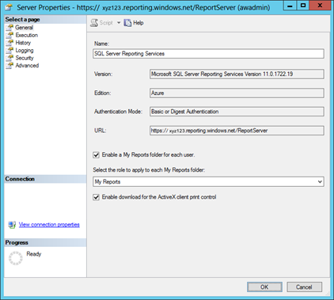
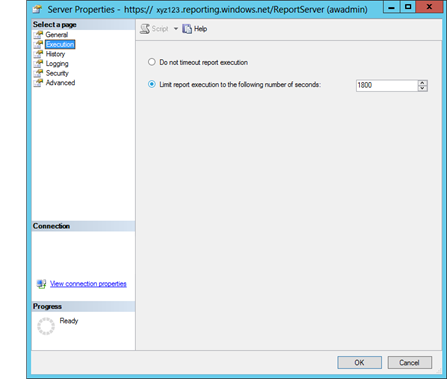

# 第四章报表管理

完成报表开发后，将报表部署到生产环境中，这意味着您将报表定义语言(RDL)文件复制到报表服务器中。此时，报告开发过程完成，报告管理过程开始。在 SQL Reporting 管理门户中，您可以通过查看执行日志或服务器使用统计信息来上传内容、管理共享数据源和监控 SQL Reporting 活动。

## 报告部署

部署是将文件从报表开发人员的计算机移动到 SQL Reporting server 的过程。通常，报表开发人员在 BIDS 或 SSDT 创建文件作为解决方案的一部分。一个解决方案可以包含一个或多个报表项目，每个项目可以包含一组文件，例如共享数据源、共享数据集、报表和报表部件。部署过程将这些文件复制到报表服务器数据库。同样，用户可以将在报表生成器中开发的报表保存到 SQL Reporting server。

有两种方法可以将报表和相关文件从 BIDS 或 SSDT 部署到报表服务器:

*   点击**建造**菜单上的**部署**。
*   在**解决方案资源管理器**中右键单击一个项目，然后在**上下文**菜单中单击**部署**。

无论哪种方式，当您在启动部署过程之前在**解决方案资源管理器**中选择项目时，项目中的所有报告、共享数据源、共享数据集和报告部分都将在您为具有内容管理器或发布者角色分配的用户提供凭据后进行部署。同样，您可以部署具有多个项目的解决方案，并为所有项目部署报告。在某些情况下，您可能更喜欢部署特定的报告或报告集。为此，请在**解决方案资源管理器**中单独选择一个或多个报告，并仅部署那些选定的报告。

您可以授予某些用户从报表生成器向 SQL Reporting server 添加内容的必要权限。当这些用户拥有服务器网址时，他们可以将报告保存到服务器。

|  | 注意:当您使用共享数据源部署或上载报表时，该数据源必须已经存在于 SQL Reporting 服务器上，以允许 SQL Reporting 将两个对象绑定在一起。否则，该过程将失败。 |

另一种选择是让用户以共同管理员的身份访问 SQL Reporting 管理门户，在那里他们可以使用 web 应用将报表直接上载到报表服务器。但是，该界面允许用户使用工具栏上的**上传**按钮一次上传一份报告。

## 重新部署

有时需要修改报告来解决测试期间的问题，或者适应不断变化的业务需求。在这种情况下，您需要编辑报告定义文件，然后重新部署报告，这可以使用本章前面部分中描述的任何方法来完成。然而，了解在重新部署期间发生了什么是很重要的。

假设您对计算机上的 RDL 进行了更改，并且 RDL 之前已经部署到了 SQL Reporting 服务器上。只要保留目标文件夹设置，部署过程就会用新的报表定义替换服务器上的原始报表定义。所有现有的报表属性都将保留，因此在重新部署报表时，没有必要更新数据源定义或安全权限。

## 数据源管理

将数据源部署到 SQL Reporting server 后，可以通过更改连接字符串或更改与数据源关联的凭据来对其进行更改。在 SQL Reporting 管理门户中，导航到包含数据源的文件夹，点击数据源链接，打开**编辑数据源**对话框，如图 39 所示。


图 39:SQL 报告服务器上的数据源设置

请注意**编辑数据源**对话框底部的**使用**连接选项。您可以选择**提示输入凭证**选项，在用户打开报表时提示用户输入凭证，而不是将凭证存储在报表服务器中。如果选择此选项，用户会看到以下提示消息:“输入用户名和密码以访问数据源。”如果您愿意，可以用自定义消息替换此提示。

## 执行日志

在 SQL Reporting 管理门户中，点击功能区中的**下载**，获取 CSV 格式的执行日志副本。您可以为要下载的数据提供开始日期和结束日期，以及存储数据的文件名。该文件包括以下信息:

*   **项目路径**。项目在 SQL Reporting 服务器上所处的文件夹层次结构。
*   **用户名**。执行报告的用户登录名。
*   **执行代码**。用户会话的唯一标识符。
*   **请求类型**。在 SQL Reporting 中，唯一有效的值是交互式。
*   **格式**。报表呈现的格式。
*   **参数**。报表执行的参数值。
*   **ItemAction** 。报表执行期间执行的操作:呈现、排序、书签导航、文档导航、获取文档映射、查找字符串、执行或呈现编辑。
*   **时间开始**。报告开始执行的日期和时间。
*   **时间结束**。报告执行结束的日期和时间。
*   **时间数据检索**。检索数据所需的毫秒数。
*   **时间处理**。处理报告所需的毫秒数。
*   **时间渲染**。呈现报表所需的毫秒数。
*   **来源**。报表执行的来源，如实时或会话，在此过程中会出现将报表导出为另一种格式的后续请求。
*   **状态**。成功的状态记录为 rsStatus。否则，将记录遇到的第一个错误代码。
*   **字节数**。呈现报表的字节大小。
*   **行数**。报表中所有数据集的总行数。
*   **附加信息**。包含有关报表执行的更多信息的 XML 片段。对于执行日志中的每个条目，此处存储的信息可能会有所不同。

**附加信息**值的示例如下:

```cs
    <AdditionalInfo>
      <ProcessingEngine>2</ProcessingEngine>
      <ScalabilityTime>
        <Pagination>0</Pagination>
        <Processing>0</Processing>
      </ScalabilityTime>
      <EstimatedMemoryUsageKB>
        <Pagination>3</Pagination>
        <Processing>19</Processing>
      </EstimatedMemoryUsageKB>
      <DataExtension>
        <SQLAZURE>1</SQLAZURE>
      </DataExtension>
      <Connections>
        <Connection>
          <ConnectionOpenTime>5</ConnectionOpenTime>
          <DataSets>
            <DataSet>
              <Name>DataSet1</Name>
              <RowsRead>18</RowsRead>
              <TotalTimeDataRetrieval>165</TotalTimeDataRetrieval>
              <ExecuteReaderTime>165</ExecuteReaderTime>
            </DataSet>
          </DataSets>
        </Connection>
      </Connections>
    </AdditionalInfo>

```

**附加信息**列可以包含以下值:

*   **加工引擎。**用于处理报告的引擎。值 2 表示较新的按需处理引擎(后 SQL Server 2005)。
*   **可扩展性时间**。缩放分页和处理组件的操作所需的毫秒数。如果该值为 0，则请求不会在内存压力下执行。
*   **estimatememoryusagekb**。分页和处理组件报告的估计峰值内存(以千字节为单位)。
*   **数据扩展**。报表中使用的每个数据扩展插件或数据源，包括每个数据源出现的次数。
*   **连接**。关于连接的信息的 XML 结构，包括数据源名称、连接持续时间、数据集名称、每个数据集检索的行数、每个数据集的总检索时间以及每个数据集的 *ExecuteReader* 时间。

## 服务器使用统计

要查看服务器使用统计数据，请单击 SQL Reporting 管理门户功能区中的**统计数据**。类似于图 40 所示的对话框显示了按小时使用的折线图。当您选择周视图或月视图时，图表还包括每小时最大使用量的数据。


图 40:服务器使用统计

## 报表服务器属性

您可以使用 SQL Server 管理工作室(SSMS)为您的 SQL Reporting server 配置一些无法在 SQL Reporting 管理门户中访问的属性。某些属性启用特定功能，例如**我的报告**。其他属性定义报表执行超时的全局值或报表可以累积的报表历史量。

打开 SSMS 时，在**连接服务器**对话框的**服务器类型**下拉列表中选择**报告服务**。如果 SSMS 已经打开，在**对象浏览器**窗口中点击**连接**，点击**报告服务**。在**服务器名称**文本框中，键入您的 SQL Reporting 服务器的网址，如 https://xyz123.reporting.windows.net/ReportServer.。在**身份验证**下拉列表中，选择**基本身份验证**，键入 SQL Reporting 管理员帐户的用户名和密码，然后单击**连接**。然后，报表服务器出现在**对象资源管理器**窗口中，如图 41 所示，有单独的文件夹可用于管理报表执行作业、安全性和共享计划。要访问报表服务器属性，右键单击树顶部的服务器节点，然后单击**属性**。


图 41:SSMS 对象资源管理器中的 SQL 报告服务器

|  | 注意:SSMS 的“服务器属性”对话框显示 SQL Server Reporting Services 的所有属性，无论该服务器是内部服务器还是由 Windows Azure 平台托管。但是，大多数属性仅适用于内部服务器。 |

### 一般属性

图 42 所示的**服务器属性**对话框的**常规**页面显示了 SQL Reporting 的当前版本和版本，以及网络服务的身份验证模式和网址。默认情况下，**我的报告**文件夹功能被禁用，但 **ActiveX 客户端**打印控件被启用。**我的报告**文件夹功能允许用户将报告保存到服务器上的个人文件夹中。在浏览器中查看报表时， **ActiveX 客户端**打印控件会在 **HTML 查看器**工具栏中添加一个按钮。**打印**按钮允许用户打印他们正在查看的报告，而无需先将报告下载到他们的计算机。



图 42:常规 SQL 报告服务器属性

要启用**我的报告**功能，请选中**为每个用户启用我的报告文件夹**复选框，然后在**选择要应用于每个我的报告文件夹的角色**下拉列表中选择一个安全角色，如**我的报告**。您选择的角色为用户提供了内容管理器角色的功能等效物，但仅适用于用户的**我的报告**文件夹，如[第 7 章报告访问](7.html#_Chapter_7_Report)所述。此权限允许用户在只有他们才能访问的文件夹中添加或删除内容。

您可以选择禁用 **ActiveX 客户端**打印控件。如果禁用打印控件，用户将无法从浏览器的报告页面打印报告。

### 执行属性

**服务器属性**对话框的**执行**页面允许您控制时间限制是否适用于服务器级别的报告执行。默认设置是将报告执行时间限制在 1800 秒，如图 43 所示。如果您预计某些报告需要较长的执行时间，您可以切换到**不超时报告执行**选项。报表可能会超时，因为查询执行需要很长时间，或者因为复杂的报表需要更长的处理和呈现时间。您可以编辑报表的数据集属性，仅在查询上设置超时。



图 43:常规 SQL 报告服务器属性