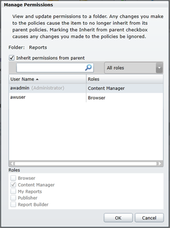
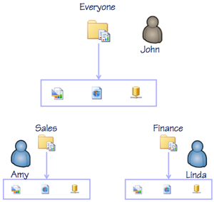

# 六、安全

另一个重要的管理任务是实现安全性。您必须将用户添加到 SQL Reporting server，并为每个用户分配一个角色。然后，您可以在文件夹级别或项目级别映射报表项目的角色，以控制每个用户可以看到和做什么。

## 基于角色的安全性

在允许用户访问 SQL Reporting 服务器之前，您应该清楚地了解 SQL Reporting 用来授权服务器上的用户活动的基于角色的安全模型。服务器上有两种类型的角色:

*   项目
*   系统

### 项目角色

您可以使用项目角色来定义权限，授予对上传到服务器的文件夹、报表和其他资源(如图像、共享数据集、报表部件和数据源)的访问权限。如果您保护一个文件夹，该文件夹中包含的任何内容自动具有相同的权限。但是，您可以通过分配不同的权限来覆盖继承的安全性并保护单个项目。

SQL 报告包括以下项目角色:

*   **内容管理器**。此角色拥有查看项目和执行与项目相关的管理任务的权限。如果用户也是订阅的共同管理员，此角色可以向 SQL Reporting server 添加项目并配置安全性。通常，您在服务器上设置有限数量的内容管理器。
*   **发布者**。此角色拥有查看项目和添加项目的权限。但是，该角色没有配置安全性的权限。您通常将此角色分配给报表开发人员。
*   **报表生成器**。此角色允许用户在报表生成器中打开 SQL Reporting server 上的报表来编辑报表。
*   **我的报告**。使用本地服务器上的此角色，用户有权将报表保存到报表服务器上的个人文件夹中。但是，在撰写本文时，我的报告功能在 SQL Reporting 中不可用。
*   **浏览器**。大多数报表读者被分配到浏览器角色。此角色只能查看一个项目。

|  | 注意:要向订阅添加联合管理员，请转到 Windows Azure 管理门户的“设置”页面，单击页面顶部的“管理员”链接，单击页面底部功能区上的“添加”，键入新管理员的电子邮件地址，然后选择订阅。 |

### 系统角色

您可以使用系统角色分配来使用户能够在报表服务器上执行管理任务。您可以将每个用户分配给以下角色之一:

*   **系统管理员**。分配给此角色的用户可以连接到 SQL Reporting 管理门户来执行管理任务。用户还可以连接到 SSMS 的 SQL Reporting 服务器，以查看和更新服务器属性。
*   **系统用户**。大多数用户都被分配到此角色。此角色的用户无法连接到 SQL Reporting 管理门户。

## 用户

设置完 SQL Reporting server 后，只有服务器管理员有权访问服务器的管理门户和部署报告。报告阅读器最初没有访问权限。您必须为每个报表读取器创建一个用户帐户，以授予对服务器的访问权限，并将用户分配给项目和系统角色。

在管理门户中，单击**管理**，然后在管理用户对话框中，单击**创建用户**。键入名称和密码，然后选择适用的角色。通常，您将报告阅读器分配给浏览器项目角色和系统用户系统角色，如图 49 所示。项目角色分配是用户的默认角色，您可以在 SQL Reporting server 上覆盖单个项目。

图 49:用户角色分配

## 报表服务器项目权限

用户的项目角色分配会自动应用于 SQL Reporting server 上的每个项目。也就是说，分配给浏览器角色的用户可以查看所有文件夹和每个文件夹的内容。但是，您可以在文件夹级别或项目级别覆盖这些角色分配。为此，请单击要在 SQL Reporting 管理文件夹中保护的项目旁边的箭头，然后选择“权限”。

默认情况下，从父级继承权限复选框被选中，如图 50 所示。在“管理权限”对话框中，您可以看到已经为当前项目分配了角色的用户列表和角色分配。要覆盖角色分配，请清除“从父角色继承权限”复选框(如有必要)，选择一个用户，然后选中新角色的复选框。

图 50:报告项目权限

您可以针对 SQL Reporting server 上的不同内容为用户分配不同的角色。例如，您可能已将所有用户分配给顶层文件夹中的浏览器角色。然后，您可以将销售部门和财务部门的用户分配到各自部门文件夹的浏览器角色。然后，对于每个文件夹，您可以为内容管理器角色分配不同的用户。例如，如图 51 所示，您可以将 John 指定为顶层文件夹的内容管理器，将 Amy 指定为 Sales 文件夹的内容管理器，将 Linda 指定为 Finance 文件夹的内容管理器。

图 51:报告项目和角色分配

|  | 注意:为数据源(或其父文件夹，如果它继承了安全性)分配了内容管理器角色的任何用户都可以查看它包含的连接字符串以及用于连接到 SQL 数据库的用户帐户。但是，密码不可见。尽管如此，您应该保护这些信息的安全。检查每个数据源的权限，并将内容管理器角色分配限制在尽可能少的人。 |