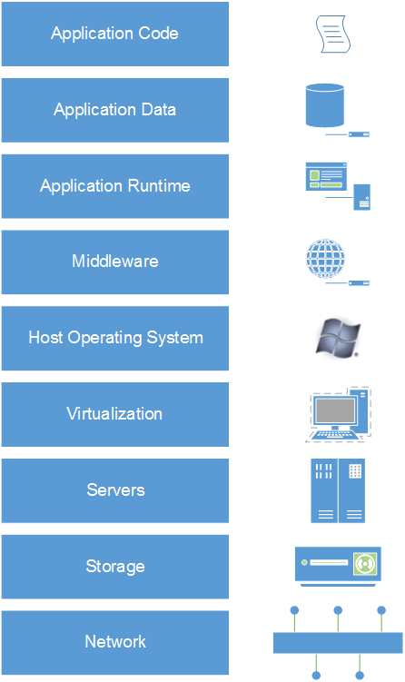
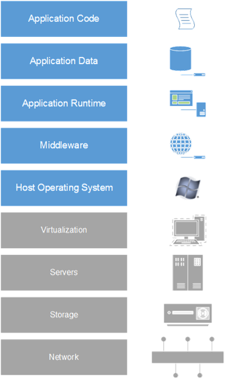
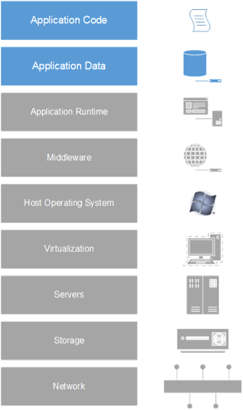

# 简介

## 云计算

如果你在过去几年里一直在开发软件、管理基础设施，甚至只是看电视，那么你已经被云计算淹没了。你也可能一直在挠头，试图弄清楚这一切意味着什么。似乎每个供应商对云计算的定义都略有不同，而且每个供应商的定义都是根据他们提供的产品和服务量身定制的。用最简单的话来说，云计算只是一个引人注目的名字，用来描述几十年来一直是应用开发的主要内容的网络分布式计算的概念(很像 21 世纪初谷歌推广“Ajax”这个术语，人们发现了一种新的范式)。

## 云计算的类型

大多数供应商确实同意大多数云计算应用可以放入的一组类别。这些类别基于应用的特性，最常见的是由分布在主机平台和客户之间的管理任务驱动的。这些类别(稍后将详细描述)包括基础架构即服务(IaaS)、平台即服务(PaaS)和软件即服务(SaaS)。出于讨论的目的，我们将从一个假设开始，即一个典型的企业应用在基础架构级别有以下一组关注点(如图 1 所示):

*   网络:包括交换机、路由器等物理设备以及子网的逻辑配置。许多应用开发人员通常认为解决方案的网络部分是理所当然的，但是没有多少代码可以克服配置不佳的网络对应用的稳定性和性能的破坏性影响。
*   存储:大多数软件应用及其支持的业务高度依赖于数据的存储，以确保数据安全，防止丢失和未经授权的泄露。存储层的管理任务包括配置存储设备以获得最佳吞吐量、监控设备故障、跟踪利用率以及确保备份计划存在并得到遵守。
*   服务器:虽然我管理网络的最早记忆包括墙对墙的塔式计算机，每台都有特殊功能，但现代数据中心的特点是物理机越来越少，越来越大，每台都托管着大量虚拟化服务器。这种模式比没有虚拟化的模式更容易管理，但它仍然带来了许多管理任务，例如监控服务器的硬件故障，确保设备有足够的电源可用，以及维护环境条件以实现硬件的最佳性能。
*   虚拟化:正如在讨论物理服务器时提到的，虚拟化是现代数据中心的常态。微软的 Hyper-V、VMware 的 vSphere 和 Citrix 的 ZenServer 等产品都允许您执行管理任务，例如管理物理资源在虚拟主机之间的分布、监控以优化硬件利用率，以及虚拟主机的配置和退役。
*   主机操作系统:虚拟化不会删除主机操作系统的管理任务。这些仍然需要针对性能、可用性和安全性进行适当配置。管理任务通常包括操作系统和安全软件(如防病毒和入侵检测)补丁的持续应用，以及虚拟化工具无法执行的任何特定于操作系统的监控任务。
*   中间件:中间件包括被用作构建应用的基础的软件，而不必重新发明特定应用中常见的功能——允许开发人员专注于他们的应用想要提供的特定价值。构建在微软堆栈上的应用使用的中间件的常见示例包括(但当然不限于)微软互联网信息服务(IIS)(以前的互联网信息服务器)来处理诸如管理 HTTP 请求的请求/响应之类的任务，微软 AppFabric 来提供分布式缓存，以及微软 SQL Server 来处理关系数据的存储和检索。每个中间件都有自己的一组配置和管理任务，这些任务因特定中间件的复杂性而异，从微软 AppFabric 的“置之不理”特性到数据库管理员为某些微软 SQL Server 实现提供的持续监控和调整。
*   应用运行时间:应用运行时间包括应用执行的容器。对于建立在微软栈上的网络应用，这个容器通常是运行 ASP.NET 网络表单或 ASP.NET MVC 的微软 ASP.NET。某些运行时配置参数(如分配给容器的处理和内存资源)是在主机级别管理的，而其他参数可供单个应用定制。
*   应用数据:应用数据通常是执行应用的有形产品。无论是记录跨国产品供应商的销售账单，还是在最新的泡泡应用热潮中获得高分，存储哪些数据以及如何使其与适用规则保持一致的管理通常由应用代码本身来执行。因此，不在存储层或中间件层执行的管理活动非常少。
*   应用代码:应用代码是在运行时执行的可执行代码，用于执行与实现应用目标直接相关的操作。这通常是应用的业务涉众最容易看到的应用堆栈层。在这个层上，可以找到解决与业务领域相关的问题的最具体的代码。我经常听到有人告诉同事和客户，开发人员应该致力于解决只有他们才能解决的问题。我的意思是，开发人员应该关注应用中最专注于解决特定业务问题的代码，而不是试图重新发明框架来解决公共框架或运行时已经解决的问题。

图 1:完整的应用堆栈

### 内部解决方案

内部解决方案是一个用来描述传统数据中心的术语，其中所有的基础架构和设备都由应用的所有者管理。它不是云计算模型，但包含在本讨论中，为何时不使用云计算建立基线。之所以包括它，也是因为某些场景将包括不在云环境中托管的资源。在这个模型中，图 1 中显示的所有方面都在应用所有者的控制和责任之下。如果管理得当，这通常会导致必须保留几个部门的专业人员来操作应用的各个部分，以及大量的持续资本支出。

### 基础设施即服务

基础架构即服务(IaaS)模型将应用堆栈上主机操作系统之下的所有内容视为主机或主机平台的责任，而将堆栈上主机操作系统及其之上的所有内容视为应用所有者的责任。这种安排(如图 2 所示)允许对应用及其主机操作系统的操作特性进行细粒度控制。它通常被视为公司实现虚拟数据中心的第一步，因为运行应用的虚拟化服务器通常可以转移到托管环境，而应用本身没有代码更改(并且只有必要的配置更改来反映应用有了新的家)。

从内部部署模式转向 IaaS 的组织通常会发现成本节约的形式是:不再需要为服务器供电和冷却，从而降低了公用事业成本；不再需要购买大型服务器，从而降低了资本设备成本；不再需要员工在数据中心执行管理服务器硬件的物理部分，从而降低了人员开支。

虽然使用 IaaS 可以节省大量成本，但组织仍然有能力和责任控制与应用代码或其数据没有直接关系的堆栈部分的配置和管理，即主机操作系统、中间件和应用运行时。这在某些情况下是有益的，因为它给了应用所有者额外的控制权。但是它也需要注意力和专门的技能，这使得当应用的需求有一些特殊之处，使得它不适合放弃对堆栈中这些部分的控制时，IaaS 选项是最合适的。

图 2: IaaS 堆栈

### 平台即服务

平台即服务(PaaS)模型进一步将必须由应用所有者管理的应用堆栈片段减少到只有应用数据和应用代码本身，如图 3 所示。在此模型中，应用所有者编写的代码旨在由服务提供商托管的应用运行时内运行，有时仅限于一组特定的应用编程接口(API)功能。这种模式在网络和基础设施的运营和管理方面需要的具体知识和技能要少得多，但会让一些应用所有者感到不安，因为他们无法获得或控制关键业务资产。缓解这种不安情绪的方法通常是，逐渐习惯这种模式，并找到一个可以信任的合作伙伴来保护这些资产，无论这种保护来自于他们保护安全的能力，还是来自于在妥协发生时提供充分救济的合同承诺。

图 3:平台即服务堆栈

### 软件即服务

软件即服务(SaaS)云计算模型将所有的配置和管理责任从应用所有者手中拿走(如图 4 所示)，并允许应用简单地按原样使用(尽管有时通过配置进行有限的定制)来满足特定的目标。这种模型通常被视为与通用软件一起使用，如电子邮件、文字处理和协作工具，以及跨行业使用的特定用途产品。SaaS 产品的一些例子包括微软的 Outlook.com 和 Office365 以及现成的 Salesforce.com(sales force 也有一个 PaaS 产品，允许您构建自己的定制应用)。

图 4: SaaS 堆栈

### 杂种

虽然我们已经将内部部署、IaaS、PaaS 和 SaaS 视为职责明确的不同模式(标志着组织参与的模式之间的区别)，但现实情况是，大多数组织要么已经确定了这些模式的某种组合方式，要么处于过渡状态——转向一种期望的未来状态，即一种模式，但仍保留其先前模式的一部分。这些组织将临时或永久地使用一个混合模型，该模型是两个或多个模型的某种组合。混合模型的一个例子是基于 IaaS 或 PaaS 模型构建的客户应用，它连接到对组织的业务目标至关重要但不能迁移到托管环境的内部大型机应用。

## 这本书是关于什么的

在本书中，我们将探讨微软以 Windows Azure 品牌共同营销的一套产品和服务，这些产品和服务旨在实现云计算。我们的主要关注点将是该套件的一个特定产品，称为 Windows Azure 网站，它提供了快速简单地托管适合许多人需求的数据驱动网站的工具，而无需额外的服务和复杂性。有时，我们还会超越 Windows Azure 网站的现成功能，关注 Windows Azure 产品的其他功能，以满足 Windows Azure 网站产品未涵盖的更高级的需求。

|  | 注意:Windows Azure 实现了一个现收现付的模式，所以在本书中，当描述导致额外成本的特性时，将会特别注意。对于任何基于云的产品，您都应该确保完全了解您正在使用的功能的成本。 |