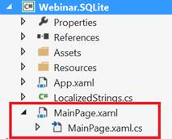
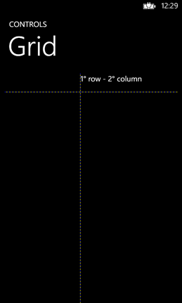
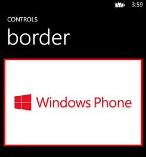
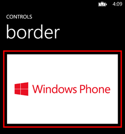
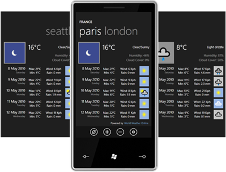
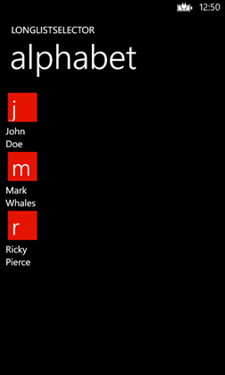
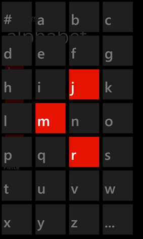

# 第 2 章用户界面:基本 XAML 概念

## 什么是 XAML？

XAML 是可扩展应用标记语言的缩写。这是一种基于 XML 的标记语言，其目的和理念与 HTML 非常相似。可以放在页面上的每个控件，无论是按钮、文本框还是自定义控件，都由特定的 XML 标记来标识。像 XML 一样，结构是分层的；您可以将标签放在其他标签中。例如，这种层次结构是您定义页面布局的方式，这要归功于一些充当其他控件容器的控件，如`Grid`或`StackPanel`。

以下是定义 Windows Phone 页面的 XAML 示例:

```cs
    <phone:PhoneApplicationPage
        x:Class="FirstApp.MainPage"

        xmlns:x="http://schemas.microsoft.com/winfx/2006/xaml"
        xmlns:phone="clr-namespace:Microsoft.Phone.Controls;assembly=Microsoft.Phone"
        xmlns:shell="clr-namespace:Microsoft.Phone.Shell;assembly=Microsoft.Phone"
        xmlns:d="http://schemas.microsoft.com/expression/blend/2008"
        xmlns:mc="http://schemas.openxmlformats.org/markup-compatibility/2006"
        mc:Ignorable="d"
        FontFamily="{StaticResource PhoneFontFamilyNormal}"
        FontSize="{StaticResource PhoneFontSizeNormal}"
        Foreground="{StaticResource PhoneForegroundBrush}"
        SupportedOrientations="Portrait" Orientation="Portrait"
        shell:SystemTray.IsVisible="True">

        <Grid x:Name="LayoutRoot" Background="Transparent">
           <Grid.RowDefinitions>
                <RowDefinition Height="Auto"/>
                <RowDefinition Height="*"/>
           </Grid.RowDefinitions>

           <Grid x:Name="ContentPanel" Grid.Row="1" Margin="12,0,12,0">
                <StackPanel>
                    <TextBlock Text="This is a page" />
                </StackPanel>
           </Grid>
        </Grid>
    </phone:PhoneApplicationPage>

```

`PhoneApplicationPage`是一个 Windows Phone 页面的基类。如您所见，每隔一个控件都放置在其中。还要注意`x:Class`属性；它标识哪个是连接到此页面的代码隐藏类。在这个示例中，能够与页面交互的代码将存储在名为`MainPage`的类中，该类是`FirstApp`命名空间的一部分。我们可以通过单击解决方案资源管理器中 XAML 文件附近的黑色箭头来查看这个类。你会看到另一个与 XAML 一号和**同名的文件。cs** 分机。



图 4:带有代码隐藏文件的页面的可视化表示

让我们开始分析这个简单的 XAML，介绍一些关键概念，比如名称空间和资源。

## 命名空间

您应该已经熟悉了名称空间；它们是一种通过为类分配逻辑路径来构造代码的方法。

默认情况下，Visual Studio 使用项目的相同文件夹结构分配命名空间。这意味着，例如，如果您有一个名为`MyClass`的类存储在**类**文件夹中的一个文件中，您的类的默认完整命名空间将是`Classes.MyClass`。

XAML 的名称空间工作方式完全相同。最终，XAML 控件是项目的一部分，所以你必须告诉页面在哪里可以找到它们。在标准页面中，您可以看到许多命名空间声明的示例:

```cs
    xmlns:phone="clr-namespace:Microsoft.Phone.Controls;assembly=Microsoft.Phone"

```

每个名称空间都以`xmlns`前缀开始，这是标准的 XML 名称空间，后跟一个自定义前缀(在本例中是`phone`)。这个前缀非常重要，因为我们将在页面的其余部分使用它来添加控件。然后，我们定义包含控件的完整命名空间。如果类是我们项目的一部分，只指定名称空间就足够了；否则，我们还需要定义哪个程序集(即 DLL 的名称)包含该类。

在前面的例子中，我们希望在我们的页面中包含在`Microsoft.Phone.Controls`命名空间中定义的控件和资源，该命名空间包含在**Microsoft.Phone.dll**库中。

`PhoneApplicationPage`类给出了一个如何使用命名空间的例子。由于`PhoneApplicationPage`类是`Microsoft.Phone.Controls`名称空间的一部分，我们必须在标签中添加前缀`phone`来使用它:

```cs
    <phone:PhoneApplicationPage />

```

理解名称空间在 XAML 是如何工作的非常重要，因为我们需要在每次使用第三方控件(我们自己创建的或外部库的一部分)或资源(如转换器)时声明它们。

## 属性和事件

每个控件都可以通过两种方式进行自定义:通过设置属性和操作。两者都由 XAML 标签的属性来标识，但是它们有两个不同的目的。

**属性**用于更改控件的外观或行为。通常，通过为特定属性赋值来简单地设置属性。例如，如果我们想为`TextBlock`控件的`Text`属性赋值，我们可以通过以下方式实现:

```cs
    <TextBlock Text="This is a text block" />

```

还有一种扩展语法，可以用于不能用普通字符串定义的复杂属性。例如，如果我们需要将图像设置为控件的背景，我们需要使用以下代码:

```cs
    <Grid>
        <Grid.Background>
           <ImageBrush ImageSource="/Assets/Background.png" />
        </Grid.Background>
    </Grid>

```

复杂的属性是通过使用嵌套的标签来设置的，标签的名称是控件的名称加上属性的名称，中间用一个点隔开(要设置`Grid`控件的`Background`属性，我们使用`Grid.Background`语法)。

每个控件共享的一个重要属性是`x:Name`，它是一个字符串，唯一标识页面中的控件。一个页面中不能有两个同名的控件。如果您需要与后面代码中的控件进行交互，设置此属性非常重要，您可以通过使用它的名称来引用它。

**事件**是管理用户与控件交互的一种方式。其中使用最多的是`Tap`，当用户点击控件时触发。

```cs
    <Button Tap="OnButtonClicked" />

```

当您定义一个动作时，Visual Studio 会自动提示您创建一个**事件处理程序**，它是事件被触发时执行的方法(在后面的代码中声明)。

```cs
    private void OnButtonClicked(object sender, GestureEventArgs e)
    {
        MessageBox.Show("Hello world");
    }

```

在前面的例子中，当按钮被按下时，我们向用户显示经典的“Hello world”消息。

## 资源

像在 HTML 中一样，我们能够定义可以在网站或页面的不同部分重用的 CSS 样式。XAML 引入了**资源**的概念，可以应用于应用程序中的不同控件。

基本上每个 XAML 控件都支持`Resources`标记:由于层次结构，每个其他嵌套控件都可以使用它。在现实世界中，定义资源有两个常见的地方:页面级和应用程序级。

**页面资源**在单个页面中定义，并且可用于该页面的所有控件。它们被放置在`PhoneApplicationPage`类的一个名为`Resources`的特定属性中。

```cs
    <phone:PhoneApplicationPage.Resources>
        <!-- you can place resources here -->
    </phone:PhoneApplicationPage.Resources>

```

**应用程序资源**是全局可用的，它们可以在应用程序的任何页面中使用。它们在 **App.xaml** 文件中定义，标准模板已经包含了所需的定义。

```cs
    <Application.Resources>
        <!-- here you can place global resources -->
    </Application.Resources>

```

每个资源都由使用`x:Key`属性分配的名称唯一标识。要将资源应用于控件，我们需要引入**标记扩展**的概念。这些是特殊的扩展，允许我们应用不同的行为，否则需要一些代码才能正常工作。在 XAML 世界中有许多标记扩展，应用一个资源所需要的被称为`StaticResource`。下面是一个如何使用它的例子:

```cs
    <TextBlock Text="MY APPLICATION" Style="{StaticResource PhoneTextNormalStyle}" />

```

在此示例中，资源通过在大括号内包含`StaticResource`关键字应用于`Style`属性，后跟资源名称，即`x:Key`属性的值。

如果你想更好地组织你的项目，也可以在一个名为`ResourceDictionary`的外部文件中定义资源。为此，在 Visual Studio 中右键单击您的项目，单击**添加** > **新项目**，并选择 **XML 文件**。给文件起一个以。xaml 扩展并包括以下定义:

```cs
    <ResourceDictionary

          xmlns:x="http://schemas.microsoft.com/winfx/2006/xaml">

        <!-- put resources here -->

    </ResourceDictionary>

```

现在您可以通过在 **App.xaml** 中声明它来将其添加到您的项目中:

```cs
    <Application.Resources>
        <ResourceDictionary>
           <ResourceDictionary.MergedDictionaries>
                <ResourceDictionary Source="Assets/Resources/Styles.xaml" />
           </ResourceDictionary.MergedDictionaries>
        </ResourceDictionary>
    </Application.Resources>

```

注意`MergedDictionaries`属性:所有的外部资源文件都要在这里声明。这样，它们将被自动合并，并且每个外部文件中声明的每个资源对每个页面都可用，就像它们是内联声明的一样。

现在让我们详细看看，哪些是最重要的可用资源。

### 风格

XAML 样式的工作方式与 CSS 样式相同:您可以在单个样式中一起定义不同属性的值，该样式可以应用于多个控件，以便它们都使用相同的布局。以下是样式定义的外观:

```cs
    <Style x:Key="CustomText" TargetType="TextBlock">
        <Setter Property="FontSize" Value="24" />
        <Setter Property="FontWeight" Value="Bold" />
    </Style>

```

样式由`Style`标签定义，标签有两个重要属性:`x:Key`是样式的名称，`TargetType`是适合该样式的控件类型。

在`Style`标签内，你可以放置任意数量的`Setter`标签。每一个都标识了要更改的控件属性。每个`Setter`标签需要两个属性:`Property`是您想要更改的控件属性，`Value`是您想要分配给该属性的值。

上例中定义的样式可以应用于任何`TextBlock`控件。其目的是将字体大小更改为 24，并对文本应用粗体样式。

还有一些特殊类型的风格叫做**含蓄风格**。它们的定义方式与前面示例中的样式相同，只是缺少`x:Key`属性。在这种情况下，根据定义样式的范围，样式会自动应用于符合`TargetType`属性值的每个控件。如果样式设置为页面资源，它将仅应用于页面的控件；如果样式设置为应用程序资源，它将应用于应用程序中的每个控件。

### 数据模板

数据模板是一种特殊类型的资源，可以应用于控件以定义其外观。数据模板通常与能够显示元素集合的控件一起使用，如`ListBox`或`LongListSelector`。

以下示例显示了一个数据模板:

```cs
    <DataTemplate x:Key="PeopleTemplate">
        <StackPanel>
           <TextBlock Text="Name" />
           <TextBlock Text="{Binding Path=Name}" />
           <TextBlock Text="Surname" />
           <TextBlock Text="{Binding Path=Surname}" />
        </StackPanel>
    </DataTemplate>

```

数据模板只包含将用于渲染特定项目的 XAML。例如，如果我们将此数据模板应用于`ListBox`控件的`ItemTemplate`属性，结果将是集合中的每个项目都重复定义的 XAML(目前，只需忽略`Binding`标记扩展；我们将在稍后讨论数据绑定时处理它)。

至于其他资源，可以使用`StaticResource`标记扩展将数据模板分配给属性。

```cs
    <ListBox ItemTemplate="{StaticResource PeopleTemplate}" />

```

## 动画

XAML 是一种强大的语言，因为它允许我们不仅仅是创建应用程序的布局。最有趣的功能之一是动画功能，可以使用`Storyboard`控件创建。

`Storyboard`控件可用于定义不同类型的动画:

*   `DoubleAnimation`，可用于更改属性的数值(例如，`Width`或`FontSize`)。
*   `ColorAnimation`，可用于与定义颜色的属性交互(就像在`SolidColorBrush`内部)。
*   `PointAnimation`，可应用于定义点坐标的属性。

以下示例代码定义了一个动画:

```cs
    <Storyboard x:Name="Animation">
        <DoubleAnimation Storyboard.TargetName="RectangleElement"
                         Storyboard.TargetProperty="Width"
                         From="200"
                         To="400"
                         Duration="00:00:04" />
    </Storyboard>

```

前两个属性继承自`Storyboard`控件:`Storyboard.TargetName`用于设置我们要制作动画的控件的名称，而`Storyboard.TargetProperty`是我们要在动画期间更改其值的属性。

接下来，我们定义动画的行为:初始值(T0)属性、结束值(T1)属性和持续时间(T2)属性。上一个示例中定义的行为通过在 4 秒钟内将其宽度从 200 增加到 400 来激活`Rectangle`控件。

我们还可以通过使用适用于每种动画类型的`UsingKeyFrames`变体来更深入地控制动画:

```cs
    <Storyboard x:Name="Animation">
        <DoubleAnimationUsingKeyFrames Storyboard.TargetName="RectangleElement"
                                      Storyboard.TargetProperty="Width">
           <LinearDoubleKeyFrame KeyTime="00:00:00" Value="200" />
           <LinearDoubleKeyFrame KeyTime="00:00:02" Value="250" />
           <LinearDoubleKeyFrame KeyTime="00:00:04" Value="500" />
        </DoubleAnimationUsingKeyFrames>
    </Storyboard>

```

这样你就能控制动画的时间。在前面的示例中，动画的类型是相同的(它是一个`DoubleAnimation`，但是我们能够为一个特定的时间设置，这是使用`LinearDoubleKeyFrame`标签应用的值。

在上一个示例中，`Rectangle`控件的`Width`在开始时被设置为 200。然后，两秒钟后，它增加到 250，四秒钟后，它被设置为 500。

### 放松动画

创建动画的另一种方法是使用数学公式，这些公式能够将逼真的行为应用于对象，如弹跳或加速和减速。您可以通过使用关键帧来获得相同的结果，但是这需要大量的工作。因此，动画框架提供了一组预定义的轻松功能，可以轻松应用于动画。

要添加放松功能，只需设置动画的`EasingFunction`属性，如下例所示:

```cs
    <Storyboard x:Name="EasingAnimation">
        <PointAnimation From="0,0" To="0, 200" Duration="00:00:3"
                                       Storyboard.TargetName="Circle"
                                       Storyboard.TargetProperty="Center">
           <PointAnimation.EasingFunction>
                <BounceEase Bounces="2" EasingMode="EaseOut" />
           </PointAnimation.EasingFunction>
        </PointAnimation>
    </Storyboard>

```

定义了常规动画(在本例中，它是一个将`Ellipse`对象从坐标(0，0)移动到(0，200)的`PointAnimation`)后，您可以使用可用的放松功能之一设置`EasingFunction`属性。此示例显示了如何使用`BounceEase`功能，该功能可用于对对象应用反弹效果(执行的反弹次数由`Bounces`属性指定)。

其他可用的放松功能有:

*   `BackEase`，在动画开始前稍微收缩动画的运动。
*   `CircleEase`，对加速动画应用循环函数。
*   `ElasticEase`，这将创建一个类似于摆动弹簧的动画。

[MSDN 官方文档](http://msdn.microsoft.com/en-us/library/cc189019(v=vs.95).aspx#easing_functions)提供了可用放松功能的完整列表。

### 如何控制动画

动画被视为资源。它们可以被定义为本地资源、页面资源或应用程序资源。与传统资源不同，`Storyboard`控件由`x:Name`属性标识，就像常规控件一样。

以下示例显示了设置为页面资源的动画:

```cs
    <phone:PhoneApplicationPage.Resources>
        <Storyboard x:Name="Animation">
           <DoubleAnimation Storyboard.TargetName="RectangleElement"
                       Storyboard.TargetProperty="Width"
                       From="200"
                       To="400"
                       Duration="00:00:04" />
        </Storyboard>
    </phone:PhoneApplicationPage.Resources>

```

由于唯一的标识符，您将能够控制后面代码中的动画。每一个`Storyboard`物体都提供了很多控制它的方法，比如`Begin()`、`Stop()`或者`Resume()`。在下面的代码中，您可以看到分配给两个按钮的事件处理程序，这两个按钮用于启动和停止动画:

```cs
    private void OnStartClicked(object sender, GestureEventArgs e)
    {
        Animation.Begin();
    }

    private void OnStopClicked(object sender, GestureEventArgs e)
    {
        Animation.Stop();
    }

```

## 数据绑定

数据绑定是 XAML 提供的最强大的功能之一。通过数据绑定，您将能够在 UI 元素和各种数据源之间创建一个通信通道，这些数据源可以是另一个控件或您的某个类中的属性。此外，数据绑定与 XAML 通知系统(我们将在后面详细介绍)紧密相连，因此每当您更改对象中的某些内容时，显示它的控件都会自动更新以反映更改并显示新值。

当您使用数据绑定创建通信通道时，您定义了一个**源**(包含要显示的数据)和一个**目标**(负责显示值)。默认情况下，绑定通道设置为`OneWay`模式。这意味着当**源**改变**、**时，**目标**会更新显示新值，反之则不会。如果我们需要创建一个双向通信通道(例如，因为目标是一个`TextBox`控件，我们需要截取用户插入的一个新值)，我们可以将绑定的`Mode`属性设置为`TwoWay`。

```cs
    <TextBox Text="{Binding Path=Name, Mode=TwoWay}" />

```

几乎 XAML 的每个控件都可以参与数据绑定。事实上，控件的大多数可用属性都是**依赖属性**。除了提供基本的读写能力之外，这些都是支持通知的特殊属性，因此它们可以通知通道的另一端发生了变化。

以下示例显示了如何使用数据绑定在两个 XAML 控件之间创建通道:

```cs
    <StackPanel>
        <Slider x:Name="Volume" />
        <TextBlock x:Name="SliderValue" Text="{Binding ElementName=Volume, Path=Value}" />
    </StackPanel>

```

首先要注意的是，要应用绑定，我们需要使用另一个**标记扩展**，叫做`Binding`。通过这个表达式，我们将一个名为`TextBlock`的控件(目标)的`Text`属性连接到一个名为`Volume`的`Slider`控件(源)的`Value`属性。

由于`Text`和`Value`都是从属属性，每次移动滑块时，所选值都会自动显示在`TextBlock`控件的屏幕上。

### 与对象的数据绑定

最强大的数据绑定功能之一是能够将控件与作为代码一部分的对象连接起来。但是，首先需要引入`DataContext`概念。`DataContext`是一个几乎每个控件都可以使用的属性，可以用来定义它的绑定上下文，每个嵌套控件也会自动继承这个绑定上下文。当您将一个对象定义为`DataContext`时，该控件及其所有子控件将有权访问其所有属性。

让我们看一个例子，它将帮助你更好地理解它是如何工作的。假设你有一个代表一个人的类:

```cs
    public class Person
    {
        public string Name { get; set; }
        public string Surname { get; set; }
    }

```

我们的目标是显示使用此类的人的信息。下面是我们如何使用数据绑定做到这一点。首先，让我们看看后面的代码:

```cs
    public MainPage()
    {
        InitializeComponent();
        Person person = new Person();
        person.Name = "Matteo";
        person.Surname = "Pagani";
        Author.DataContext = person;
    }

```

当页面初始化时，我们创建一个新的`Person`对象，并为`Name`和`Surname`属性设置一个值。然后，我们将这个新对象设置为`Author`控件的`DataContext`。让我们看看 XAML 页面中的`Author`控件以及`Name`和`Surname`属性的显示方式:

```cs
    <StackPanel x:Name="Author">
        <TextBlock Text="Name" />
        <TextBlock Text="{Binding Path=Name}" />
        <TextBlock Text="Surname" />
        <TextBlock Text="{Binding Path=Surname}" />
    </StackPanel>

```

`Author`是分配给`StackPanel`控件的名称，这是我们放置在不同`TextBlock`控件中的容器。在前面的示例中，我们可以再次看到`Binding`标记扩展在运行，这次使用了不同的属性:`Path`。我们用它来告诉 XAML 显示当前`DataContext`的哪个属性。由于`DataContext`是从`StackPanel`控件继承而来的，所以每个`TextBlock`都可以访问我们在后面的代码中创建的`Person`对象的属性。注意`Path`属性是可选的。以下两种说法完全相同:

```cs
    <TextBlock Text="{Binding Path=Name}" />
    <TextBlock Text="{Binding Name}" />

```

### INotifyPropertyChanged 接口

之前的代码有一个缺陷。一切正常，但如果在执行过程中更改`Name`或`Surname`属性之一的值，用户界面将不会更新以显示新值。原因是`Name`和`Surname`是简单的属性，所以它们不能像依赖属性那样通知用户界面有什么变化。对于这个场景，XAML 框架引入了`INotifyPropertyChanged`接口，可以由需要满足这个通知要求的对象来实现。下面是如何改变`Person`类来实现这个接口:

```cs
    public class Person: INotifyPropertyChanged
    {
        private string _name;
        private string _surname;

        public string Name
        {
           get { return _name; }
           set
            {
                _name = value;
                OnPropertyChanged();
            }
        }

        public string Surname
        {
           get { return _surname; }
           set
            {
                _surname = value;
                OnPropertyChanged();
            }
        }

        public event PropertyChangedEventHandler PropertyChanged;

        protected virtual void OnPropertyChanged([CallerMemberName] string propertyName = null)
        {
           PropertyChangedEventHandler handler = PropertyChanged;
           if (handler != null) handler(this, new PropertyChangedEventArgs(propertyName));
        }
    }

```

该类现在实现了`INotifyPropertyChanged`接口，允许我们支持一个事件处理程序(称为`PropertyChangedEventHandler`)，每当属性的值发生变化时就会触发该事件处理程序。该类还实现了一个名为`OnPropertyChanged()`的方法，该方法充当事件处理程序的包装器，需要在属性更改时调用。

我们也需要改变我们的财产。每次调用属性集(意味着已经分配了一个新值)时，我们都会引发`OnPropertyChanged()`方法。结果是，与属性绑定的每个控件都将收到更改通知，并将相应地更新其可视状态。

### 数据绑定和收集

当您必须处理像数组或列表这样的对象集合时，数据绑定尤其有用(基本上，每个框架的集合类型都实现了`IEnumerable`接口)。几乎每一个支持集合的控件，继承自`ItemsControl`类(如`ListBox`或`LongListSelector`，都有一个名为`ItemsSource`的属性，可以直接分配给一个列表。

您可以使用`ItemTemplate`属性控制集合中每个对象的渲染方式。正如我们在讨论数据模板时看到的，这个属性允许我们设置使用哪个 XAML 来显示对象。

既然我们已经讨论了数据绑定，还有另一个重要的补充。在我们用来显示数据模板的示例代码中，我们包含了一些绑定表达式来显示一个人的姓名。

```cs
    <DataTemplate x:Key="PeopleTemplate">
        <StackPanel>
           <TextBlock Text="Name" />
           <TextBlock Text="{Binding Path=Name}" />
           <TextBlock Text="Surname" />
           <TextBlock Text="{Binding Path=Surname}" />
        </StackPanel>
    </DataTemplate>

```

当您将一个集合设置为`ItemSource`时，该集合中的每个对象都将成为`ItemTemplate`的`DataContext`。例如，如果`ListBox`的`ItemsSource`属性连接到类型为`List<Person>`的集合，则包含在`ItemTemplate`中的控件将能够访问`Person`类的所有属性。

这就是前面示例代码的真正含义:对于集合中的每个`Person`对象，我们将显示`Name`和`Surname`属性的值。

当你处理收藏时，另一个重要的难题是`ObservableCollection<T>`类。它就像一个常规集合，因此您可以轻松地添加、移除和移动对象。在引擎盖下，它实现了`INotifyPropertyChanged`界面，这样每次集合变更时，UI 都会收到通知。这样，每次我们操作集合时(例如，我们添加一个新项)，连接到它的控件将自动更新以反映更改。

## 转换器

转换器在数据绑定中起着重要的作用。事实上，有时您需要在源数据发送到目标之前对其进行修改。一个常见的例子是当你必须处理`DateTime`属性时。`DateTime`类包含日期的完整表示，包括小时、分钟、秒和毫秒。然而，大多数情况下，您不需要显示完整的表示，通常日期就足够了。

这就是转换器派上用场的地方。在将数据发送到将使用数据绑定显示数据的控件之前，您可以更改数据(或者，如以下示例所示，应用不同的格式)。

要创建一个转换器，你需要在你的项目中添加一个新的类(在 Visual Studio 中右击，选择**添加** > **类**，它必须从`IValueConverter`界面继承。以下是转换器示例:

```cs
    public class DateTimeConverter : IValueConverter
    {
        public object Convert(object value, Type targetType, object parameter, CultureInfo culture)
        {
           if (value != null)
            {
                DateTime date = (DateTime)value;
                return date.ToShortDateString();
            }
           return string.Empty;
        }

        public object ConvertBack(object value, Type targetType, object parameter, CultureInfo culture)
        {
           if (value != null)
            {
                DateTime date = DateTime.Parse(value.ToString());
                return date;
            }
           return DateTime.Now;
        }
    }

```

当您支持`IValueConverter`界面时，您被迫实现两种方法:

*   `Convert()`是当数据从源发送到目标时调用的方法。
*   `ConvertBack()`则相反——当数据从目标发送回源时调用。

很多时候实现每个绑定都支持的`Convert()`方法就足够了。相反，`ConvertBack()`方法仅在您有`TwoWay`绑定时受支持。

这两种方法都接收一些重要信息作为输入参数:

*   从绑定源返回的值(这是您需要操作的值)。
*   已应用绑定的属性。
*   可以在 XAML 使用`ConverterParameter`属性设置的可选参数。此参数可用于在转换器逻辑中应用不同的行为。
*   当前的文化。

前面的代码示例显示了前面提到的`DateTime`示例。在`Convert()`方法中，我们得到原始值，在我们将它转换成一个`DateTime`对象之后，我们返回一个带有短格式的字符串。

在`ConvertBack()`方法中，我们获取从控件返回的字符串，并将其转换为`DateTime`对象，然后将其发送回代码。

转换器被视为资源，您需要声明它们，并使用`StaticResource`关键字将它们包含在绑定表达式中。

```cs
    <phone:PhoneApplicationPage.Resources>
        <converters:DateTimeConverter x:Key="DateConverter" />
    </phone:PhoneApplicationPage.Resources>
    <TextBlock Text="{Binding Path=BirthDate, Converter={StaticResource DateConverter}}" />

```

需要强调的是，如果转换器使用过多，会对性能产生负面影响，因为每次数据更改时都需要重新应用绑定操作。在这种情况下，最好找到一种直接修改源数据的方法，或者用修改后的值在类中添加一个新属性。

## 控制

Windows Phone 8 SDK 包括许多内置控件，可用于定义应用程序的用户界面。控件太多了，在这本书里几乎不可能分析所有的控件，所以我们将仔细看看最重要的控件。

### 布局控件

有些控件只是充当其他控件的容器，并定义页面的布局。让我们讨论最重要的。

#### StackPanel

`StackPanel`控件可用于简单地将嵌套控件一个接一个地对齐。它能够自动适应子控件的大小。

```cs
    <StackPanel>
        <TextBlock Text="First text" />
        <TextBlock Text="Second text" />
    </StackPanel>

```

通过将`Orientation`属性设置为`Horizontal`，也可以使用`StackPanel`控件水平对齐控件，一个接一个。

```cs
    <StackPanel Orientation="Horizontal">
        <TextBlock Text="First text" />
        <TextBlock Text="Second text" />
    </StackPanel>

```


图 5:堆栈面板控件

#### 格子

`Grid`控件可用于创建表格布局，该布局可填充整个父容器的大小。它支持可以放置不同控件的行和列。下面的代码示例演示了它的用法:

```cs
    <Grid>
        <Grid.RowDefinitions>
            <RowDefinition Height="50" />
           <RowDefinition MaxHeight="100" />
        </Grid.RowDefinitions>
        <Grid.ColumnDefinitions>
           <ColumnDefinition Width="200" />
           <ColumnDefinition Width="*" />
        </Grid.ColumnDefinitions>
        <TextBlock Text="1° row - 2° column" Grid.Row="0" Grid.Column="1" />
    </Grid>

```

您可以使用`RowDefinitions`和`ColumnDefinitions`属性定义网格布局。您可以为表格的每一行添加一个`RowDefinition`标签，而`ColumnDefinition`标签可用于设置列数。对于每一行和每一列，您可以设置宽度和高度，或者您可以简单地省略它们，以便它们自动适应嵌套控件。

为了定义控件在网格中的位置，我们将使用两个附加属性，它们是从`Grid`控件继承的特殊依赖属性，可以用于每个控件。使用`Grid.Row`属性，我们可以设置行的编号，使用`Grid.Column`属性，我们可以设置列的编号。

前面的示例代码用于在网格第一行第二列的单元格中显示一个`TextBlock`，如下图所示:



图 6:网格控件

#### 滚动查看器

`ScrollViewer`控件是一个容器，但它没有定义布局。如果你想排列嵌套控件，你仍然需要使用另一个容器，比如`StackPanel`或者`Grid`。此控件的目的是创建一个大于屏幕大小的布局。这样，用户将能够向下滚动以查看用户界面的其余部分。

例如，当您必须显示不适合页面大小的文本时，此控件非常有用。

```cs
    <ScrollViewer>
        <StackPanel>
           <TextBlock TextWrapping="Wrap" Text="This can be long text" />
        </StackPanel>
    </ScrollViewer>

```

#### 边境

`Border`控件的目的是显示边框。这很有用，因为它能够包含将被包装到边框中的子控件。

以下示例显示了如何将图像环绕在红色边框内:

```cs
    <Border BorderThickness="5" BorderBrush="Red">
        <Image Source="/Assets/windows-phone-8-logo.png"/>
    </Border>

```



图 7:用于嵌入图像的边框控件

`Border`控件有一些关键属性。第一个是`BorderThickness`，指定边框的粗细。您可以指定一个值，就像我们在前面的示例中所做的那样。在这种情况下，相同的厚度适用于每一侧。您也可以指定多个值，为每个边框赋予不同的大小，如下例所示:

```cs
    <Border BorderThickness="5, 10, 15, 20" BorderBrush="Red">
        <Image Source="/Assets/windows-phone-8-logo.png"/>
    </Border>

```


图 8:不同边框厚度的边框控件

第二个重要属性是`BorderBrush`，用于设置应用于边框的画笔。它可以使用任何可用的 XAML 画笔。默认情况下，它接受一个`SolidColorBrush`，所以您可以简单地指定您想要应用的颜色。

另一个有用的属性是`Padding`，可以用来指定边框与子控件之间的距离，如下例所示:

```cs
    <Border BorderThickness="5" BorderBrush="Red" Padding="10">
        <Image Source="/Assets/windows-phone-8-logo.png"/>
    </Border>

```



图 9:带填充的边框控件

### 输出控制

这些控件的目的是向用户显示一些东西，如文本、图像等。

#### 文本块

`TextBlock`是基本的 XAML 控件之一，用于在屏幕上显示文本。它最重要的属性是`Text`，当然，它包含要显示的文本。您可以选择许多属性来修改文本的外观，如`FontSize`、`FontWeight`和`FontStyle`，如果文本太长，您可以通过将`TextWrapping`属性设置为`true`来自动将文本换行。

```cs
    <TextBlock Text="This is long and bold text" TextWrapping="Wrap" FontWeight="Bold" />

```

您也可以通过使用`Run`标记对文本应用不同的格式，而无需使用多个`TextBlock`控件，该标记可用于拆分文本，如下例所示:

```cs
    <TextBlock>
        <Run Text="Standard text" />
        <LineBreak />
        <Run Text="Bold test" FontWeight="Bold" />
    </TextBlock>

```

#### RichTextBlock

`RichTextBlock`控件类似于`TextBlock`，但它提供了对可应用于文本的格式样式的更多控制。像 HTML 提供的一样，您可以定义段落、应用不同的文本样式等等。

```cs
    <RichTextBox>
        <Paragraph>
           <Bold>This is a paragraph in bold</Bold>
        </Paragraph>
        <Paragraph>
           <Italic>This is a paragraph in italics</Italic>
           <LineBreak />
        </Paragraph>
    </RichTextBox>

```

#### 图像

`Image`控件可用于显示图像。您可以使用远程路径(发布在互联网上的图像的网址)或本地路径(属于 Visual Studio 项目的文件)来设置`Source`属性。您不能分配指向存储在应用程序本地存储中的图像的路径。我们将在[第 4 章](04.html#_Chapter_4_Data)中看到如何管理这个限制。

```cs
    <Image Source="http://www.syncfusion.com/Content/en-US/Hoimg/syncfusion-logo.png" />

```

您还可以通过使用`Stretch`属性来控制如何调整图像以填充控件的大小，该属性可以具有以下值:

*   `Uniform`:默认值。调整图像大小以适合容器，同时保持原始纵横比，这样图像看起来就不会失真。如果容器的纵横比与图像的不同，图像看起来会比可用空间小。
*   `Fill`:调整图像大小以适合容器，忽略纵横比。它将填满所有可用的空间，但是如果控件的大小与图像的纵横比不同，它将看起来失真。
*   `UniformToFill`是之前值的混合。如果图像的宽高比与容器不同，则会对图像进行剪裁，使其保持正确的宽高比，同时填满所有可用空间。
*   `None`:图像以原始尺寸显示。

### 输入控件

这些控件用于获取用户的输入。

#### 文本框

`TextBox`是另一个基本的 XAML 控件，它只是从用户那里收集文本的一种方式。输入的文本将存储在控件的`Text`属性中。当用户点击`TextBox`控件时，虚拟键盘会自动打开。作为开发人员，您可以根据正在收集的数据类型来控制显示的键盘类型。

例如，如果用户只需要输入一个数字，就可以显示一个数字键盘；或者，如果您正在收集电子邮件地址，您可以使用电子邮件键盘(它可以轻松访问@)等符号。

您可以使用`InputScope`属性控制键盘的类型。支持的值列表非常长，可以在 [MSDN 文档](http://msdn.microsoft.com/en-us/library/windowsphone/develop/hh393998(v=vs.105).aspx)中找到。一些最常用的是:

*   `Text`用于支持字典的通用文本输入。
*   `Number`为通用号码输入。
*   `TelephoneNumber`为特定的电话号码输入(这是在原生 phone 应用程序中编写号码时显示的同一个键盘)。
*   `EmailNameOrAddress`增加了对@等符号的快速访问。
*   `Url`增加了对常见域的快速访问，如。com 或。它(取决于键盘的语言)。
*   `Search`提供自动建议。

```cs
    <TextBox InputScope="TelephoneNumber" />

```

|  | 提示:如果文本框控件用于收集通用文本，请始终记住将输入范围属性设置为文本。这样，用户将获得自动完成和自动更正工具的支持。 |


图 10:从左到右:文本、电子邮件名称或地址和电话号码输入范围

#### 密码箱

`PasswordBox`的工作原理与`TextBox`控件完全一样，只是插入的字符会自动转换成点，这样用户附近的人就看不到文本了。顾名思义，该控件通常用于收集密码。

### 主题资源

开发人员的目标之一应该是使他或她的应用程序的用户界面尽可能与操作系统提供的指导方针保持一致。为了帮助实现这一目标，SDK 提供了许多现成的资源，这些资源可以应用于控件，以获得与本机应用程序相同的外观和感觉。这些样式通常与`TextBox`、`TextBlock`或`RadioButton`等控件一起使用，它们提供了一套标准的视觉特征(如字体大小、颜色、不透明度等)。)与其他应用程序一致。

使用主题资源的另一个很好的理由是他们知道用户设置的主题。例如，如果您想给控件赋予与手机强调色相同的颜色，可以使用`PhoneAccentBrush`样式。

许多主题资源被分成不同的类别，如画笔资源、颜色资源、字体名称和样式以及文本资源。您可以在 MSDN 文档中找到可用样式[的完整列表。它们只需使用每个控件提供的`Style`属性来应用，如下例所示:](http://msdn.microsoft.com/en-us/library/windowsphone/develop/ff769552(v=vs.105).aspx)

```cs
    <TextBlock Text="App name" Style="{StaticResource PhoneTextNormalStyle}" />

```

### 与用户互动

在这个类别中，我们可以收集所有我们可以用来与用户交互的控件，如`Button`、`CheckBox`或`RadioButton`。

要显示的文本由`Content`属性设置，如下例所示:

```cs
    <Button Content="Tap me" Tap="OnClickMeClicked" />

```

`Content`属性也可以很复杂，这样就可以添加其他 XAML 控件。在下面的示例中，我们可以看到如何在按钮中插入图像:

```cs
    <Button Tap="OnClickMeClicked">
        <Button.Content>
           <StackPanel>
                <Image Source="/Assets/logo.png" Height="200" />
           </StackPanel>
        </Button.Content>
    </Button>

```

这些控件提供了许多与用户交互的方式。最常见的事件是`Click`、`Tap`和`DoubleTap`。

|  | 注意:单击和点击是同一个事件，它们都是在用户按下控件时触发的。Windows Phone 7.5 中引入了 Tap，以与触控界面更加一致，但为了避免破坏旧应用，仍然支持 Click 事件。 |

### Windows Phone 签名控件

到目前为止，我们看到的大多数控件都是 XAML 框架的一部分，并且可以在其他基于 XAML 的技术上使用，比如 Silverlight、WPF 和 Windows Store 应用程序。

但是，有些控件仅在 Windows Phone 平台上可用，因为它们是针对移动体验的。让我们看看他们。

#### 全景画

`Panorama`控件通常用于 Windows Phone 应用程序，因为它通常被视为起点。该控件之所以得名，是因为一个过大的图像被用作页面的背景。用户可以向左或向右滑动以查看其他可用页面。由于图像比页面大，手机会应用视差效果，让用户在视觉上感到愉悦。

`Panorama`控件的另一个主要特点是，用户可以偷看下一页。当前页面没有占据所有可用空间，因为下一页的一瞥显示在右边。

`Panorama`控件通常用于提供应用程序中可用内容的概述。这是一个起点，不是一个数据容器。例如，使用全景页面显示博客上发布的所有新闻是不合适的。相反，最好只显示最新的新闻项目，并提供一个按钮将用户重定向到另一个页面，在那里他们将能够看到所有的新闻项目。

从开发人员的角度来看，`Panorama`控件由不同的页面组成:每个页面都是包含页面布局的`PanoramaItem`控件。

`Panorama`可以有一个通用的标题，比如应用程序的标题(分配给`Title`属性)，而每个页面可以有自己的特定标题(分配给`Header`属性)。

```cs
    <phone:Panorama Title="Panorama">
        <phone:PanoramaItem Header="First page">
           <StackPanel>
                <TextBlock Text="Page 1" />
           </StackPanel>
        </phone:PanoramaItem>
        <phone:PanoramaItem Header="Second page">
           <StackPanel>
                <TextBlock Text="Page 2" />
           </StackPanel>
        </phone:PanoramaItem>
    </phone:Panorama>

```

|  | 注意:默认情况下，全景控件(如透视控件)在页面中不可用。您必须声明以下命名空间:`xmlns` `:` `phone` `="clr-namespace:Microsoft.Phone.Controls;assembly=Microsoft.Phone"` |

#### 在枢轴上转动

从技术和用户交互的角度来看，`Pivot`控件的工作方式类似于`Panorama`控件——用户可以向左或向右滑动屏幕来查看其他页面。从用户的角度来看，不同之处在于视图适合屏幕大小。用户可以看到下一个页面，因为它的标题以灰色显示在当前页面标题的旁边。



图 11:枢轴控件

然而，`Pivot`控件用于`Panorama`控件不共享的目的:

*   显示应用于不同上下文的一种信息。上图就是一个很好的例子。每一页上的信息都是一样的(天气预报)，但在不同的上下文中被引用(城市)。
*   显示引用同一上下文的不同类型的信息。Windows Phone 上的“人员中心”中的联系人详细信息页面就是一个很好的例子——您有很多信息(联系人的详细信息、社交网络更新、对话等)。)，但都属于同一个上下文(联系人)。

正如之前预期的那样，用于`Pivot`控制的 XAML 就像用于`Panorama`控制的 XAML 一样工作。主控件叫做`Pivot`，而表示页面的嵌套控件叫做`PivotItem`。

```cs
    <phone:Pivot Title="Pivot">
        <phone:PivotItem Header="First page">
           <StackPanel>
                <TextBlock Text="Page 1" />
           </StackPanel>
        </phone:PivotItem>
        <phone:PivotItem Header="Second page">
           <StackPanel>
                <TextBlock Text="Page 2"/>
           </StackPanel>
        </phone:PivotItem>
    </phone:Pivot>

```

#### 应用程序栏

`ApplicationBar`是放置在页面底部的控件，用于快速访问连接到当前视图的功能。

您可以向应用程序栏添加两种元素类型:

*   **图标**始终显示(除非`ApplicationBar`最小化)，一次最多可以显示四个。
*   **菜单项**只是仅在应用程序栏打开时显示的文本项。可以包含的项目数量没有限制。


图 12:一个打开的应用程序栏

`ApplicationBar`的行为不像其他 XAML 控件。它不是页面的一部分——事实上，它是在主`Grid`之外声明的，主`Grid`被称为`LayoutRoot`，它不像其他控件一样继承自`FrameworkElement`类。这样做最大的缺点是控件不支持绑定；你将不得不依赖第三方库，就像适用于 Windows Phone 的 [Cimbalino 工具包](http://cimbalino.org/)中的实现一样。

这里有一个`ApplicationBar`样本:

```cs
    <phone:PhoneApplicationPage.ApplicationBar>
        <shell:ApplicationBar IsVisible="True" IsMenuEnabled="True">
           <shell:ApplicationBarIconButton IconUri="/Assets/Add.png" Text="Add" Click="ApplicationBarIconButton_Click" />
           <shell:ApplicationBar.MenuItems>
                <shell:ApplicationBarMenuItem Text="update" Click="ApplicationBarMenuItem_Click"/>
           </shell:ApplicationBar.MenuItems>
        </shell:ApplicationBar>
    </phone:PhoneApplicationPage.ApplicationBar>

```

`ApplicationBar`是`PhoneApplicationPage`类的一个属性，其中包含了真正的`ApplicationBar`定义。它不是标准 XAML 命名空间的一部分，而是以下命名空间的一部分，应该已经在每个标准的 Windows Phone 页面中声明了:

```cs
    xmlns:shell="clr-namespace:Microsoft.Phone.Shell;assembly=Microsoft.Phone"

```

图标按钮直接在`ApplicationBar`标签中声明。基类是`ApplicationBarIconButton`，最重要的属性是`Text`(图标描述)和`IconUri`(用作图标的图像路径)，而`Click`是用户点击按钮时调用的事件处理程序。

相反，菜单项被分组在名为`MenuItems`的`ApplicationBar`控件的属性中。您可以添加任意数量的`ApplicationBarMenuItem`控件。它们的行为类似于按钮图标，只是因为它们只是文本，`IconUri`属性丢失了。

`ApplicationBar`控件的另一个重要限制是我们不能将`x:Name`属性分配给`ApplicationBarIconButton`或`ApplicationBarMenuItem`控件。这意味着，如果我们需要在后面的代码中更改属性的值，我们不能简单地使用符号*controlname . property name .*

解决方法是使用后面的代码直接访问包含按钮和菜单项的集合，这些按钮和菜单项由于`ApplicationBar`对象而可用。它们被称为`Buttons`和`MenuItems`，您可以在下面的代码示例中看到:

```cs
    ApplicationBarIconButton iconButton = this.ApplicationBar.Buttons[0] as ApplicationBarIconButton;
    iconButton.Text = "New text";
    ApplicationBarMenuItem menuItem = this.ApplicationBar.MenuItems[0] as ApplicationBarMenuItem;
    menuItem.Text = "New text";

```

此示例的目的是访问`ApplicationBar`内的第一个图标按钮和第一个菜单项，并更改`Text`属性的值。

最后，还有另外两种方式可以自定义`ApplicationBar`。首先是尽量减少。这样，只会显示右边距的三个点；图标将不可见。为此，您必须将`Mode`属性设置为`Minimized`。

另一种方法是改变不透明度。您可以使用 0(透明)到 1(不透明)之间的值来设置`Opacity`属性。最大的区别是`ApplicationBar`半透明时，页面内容会下到栏下，适合整个屏幕大小；当栏不透明时，内容将无法容纳所有可用的屏幕空间，因为页面底部将保留给`ApplicationBar`。

### 用长列表选择器显示数据集合

应用程序中最常见的需求之一是显示可以从远程服务或本地数据库中检索的项目集合。Windows Phone SDK 从一开始就包含了一些用于此目的的控件，如`ItemsControl`和`ListBox`。在 Windows Phone 8 中，微软引入了一个新的更强大的控件，该控件以前是作为 Windows Phone Toolkit 的一部分提供的(在本章的后面部分，您将找到关于该工具包的更多详细信息)。该控件被称为`LongListSelector`，与其他类似控件相比具有许多优势:

*   性能更好。
*   虚拟化支持，避免同时加载所有数据，而是仅在需要时加载数据。
*   分组支持将列表变成**跳转列表**，这样数据就可以按类别分组，用户可以很容易地从一个跳转到另一个(例如，在 People Hub 中，联系人按第一个字母分组)。

#### 创建平面列表

`LongListSelector`控件可以像普通的`ListBox`一样显示一个扁平的项目列表，而无需分组。在这种情况下，您只需要将`IsGroupingEnabled`属性设置为`false`。除了这个修改，你可以使用一个像标准的 T4。您将使用`DataTemplate`定义`ItemTemplate`属性来定义项目布局，并且您将想要显示的集合分配给`ItemsSource`属性。

```cs
    <phone:LongListSelector x:Name="List"
                           IsGroupingEnabled="False"
                           ItemTemplate="{StaticResource PeopleItemTemplate}" />

```

#### 创建按字母分组的列表

创建一个按项目首字母分组的列表有点复杂，因为我们必须更改数据源。它将不再是数据的平面集合。此外，如果我们想保持用户体验与其他应用程序一致，我们需要创建一个包含所有字母的跳转列表。没有任何成员的组将被禁用，因此用户无法点击它们。

为了实现这一结果，微软提供了一个名为`AlphaKeyGroup<T>`的类，它代表了字母表中的一个字母以及以它开头的所有项目。但是，这个类不是 Windows Phone SDK 的一部分，应该通过在 Visual Studio 的解决方案资源管理器中右键单击您的项目，然后选择**添加新类**来手动添加到您的项目中。下面的代码示例是完整的实现。

```cs
    public class AlphaKeyGroup<T> : List<T>
    {
        /// <summary>
        /// The delegate that is used to get the key information.
        /// </summary>
        /// <param name="item">An object of type T.</param>
        /// <returns>The key value to use for this object.</returns>
        public delegate string GetKeyDelegate(T item);

        /// <summary>
        /// The key of this group.
        /// </summary>
        public string Key { get; private set; }

        /// <summary>
        /// Public constructor.
        /// </summary>
        /// <param name="key">The key for this group.</param>
        public AlphaKeyGroup(string key)
        {
            Key = key;
        }

        /// <summary>
        /// Create a list of AlphaGroup<T> with keys set by a SortedLocaleGrouping.
        /// </summary>
        /// <param name="slg">The </param>
        /// <returns>The items source for a LongListSelector.</returns>
        private static List<AlphaKeyGroup<T>> CreateGroups(SortedLocaleGrouping slg)
        {
           List<AlphaKeyGroup<T>> list = new List<AlphaKeyGroup<T>>();

           foreach (string key in slg.GroupDisplayNames)
            {
                list.Add(new AlphaKeyGroup<T>(key));
            }

           return list;
        }

        /// <summary>
        /// Create a list of AlphaGroup<T> with keys set by a SortedLocaleGrouping.
        /// </summary>
        /// <param name="items">The items to place in the groups.</param>
        /// <param name="ci">The CultureInfo to group and sort by.</param>
        /// <param name="getKey">A delegate to get the key from an item.</param>
        /// <param name="sort">Will sort the data if true.</param>
        /// <returns>An items source for a LongListSelector.</returns>
        public static List<AlphaKeyGroup<T>> CreateGroups(IEnumerable<T> items, CultureInfo ci, GetKeyDelegate getKey, bool sort)
        {
           SortedLocaleGrouping slg = new SortedLocaleGrouping(ci);
           List<AlphaKeyGroup<T>> list = CreateGroups(slg);

           foreach (T item in items)
            {
                int index = 0;
                if (slg.SupportsPhonetics)
                {
                 //Checks whether your database has the string yomi as an item.
                 //If it does not, then generate Yomi or ask users for this item.
                 //index = slg.GetGroupIndex(getKey(Yomiof(item)));
                }
                else
                {
                    index = slg.GetGroupIndex(getKey(item));
                }
                if (index >= 0 && index < list.Count)
                {
                    list[index].Add(item);
                }
            }

           if (sort)
            {
                foreach (AlphaKeyGroup<T> group in list)
                {
                    group.Sort((c0, c1) => { return ci.CompareInfo.Compare(getKey(c0), getKey(c1)); });
                }
            }

           return list;
        }

    }

```

该课程的主要特点是:

*   它继承自`List<T>`，所以它代表一个元素列表。
*   它有一个名为`Key`的属性，这是识别该组的键(字母表的字母)。
*   它使用一种叫做`SortedLocaleGroup`的特殊收集类型，能够管理一种语言和另一种语言之间的文化差异。
*   它提供了一种称为`CreateGroups()`的方法，这是我们将用来对数据进行分组的方法。

为了更好地解释如何使用`AlphaKeyGroup<T>`类，让我们用一个真实的例子。让我们定义一个人的集合，我们希望按照他们名字的首字母进行分组，就像人民中心所做的那样。第一步是创建一个代表一个人的类:

```cs
    public class Person
    {
        public string Name { get; set; }
        public string Surname { get; set; }
        public string City { get; set; }
    }

```

然后，当应用程序启动时，我们用一组假数据填充列表，如下例所示:

```cs
    void LongListSelectorAlphabetic_Loaded(object sender, RoutedEventArgs e)
    {
        List<Person> people = new List<Person>
        {
           new Person
            {
                Name = "John",
                Surname = "Doe",
                City = "Como"
            },
           new Person
            {
                Name = "Mark",
                Surname = "Whales",
                City = "Milan"
            },
           new Person
            {
                Name = "Ricky",
                Surname = "Pierce",
                City = "New York"
            }
        };
    }

```

现在是时候使用`AlphaGroupKey<T>`类通过调用`CreateGroups()`方法将这个平面列表转换成分组列表了。

```cs
    List<AlphaKeyGroup<Person>> list = AlphaKeyGroup<Person>.CreateGroups(people,
        Thread.CurrentThread.CurrentUICulture,
        p => p.Name, true);

```

该方法需要四个参数:

*   我们要分组的集合:在示例中，它是我们创建的`Person`对象的集合。
*   用于生成字母的区域性:标准做法是使用`Thread.CurrentThread.CurrentUICulture`属性的值，这是用户为手机设置的主要语言。
*   将用于分组的对象属性:这是使用 lambda 表达式指定的。在示例中，列表将按名称的第一个字母分组。
*   最后一个参数`Boolean`类型用于确定是否应用排序:如果设置为`true`，集合将按字母顺序排序。

我们得到的回报是一组`AlphaKeyGroup<T>`物体，每个字母对应一个。这是我们需要分配给`LongListSelectorControl`的`ItemsSource`财产的集合。

```cs
    List<AlphaKeyGroup<Person>> list = AlphaKeyGroup<Person>.CreateGroups(people,
    Thread.CurrentThread.CurrentUICulture,
    p => p.Name, true);

    People.ItemsSource = list;

```

然而，这些代码还不够——我们还需要在 XAML 提供额外的模板来定义跳转列表的布局。

第一个要设置的属性叫做`GroupHeaderTemplate`，它代表列表中每组之前显示的标题。在字母列表的情况下，是字母本身。下面的 XAML 代码显示了一个示例模板，它重新创建了与原生应用相同的外观和感觉:

```cs
    <DataTemplate x:Key="PeopleGroupHeaderTemplate">
        <Border Background="Transparent" Padding="5">
           <Border Background="{StaticResource PhoneAccentBrush}" BorderBrush="{StaticResource PhoneAccentBrush}" BorderThickness="2" Width="62"
        Height="62" Margin="0,0,18,0" HorizontalAlignment="Left">
                <TextBlock Text="{Binding Key}" Foreground="{StaticResource PhoneForegroundBrush}" FontSize="48" Padding="6"
        FontFamily="{StaticResource PhoneFontFamilySemiLight}" HorizontalAlignment="Left" VerticalAlignment="Center"/>
           </Border>
        </Border>
    </DataTemplate>

```

在这种布局下，信件被放置在一个正方形内，背景颜色与手机的强调色相同。注意两件重要的事情:

*   `Border`控件的某些属性使用`PhoneAccentBrush`资源。这是前面描述的主题资源之一，用于识别手机的强调色。
*   `TextBlock`控件的`Text`属性与`AlphaGroupKey<T>`类的`Key`属性绑定。这样，我们就可以在广场内展示该团体的信件。



图 13:长列表选择器控件中的典型组标题布局

第二个要定义的属性叫做`JumpListStyle`，与之前的属性不同，它不是模板，而是样式。它的目的是定义跳转列表的外观和感觉，跳转列表是当用户点击一个字母时显示的视图。它显示字母表中的所有字母，这样用户就可以轻按其中一个字母，并快速跳转到该组。

下面是一个示例定义，它再次重现了原生应用程序的外观和感觉——字母表中的所有字母都并排显示在多行中。

```cs
    <phone:JumpListItemBackgroundConverter x:Key="BackgroundConverter"/>
    <phone:JumpListItemForegroundConverter x:Key="ForegroundConverter"/>
    <Style x:Key="PeopleJumpListStyle" TargetType="phone:LongListSelector">
        <Setter Property="GridCellSize" Value="113,113"/>
        <Setter Property="LayoutMode" Value="Grid" />
        <Setter Property="ItemTemplate">
           <Setter.Value>
                <DataTemplate>
                    <Border Background="{Binding Converter={StaticResource BackgroundConverter}}" Width="113" Height="113" Margin="6" >
                        <TextBlock Text="{Binding Key}" FontFamily="{StaticResource PhoneFontFamilySemiBold}" FontSize="48" Padding="6"
           Foreground="{Binding Converter={StaticResource ForegroundConverter}}" VerticalAlignment="Center"/>
                    </Border>
                </DataTemplate>
           </Setter.Value>
        </Setter>
    </Style>

```

这种风格使用了两个转换器，它们是名为`JumpListItemBackgroundConverter`和`JumpListItemForegroundConverter`的 Windows Phone Toolkit 的一部分。如您在应用于控制的`ItemTemplate`中所见，这些转换器用于定义文本颜色和`Border`背景颜色。他们的目的是管理空组。如果收藏包含一个或多个项目，它将以白色显示，并以手机的强调色作为背景。相反，如果该字母与没有项目的组相关联，则文本和背景都将是灰色的。这样，用户可以立即看到该组被禁用，点击它不会产生任何效果。



图 14:长列表选择器跳转列表的典型外观

最后，不要忘记，对于其他基于`ItemsControl`类的控件，您需要用`DataTemplate`设置`ItemTemplate`属性来定义单个项目的外观。以下示例显示了一个基本实现，其中姓名一个接一个地显示:

```cs
    <DataTemplate x:Key="PeopleItemTemplate">
        <StackPanel>
           <TextBlock Text="{Binding Name}" />
           <TextBlock Text="{Binding Surname}" />
        </StackPanel>
    </DataTemplate>

```

一旦收集了所有需要的样式和模板，就可以将它们应用到`LongListSelector`控件，如下例所示:

```cs
    <phone:LongListSelector
                       x:Name="People"
                       GroupHeaderTemplate="{StaticResource PeopleGroupHeaderTemplate}"
                       ItemTemplate="{StaticResource PeopleItemTemplate}"
                       JumpListStyle="{StaticResource PeopleJumpListStyle}"
                       IsGroupingEnabled="True"
                       HideEmptyGroups="True" />

```

请注意`HideEmptyGroups`属性，该属性可用于隐藏列表中不包含任何项目的所有组。

#### 创建按类别分组的列表

在某些情况下，我们可能需要根据自定义字段而不是第一个字母对项目进行分组。让我们看另一个例子。我们想通过`City`字段对`Person`对象进行分组；那么，我们需要一个类来代替`AlphaKeyGroup<T>`，因为它不适合我们的场景。

先介绍一下`Group<T>`类，简单多了:

```cs
    public class Group<T> : List<T>
    {
        public Group(string name, IEnumerable<T> items)
            : base(items)
        {
           this.Key = name;
        }

        public string Key
        {
           get;
           set;
        }
    }

```

在引擎盖下，这个类的行为就像`AlphaKeyGroup<T>`。它继承自`List<T>`，所以它代表了一个项目集合，并定义了一个由一个键标识的组(这将是类别的名称)。

通过这个类，您将能够使用 LINQ 对集合中包含的项目进行分组，如下例所示:

```cs
    private List<Group<T>> GetItemGroups<T>(IEnumerable<T> itemList, Func<T, string> getKeyFunc)
    {
        IEnumerable<Group<T>> groupList = from item in itemList
           group item by getKeyFunc(item)
           into g
           orderby g.Key
           select new Group<T>(g.Key, g);

        return groupList.ToList();
    }

```

前面的方法将作为输入参数:

*   要分组的平面集合。
*   一个函数(用 lambda 表达式表示)，用于设置我们要用于分组的对象属性。

下面的例子是我们可以用来通过`City`属性对`Person`对象集合进行分组的代码:

```cs
    List<Group<Person>> groups = GetItemGroups(people, x => x.City);
    PeopleByCity.ItemsSource = groups;

```

`GetItemGroups()`方法返回的结果可以直接赋给`LongListSelector`控件的`ItemsSource`属性。

就像我们在字母分组场景中所做的那样，我们仍然需要定义组头和跳转列表的布局。我们可以重用之前定义的资源，但是，如果我们想获得更好的结果，我们可以调整它们，使背景矩形填充类别名称的大小，如下面的代码示例所示:

```cs
    <phone:JumpListItemBackgroundConverter x:Key="BackgroundConverter"/>
    <phone:JumpListItemForegroundConverter x:Key="ForegroundConverter"/>

    <DataTemplate x:Key="PeopleCityGroupHeaderTemplate">
        <Border Background="Transparent" Padding="5">
           <Border Background="{StaticResource PhoneAccentBrush}" BorderBrush="{StaticResource PhoneAccentBrush}" BorderThickness="2"
        Height="62" Margin="0,0,18,0" HorizontalAlignment="Left">
                <TextBlock Text="{Binding Key}" Foreground="{StaticResource PhoneForegroundBrush}" FontSize="48" Padding="6"
        FontFamily="{StaticResource PhoneFontFamilySemiLight}" HorizontalAlignment="Left" VerticalAlignment="Center"/>
           </Border>
        </Border>
    </DataTemplate>

    <Style x:Key="PeopleCityJumpListStyle" TargetType="phone:LongListSelector">
        <Setter Property="GridCellSize" Value="113,113"/>
        <Setter Property="LayoutMode" Value="List" />
        <Setter Property="ItemTemplate">
           <Setter.Value>
                <DataTemplate>
                    <Border Background="{Binding Converter={StaticResource BackgroundConverter}}" Height="113" Margin="6" >
                        <TextBlock Text="{Binding Key}" FontFamily="{StaticResource PhoneFontFamilySemiBold}" FontSize="48" Padding="6"
           Foreground="{Binding Converter={StaticResource ForegroundConverter}}" VerticalAlignment="Center"/>
                    </Border>
                </DataTemplate>
           </Setter.Value>
        </Setter>
    </Style>

```

下图显示了代码示例的结果。


图 15:用于按自定义字段对集合进行分组的长列表选择器控件

记住通过添加您刚刚创建的所有样式和模板来组装`LongListSelector`控件，如下例所示:

```cs
    <phone:LongListSelector
           x:Name="PeopleByCity"
           ItemTemplate="{StaticResource PeopleItemTemplate}"
           GroupHeaderTemplate="{StaticResource PeopleCityGroupHeaderTemplate}"
           JumpListStyle="{StaticResource PeopleCityJumpListStyle}"
           IsGroupingEnabled="True" />

```

#### 与列表交互

当您与`LongListSelector`控件(或从`ItemsControl`类继承的任何其他控件)交互时，需要记住两个关键概念:

*   `SelectionChanged`事件，每次用户点击列表中的一个元素时触发。
*   `SelectedItem`属性，存储用户选择的项目。

通过这两个项目的组合，您将能够检测到用户何时选择了哪个项目，并做出正确的响应。例如，您可以将用户重定向到可以看到所选项目的详细信息的页面。

```cs
    <phone:LongListSelector
           x:Name="People"
           GroupHeaderTemplate="{StaticResource PeopleGroupHeaderTemplate}"
           ItemTemplate="{StaticResource PeopleItemTemplate}"
           SelectionChanged="LongListSelectorAlphabetic_Loaded" />

```

前面的示例显示了一个已经订阅了`SelectionChanged`事件的`LongListSelector`控件。相反，下面的示例显示了事件处理程序代码:

```cs
    private void People_OnSelectionChanged(object sender, SelectionChangedEventArgs e)
    {
        Person selectedPerson = People.SelectedItem as Person;
        string uri = string.Format("/DetailPage.xaml?Id={0}", selectedPerson.Id);
        NavigationService.Navigate(new Uri(uri, UriKind.Relative));
    }

```

借助`SelectedItem`属性，我们检索所选的`Person`对象，并将用户重定向到另一个名为 **DetailPage.xaml** 的页面，以显示所选人员的详细信息。我们将在下一章深入讨论导航。

## Windows Phone 工具包

在本章中，我们只看到了基本的控件，但是您会注意到 SDK 缺少了许多在其他应用程序中使用的控件。它们中的大多数都可以在名为 Windows Phone Toolkit 的库中找到，该库可在 [CodePlex](http://phone.codeplex.com/) 和 [NuGet](http://nuget.org/packages/WPtoolkit/) 上获得。它由微软直接维护，是保持一个独立的、比发布新的 SDK 版本更快的开发过程的一种方式。

以下是最重要的可用控件的简要列表:

*   `ToggleSwitch`:对设置页面特别有帮助，因为这是一个可以用来定义布尔值(开/关)的开关。
*   `ContextMenu`:当用户点击并按住一个项目时可以显示的菜单。
*   `DatePicker`和`TimePicker`:分别用于选择日期或时间。
*   `WrapPanel`:一个特殊的容器，可以将嵌套的控件一个挨着一个对齐，如果没有剩余空间，可以自动换行。
*   `AutoCompleteBox`:一个特殊的`TextBox`，可以根据用户正在输入的文本向用户提示建议。
*   `ListPicker`:用于显示项目列表。当要求用户在不同的值之间进行选择时，这尤其有用。
*   `ExpanderView`:用于创建可以使用树形结构展开的元素，以显示其他元素。邮件应用程序就是一个很好的例子；它用来显示对话。
*   `MultiSelectList`:类似于 a `ListBox`，但是会自动在每个项目旁边放置复选框，允许用户选择多个项目。
*   `PhoneTextBox`:一个特殊的`TextBox`控件，有很多内置功能，比如支持动作图标、占位符、字符计数器等。
*   `HubTile`:可用于在应用程序内部重现 Live Tiles 提供的开始屏幕体验。
*   `CustomMessageBox`:一个特别的`MessageBox`，提供了比标准多很多的选项，像按钮定制，自定义模板支持等。
*   `Rating`:让用户能够对应用程序内部的东西进行评级。用户体验与商店提供的类似，用户可以对应用程序进行投票。
*   `SpeechTextBox`:另一个特殊的`TextBox`，支持语音识别，让用户可以听写文字，而不是打字。

Windows Phone Toolkit 还包括一个 Windows Phone 框架替换(管理视图和导航的类)，内置了对动画的支持，因此当用户从应用程序的一个页面移动到另一个页面时，您可以轻松添加过渡效果。让我们更深入地探讨这个话题。

### 页面过渡

在本章中，我们学习了如何将放置在页面内的对象制作成动画。通常，改善应用程序外观的最简单方法之一是在从一个页面转换到另一个页面的过程中添加动画。Windows Phone Toolkit 在实现这一结果方面发挥了重要作用，因为管理我们应用程序所有页面的 SDK 提供的标准应用程序框架不支持转换。相反，工具包提供了一个特定的框架类，称为`TransitionFrame`，可以用来替换原来的框架类，称为`PhoneApplicationFrame`。

第一步是替换原来的框架。您可以在 **App.xaml.cs** 文件中执行此操作，该文件包含一个名为`Phone application initialization`的隐藏区域。如果您展开它，您会发现一个名为`InitializePhoneApplication()`的方法，其中包括使用以下代码初始化应用程序的框架:

```cs
    RootFrame = new PhoneApplicationFrame();

```

替换原来的框架很容易。一旦安装了 Windows Phone Toolkit，就可以使用`TransitionFrame`类更改`RootFrame`对象的初始化，该类是`Microsoft.Phone.Controls`命名空间的一部分，如下例所示:

```cs
    RootFrame = new TransitionFrame();

```

现在，您可以根据导航类型设置要在页面中使用的动画了。让我们从下面的示例代码开始，它应该被添加到您想要用过渡制作动画的每个页面中。在定义页面布局之前，代码必须放在主`PhoneApplicationPage`节点下:

```cs
    <toolkit:TransitionService.NavigationInTransition>
        <toolkit:NavigationInTransition>
           <toolkit:NavigationInTransition.Backward>
                <toolkit:TurnstileTransition Mode="BackwardIn"/>
           </toolkit:NavigationInTransition.Backward>
           <toolkit:NavigationInTransition.Forward>
                <toolkit:TurnstileTransition Mode="ForwardIn"/>
           </toolkit:NavigationInTransition.Forward>
        </toolkit:NavigationInTransition>
    </toolkit:TransitionService.NavigationInTransition>

    <toolkit:TransitionService.NavigationOutTransition>
        <toolkit:NavigationOutTransition>
           <toolkit:NavigationOutTransition.Backward>
                <toolkit:TurnstileTransition Mode="BackwardOut"/>
           </toolkit:NavigationOutTransition.Backward>
           <toolkit:NavigationOutTransition.Forward>
                <toolkit:TurnstileTransition Mode="ForwardOut"/>
           </toolkit:NavigationOutTransition.Forward>
        </toolkit:NavigationOutTransition>
    </toolkit:TransitionService.NavigationOutTransition>

```

过渡是使用`TransitionService`添加的，这是 Windows Phone Toolkit 的一部分(确保`xmlns:toolkit="clr-namespace:Microsoft.Phone.Controls;assembly=Microsoft.Phone.Controls.Toolkit"`命名空间已添加到您的页面中)。

它支持两种类型的动画，使用`NavigationInTransition`属性指定:

*   **在**动画中，当用户移动到当前页面时应用。
*   **出**动画，当用户离开当前页面时应用。

对于每种过渡类型，您还有机会指定两个附加条件:

*   `Backward`属性用于指定用户按下后退按钮后到达页面时要使用的过渡。
*   `Forward`属性用于指定当用户通过常规导航流到达页面时要使用的过渡。

最后，您可以指定希望在每个场景中使用哪个过渡。该工具包提供了一系列预定义的动画，如`RotateTransition`应用旋转效果，`TurnstileTransition`模拟浏览书籍，或`SlideTransition`应用幻灯片效果。每个过渡都提供一个`Mode`属性，可用于自定义应用的效果。上一个示例显示了在每次导航期间应用的`TurnstileTransition`效果，根据导航类型(向后或向前)有不同的效果。

#### 自定义十字转门过渡

动画框架不仅可以应用于整个页面，还可以应用于页面中的每个控件。`TurnstileFeatherTransition`控件支持这种情况，它对页面中的控件应用十字转门效果。您可以使用`FeatheringIndex`属性决定动画制作和在页面中输入控件的顺序。

第一步是向页面添加一个`TransitionService`并定义一组`TurnstileFeatherTransition`动画，如下例所示:

```cs
    <toolkit:TransitionService.NavigationInTransition>
        <toolkit:NavigationInTransition>
           <toolkit:NavigationInTransition.Backward>
                <toolkit:TurnstileFeatherTransition Mode="BackwardIn"/>
           </toolkit:NavigationInTransition.Backward>
           <toolkit:NavigationInTransition.Forward>
                <toolkit:TurnstileFeatherTransition Mode="ForwardIn"/>
           </toolkit:NavigationInTransition.Forward>
        </toolkit:NavigationInTransition>
    </toolkit:TransitionService.NavigationInTransition>
    <toolkit:TransitionService.NavigationOutTransition>
        <toolkit:NavigationOutTransition>
           <toolkit:NavigationOutTransition.Backward>
                <toolkit:TurnstileFeatherTransition Mode="BackwardOut"/>
           </toolkit:NavigationOutTransition.Backward>
           <toolkit:NavigationOutTransition.Forward>
                <toolkit:TurnstileFeatherTransition Mode="ForwardOut"/>
           </toolkit:NavigationOutTransition.Forward>
        </toolkit:NavigationOutTransition>
    </toolkit:TransitionService.NavigationOutTransition>

```

然后，您可以将`TurnstileFeatherTransition.FeatheringIndex`属性应用于页面中的任何控件，并指定它们出现的顺序，从 0 开始设置将进入页面的第一个控件。

```cs
    <StackPanel>
        <TextBlock Text="First Element"
                   toolkit:TurnstileFeatherEffect.FeatheringIndex="0"/>
        <TextBlock Text="Second Element"
                   toolkit:TurnstileFeatherEffect.FeatheringIndex="1"/>
        <TextBlock Text="Third Element"
                   toolkit:TurnstileFeatherEffect.FeatheringIndex="2"/>
    </StackPanel>

```

在上一个示例中，三个`TextBlock`控件将出现在页面中，从第一个(其`FeatheringIndex`等于 0)开始，到最后一个(其`FeatheringIndex`等于 2)结束。

## 快速回顾一下

到目前为止，这是一个漫长的旅程，我们只是触及了表面；涵盖所有 XAML 特色需要整本书。在本章中，我们考虑了 Windows Phone 开发中使用的一些关键概念:

*   我们介绍了基本的 XAML 概念，如属性、事件、名称空间和资源。
*   我们学习了数据绑定是如何工作的。这是 XAML 最强大的功能之一，了解它对提高工作效率非常重要。
*   我们已经看到了 SDK 中包含的一些基本控件，以及如何使用它们来定义应用程序的用户界面。
*   我们讨论了一些特定于 Windows Phone 体验的控件，如`Panorama`、`Pivot`和`ApplicationBar`控件。