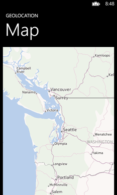
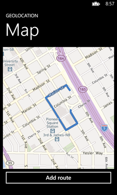

# 第 6 章与硬件集成

## 地理位置

所有 Windows Phone 设备都内置了地理定位硬件。通过结合使用 3G、无线网络和全球定位系统信号，手机能够识别用户的位置，并将其提供给每个应用，这要归功于视窗运行时中包含的一组应用编程接口。

地理定位是复制 API 的另一种情况。最初的应用编程接口集是 Silverlight 框架的一部分，但是它已经在 Windows 运行时中进行了扩展。

使用地理定位服务的新主类叫做`Geolocator`，它是`Windows.Devices.Geolocation`命名空间的一部分。

|  | 注意:要使用地理定位服务，您需要在清单文件中启用 ID_CAP_LOCATION 功能。 |

使用地理定位服务的第一步是检查`Geolocator`类的`LocationStatus`属性值，以识别服务的当前状态。具体来说，我们必须管理`PositionStatus.Disabled`的地位。在这种情况下，用户已经在手机的设置中禁用了地理定位服务，所以我们不必执行任何与地理定位相关的操作，否则我们将会得到一个异常。如果您想跟踪地理定位服务的状态，有一个名为`StatusChanged`的特定事件处理程序，它会在每次状态改变时被调用。例如，它可以帮助您识别全球定位系统是否就绪，或者用户是否处于难以跟踪的位置。

与`Geolocator`类交互有两种方式:请求单个位置(例如，需要对推文进行地理定位的推特客户端)，或者订阅可用于持续跟踪用户位置的事件处理程序(例如，正在运行的跟踪器应用)。

要请求单个位置，只需调用异步方法`GetGeopositionAsync()`。它将返回一个包含`Coordinate`属性的`Geoposition`对象，该属性将帮助您识别用户的位置。

|  | 注意:地理位置对象有另一个名为 CivicAddress 的属性，它应该包含一个使用 civic 引用的用户位置的引用(如城市、街道地址等)。).不支持此属性，因此它将总是返回不正确的信息。在本章的后面，我们将看看如何获得用户的公民地位。 |

下面的代码示例演示如何获取单个用户的位置:

```cs
    private async void OnGetSinglePositionClicked(object sender, RoutedEventArgs e)
    {
        Geolocator geolocator = new Geolocator();
        if (geolocator.LocationStatus != PositionStatus.Disabled)
        {
           Geoposition geoposition = await geolocator.GetGeopositionAsync();
           MessageBox.Show(string.Format("The user's coordinates are {0} - {1}", geoposition.Coordinate.Latitude, geoposition.Coordinate.Latitude))
        }
    }

```

相反，要持续跟踪用户的位置，您需要订阅`PositionChanged`事件处理程序，每次用户从上一个位置移动时都会调用该程序。您可以通过设置`Geolocator`对象的三个属性来控制引发此事件的频率:

*   `DesiredAccuracy`，即地理定位精度。设置得越高，结果越精确，消耗的电池电量也越多。
*   `MovementThreshold`，即距离，以米为单位，用户应在`PositionChanged`事件触发前从上一位置开始移动。
*   `ReportInterval`，这是两次检测之间应该经过的最小毫秒数。

`PositionChanged`事件返回一个包含类型为`Geoposition`的`Position`属性的参数——其工作方式与我们之前看到的`GetGeopositionAsync()`方法相同。

```cs
    private void OnStartTrackingPosition(object sender, RoutedEventArgs e)
    {
        Geolocator geolocator = new Geolocator();
        geolocator.MovementThreshold = 100;
        geolocator.ReportInterval = 1000;
        geolocator.DesiredAccuracy = PositionAccuracy.High;

        geolocator.PositionChanged += geolocator_PositionChanged;
    }

    private void geolocator_PositionChanged(Geolocator sender, PositionChangedEventArgs args)
    {
        Dispatcher.BeginInvoke(() =>
        {
           Latitude.Text = args.Position.Coordinate.Latitude.ToString();
           Longitude.Text = args.Position.Coordinate.Longitude.ToString();
        });
    }

```

在上一个示例中，我们跟踪用户的位置，每次他或她从上一个位置移动 100 米时，只有在自上一次检测以来至少过了一秒钟的情况下。每次引发`PositionChanged`事件，我们在两个不同的`TextBlock`控件中显示`Latitude`和`Longitude`属性的值。请注意，我们使用的是我们在第三章中讨论的`Dispatcher`课程。这是必需的，因为`PositionChanged`事件是在后台线程中管理的，所以我们不能直接与 UI 交互。

|  | 提示:您可以使用模拟器附带的工具轻松测试地理定位服务。只需点击地图上的一个位置，相关坐标将被发送到模拟器。 |

### 背景跟踪

Windows Phone 8 引入了在应用暂停时持续跟踪用户位置的功能。这意味着即使应用没有在前台运行，`PositionChanged`事件处理程序也将继续被调用。

背景跟踪可以继续，除非:

*   应用通过取消注册`PositionChanged`和`StatusChanged`事件处理程序来停止跟踪用户的位置。
*   该应用已经在后台运行了四个小时，没有重新打开。
*   电池节电模式已启用。
*   手机的可用内存不足。
*   地理定位服务已被禁用。
*   用户打开另一个能够在后台跟踪他或她的位置的应用。

要激活后台跟踪，您需要使用手动编辑器编辑清单文件(右键单击文件并选择**查看代码**)，因为可视化编辑器不支持该选项。您必须以下列方式编辑`DefaultTask`节点:

```cs
    <Tasks>
       <DefaultTask Name="_default" NavigationPage="MainPage.xaml">
        <BackgroundExecution>
          <ExecutionType Name="LocationTracking"/>
        </BackgroundExecution>
       </DefaultTask>
    </Tasks>

```

现在，如果满足前面的条件，应用将继续跟踪用户的位置，即使它没有在前台运行。

如果你想根据应用是否在后台运行来定制用户体验，你可以订阅`PhoneApplicationService`对象的特定事件，该事件在 **App.xaml** 文件中声明，我们在[第三章](03.html#_Chapter_3_Core)中学习使用。事件处理程序称为`RunningInBackground`，每次应用暂停时都会触发。然而，由于它使用地理定位服务，它将继续在后台运行。

在下面的示例中，您可以看到`PhoneApplicationService`声明在我们订阅该事件后的样子:

```cs
    <Application.ApplicationLifetimeObjects>
        <!--Required object that handles lifetime events for the application-->
        <shell:PhoneApplicationService
           Launching="Application_Launching" Closing="Application_Closing"
           Activated="Application_Activated" Deactivated="Application_Deactivated"
           RunningInBackground="Application_RunningInBackground"
           />
    </Application.ApplicationLifetimeObjects>

```

订阅事件后，您将能够在 **App.xaml.cs** 中管理它，例如，设置一个全局属性，可以在不同的页面中使用该属性来标识当前的执行状态。例如，应用可以继续跟踪用户的位置并将其显示在地图上，但是如果应用被挂起，开发人员可以选择使用另一种方式来通知用户的位置，因为地图不再可见，例如发送通知或更新应用的平铺。

```cs
    public static bool IsRunningInBackground { get; set; }

    private void Application_RunningInBackground(object sender, RunningInBackgroundEventArgs e)
    {
        IsRunningInBackground = true;
    }
    private void Application_Activated(object sender, ActivatedEventArgs e)
    {
        IsRunningInBackground = false;
    }

```

在前面的示例中，我们设置了一个属性(称为`IsRunningInBackground`)来知道应用是否在后台运行。当`RunningInBackground`事件被触发时，我们将其设置为真，当`Activated`事件被引发时，我们将其设置为假，这意味着应用已经被重新打开。

### 与地图控件交互

Windows Phone 包括一个内置的`Map`控件，可用于在应用的页面中嵌入地图，并可与地理定位服务结合使用。自从 Windows Phone 7 以来，这种控制已经有了很大的改进，现在它是基于诺基亚的制图学。此外，它支持离线地图-如果用户已经下载了当前位置的地图，控件将能够自动使用它们。`Map`控件是`Microsoft.Phone.Maps.Controls`命名空间的一部分，因此在使用它之前，您需要将其添加到您的 XAML 页面:

```cs
    xmlns:maps="clr-namespace:Microsoft.Phone.Maps.Controls;assembly=Microsoft.Phone.Maps"

```

`Map`控件公开了许多自定义属性。最有用的是:

*   `Center`，地图居中的地理位置坐标。
*   `ZoomLevel`，是从`1`(最小值)到`19`(最大值)的缩放级别。
*   `CartographicMode`，可用于在`Aerial`(卫星视图)`Road`(道路视图)`Terrain`(景观视图)`Hybrid`(其他组合)之间切换。
*   `ColorMode`可根据光度条件设置`Light`或`Dark`主题。

在以下示例中，您可以看到页面中包含一个`Map`控件:

```cs
    <maps:Map x:Name="CustomMap"
               ZoomLevel="15"
               CartographicMode="Aerial"
                ColorMode="Light" />

```



图 19:地图控件

将`Map`控件与地理定位服务结合使用应该很容易:用`Geolocator`类返回的`Geoposition`对象设置地图的`Center`属性就足够了。不幸的是，这是有限制的，因为 Windows Phone 和`Map`控件使用两个不同的类来存储地理位置坐标。第一个名为`Geocoordinate`是`Windows.Devices.Geolocation`命名空间的一部分，第二个名为`GeoCoordinate`(带大写字母 C)，是`System.Device.Location`命名空间的一部分。

幸运的是，有一个解决办法:安装我们在第 2 章中讨论过的[视窗手机工具包](http://phone.codeplex.com/)。除了提供一组有用的附加控件之外，它还提供了许多在使用`Map`控件时有用的助手和扩展。

具体来说，将 Windows Phone Toolkit 添加到您的项目中之后(最简单的方法是使用 [NuGet](http://nuget.org/packages/WPtoolkit/) ，您将能够使用名为`ToGeoCoordinate()`的扩展方法，该方法能够将原始的 Windows Runtime 类转换为`Map`控件的特定类。在下面的示例中，您可以看到我们如何使用它在地图上显示用户的当前位置:

```cs
    private async void OnGetSinglePositionClicked(object sender, RoutedEventArgs e)
    {
        Geolocator geolocator = new Geolocator();
        if (geolocator.LocationStatus != PositionStatus.Disabled)
        {
           Geoposition geoposition = await geolocator.GetGeopositionAsync();
            myMap.Center = geoposition.Coordinate.ToGeoCoordinate();
        }
    }

```

### 层

`Map`控件支持可以添加到地图顶部的图层。图层是显示在地图上的视觉对象的集合，由`MapLayer`类表示。

每个`MapLayer`都有一个覆盖集合(即`MapOverlay`类)；每一个都是显示在地图上的对象。

覆盖可以由几乎任何控件组成。事实上，它是由使用`GeoCoordinate`属性的位置和使用`Content`属性的内容定义的，后者是一个通用对象。这意味着您可以添加任何想要作为内容的对象，就像框架中的任何 XAML 可视化控件一样。

在下面的示例中，我们创建了一个`Rectangle`对象，并将其设置为添加到新图层的`MapOverlay`对象的`Content`。

```cs
    private void OnAddShapeClicked(object sender, RoutedEventArgs e)
    {
        MapOverlay overlay = new MapOverlay
        {
            GeoCoordinate = myMap.Center,
            Content = new Rectangle
            {
                Fill = new SolidColorBrush(Colors.Blue),
                Width = 40,
                Height = 40
            }
        };
        MapLayer layer = new MapLayer();
        layer.Add(overlay);

        myMap.Layers.Add(layer);
    }

```


图 20:地图控件上显示的图层

### 路由

您使用`Map`控件的一个常见场景是路线，您可以在地图上显示路线。即使听起来很复杂，使用`RouteQuery`类也很容易实现，它允许您:

*   使用`TravelMode`和`RouteOptimization`属性设置不同的路线选项。
*   添加组成路线的航路点列表。

下面的代码演示了一个路由示例:

```cs
    private void OnCalculateRouteClicked(object sender, RoutedEventArgs e)
    {
        RouteQuery query = new RouteQuery
        {
            TravelMode = TravelMode.Driving,
            RouteOptimization = RouteOptimization.MinimizeTime,
        };

        List<GeoCoordinate> coordinates = new List<GeoCoordinate>();
        coordinates.Add(new GeoCoordinate(47.6045697927475, -122.329885661602));
        coordinates.Add(new GeoCoordinate(47.605712890625, -122.330268859863));
        query.Waypoints = coordinates;

        query.QueryCompleted += query_QueryCompleted;
        query.QueryAsync();
    }

```

`TravelMode`和`RouteOptimization`选项可用于定制路线，方式类似于许多全球定位系统导航器。在前面的示例中，我们希望行驶路线需要的时间最少。

使用`Waypoints`属性设置路径，这需要一组`GeoCoordinate`对象。每个对象代表路径中应该被路线接触的一个点。

`RouteQuery`类使用回调方法工作。我们调用`QueryAsync()`方法并订阅`QueryCompleted`事件，该事件在计算路线时触发，如下例所示:

```cs
    void query_QueryCompleted(object sender, QueryCompletedEventArgs<Route> e)
    {
        MapRoute route = new MapRoute(e.Result);
        myMap.AddRoute(route);
    }

```

在`Map`控件上显示路线很简单——您只需创建一个新的`MapRoute`对象，将查询结果(存储在返回对象的`Result`属性中)作为参数传递，并使用`AddRoute()`方法将其添加到`Map`中。



图 21:地图上显示的路线

### 使用坐标工作

到目前为止，我们一直使用基于纬度和经度的地理定位坐标，但用户通常更容易根据其城市地址了解位置。Windows Phone 8 引入了两个类来执行地理编码转换:`GeoCodeQuery`(将地址转换为一组数字坐标)和`ReverseGeocodeQuery`(将经纬度转换为地址)。

它们都以相同的方式工作，因为它们使用的回调方法与我们看到的路由方法相同。定义要执行的操作后，可以使用`QueryAsync()`方法开始搜索。搜索完成后，您可以使用`QueryCompleted`事件处理程序来管理结果。

`GeocodeQuery`类需要你设置两个参数:`GeoCoordinate`和最重要的`SearchTerm`，这是搜索关键字。`GeoCoordinate`不应该是必需的(因为这个类的目的是找到位置的坐标)，但是您无论如何都必须用一个伪值来设置它，如下例所示。否则，你不会得到任何结果。

```cs
    private void OnResolveCoordinatesClicked(object sender, RoutedEventArgs e)
    {
        GeocodeQuery query = new GeocodeQuery
            {
                   GeoCoordinate = new GeoCoordinate(0, 0),
                   SearchTerm = "Milan,Italy"
            };
        query.QueryCompleted += query_QueryCompleted;
        query.QueryAsync();
    }

```

相反，`ReverseGeoCodeQuery`类只要求用位置坐标设置`GeoCoordinate`属性。

```cs
    private void OnResolveAddressClicked(object sender, RoutedEventArgs e)
    {
        ReverseGeocodeQuery reverseQuery = new ReverseGeocodeQuery
            {
                 GeoCoordinate = new GeoCoordinate(45.3967, 9.3163)
            };
        reverseQuery.QueryCompleted += reverseQuery_QueryCompleted;
        reverseQuery.QueryAsync();
    }

```

两个类的`QueryCompleted`事件处理程序是相同的，并返回一组`MapLocation`对象。如果您使用了`GeocodeQuery`类，您可能会对`GeoCoordinate`对象感兴趣，该对象包含搜索位置的纬度和经度。

```cs
    void query_QueryCompleted(object sender, QueryCompletedEventArgs<IList<MapLocation>> e)
    {
        var item = e.Result.FirstOrDefault();
        myMap.SetView(item.BoundingBox, MapAnimationKind.Parabolic);
    }

```

上一个示例显示了一种将地图居中放置在服务返回的位置上的方法。

相反，如果您使用`ReverseGeocodeQuery`类，您将在`Information`属性中找到您要查找的信息，该属性包含像`City`、`Street`、`Address`等数据。

```cs
    void reverseQuery_QueryCompleted(object sender, QueryCompletedEventArgs<IList<MapLocation>> e)
    {
        var item = e.Result.FirstOrDefault();
        MessageBox.Show(string.Format("{0},{1}", item.Information.Address.Street, item.Information.Address.City));
    }

```

在这两种情况下，事件处理程序都会返回一个`MapLocation`对象的集合，因为，特别是当您通过关键字搜索一个位置时，服务会返回多个结果。上一个示例显示了集合中第一项的信息。

### 如何发布使用 Map 控件的应用

您可以在测试阶段自由使用`Map`控件，但是当您将其提交给商店时，您将需要生产凭证。

可以在提交过程中获取凭据。其中一个可选步骤叫做**地图服务**，它会给你两个代码叫做`ApplicationId`和`AuthenticationToken`。获得代码后，当应用启动时，您需要以下列方式设置它们:

```cs
    Microsoft.Phone.Maps.MapsSettings.ApplicationContext.ApplicationId = "ApplicationId";
    Microsoft.Phone.Maps.MapsSettings.ApplicationContext.AuthenticationToken = "AuthenticationToken";

```

## 运动传感器

Windows Phone 设备有许多可以被应用使用的运动传感器，如加速度计、陀螺仪和指南针。视窗运行时引入了一组新的应用编程接口，它们是`Windows.Devices.Sensors`命名空间的一部分:

*   `Accelerometer`类可用于与加速度计交互。
*   `Gyrometer`类可用于与陀螺仪交互。
*   `Compass`类可用于与指南针交互。
*   `OrientationSensor`是一个特殊的类别，可以组合从所有可用传感器获得的值。

|  | 注意:要使用传感器，您需要在清单文件中启用标识 _ 帽 _ 传感器选项。如果您还想使用陀螺仪和指南针，您需要在清单文件的需求部分启用 ID _ REQ _ 磁力计和 ID _ REQ _ 陀螺仪功能。这样，拥有不带这些传感器的设备的用户将无法下载您的应用。 |

所有的传感器都以同样的方式工作。您将能够使用`GetDefault()`方法获得传感器的参考。如果它在手机上不可用(例如，不是所有设备都有陀螺仪)，你会得到一个`null`参考作为回报。在进行任何操作之前，务必检查返回的传感器是否为`null`。

像地理定位服务一样，您有两种方式与传感器交互:

*   `GetCurrentReading()`方法，返回单次检测。
*   `ReadingChanged`事件处理程序，每次手机移动到新位置时触发。

在本节中，我们将使用`OrientationSensor`类作为示例，该类是一种特殊的传感器，能够组合可用传感器返回的所有值，并自动过滤所有超出范围的数据。该类返回一个`OrientationSensorReading`对象，该对象包含当前位置的所有信息。您可以使用`Quaternion`和`RotationMatrix`属性获得设备位置。在下面的示例中，您可以看到实现相同结果的两种方法:获取单个读数，以及订阅每次位置变化时发送的通知。设备在 x 轴、y 轴和 z 轴上的坐标通过三个`TextBlock`控件显示在屏幕上:

```cs
    //Single reading.
    private void OnGetReadingClicked(object sender, RoutedEventArgs e)
    {
        OrientationSensor orientationSensor = OrientationSensor.GetDefault();
        if (orientationSensor != null)
        {
           OrientationSensorReading reading = orientationSensor.GetCurrentReading();
            txtX.Text = reading.Quaternion.X.ToString();
            txtY.Text = reading.Quaternion.Y.ToString();
            txtZ.Text = reading.Quaternion.Z.ToString();
        }
        else
        {
           MessageBox.Show("The sensor is not available");
        }
    }
    //Continuous reading.
    private void OnGetReadingClicked(object sender, RoutedEventArgs e)
    {
        OrientationSensor orientationSensor = OrientationSensor.GetDefault();
        if (orientationSensor != null)
        {
            orientationSensor.ReadingChanged += orientationSensor_ReadingChanged;
        }
        else
        {
           MessageBox.Show("The sensor is not available");
        }
    }

    void orientationSensor_ReadingChanged(OrientationSensor sender, OrientationSensorReadingChangedEventArgs args)
    {
        Dispatcher.BeginInvoke(() =>
        {
            txtX.Text = args.Reading.Quaternion.X.ToString();
            txtY.Text = args.Reading.Quaternion.Y.ToString();
            txtZ.Text = args.Reading.Quaternion.Z.ToString();
        });
    }

```

请注意，如果您决定订阅`ReadingChanged`事件，您将需要一个`Dispatcher`来与用户界面通信，因为事件处理程序由后台线程管理。

如果需要使用特定的传感器，使用的代码非常相似。您只需使用特定的传感器类并管理您将得到的特定读取对象。

|  | 提示:Windows Phone 模拟器有一个模拟移动传感器的工具。遗憾的是，只支持加速度计；对于每一个其他的传感器，包括方位传感器，你需要一个真正的设备。 |

## 确定当前硬件

Windows Phone 提供了一个名为`DeviceStatus`的类，可以用来获取当前设备的信息，比如:

*   固件版本，具有`DeviceFirmwareVersion`属性。
*   硬件版本，具有`DeviceHardwareVersion`属性。
*   制造商，具有`DeviceManufacturer`属性。
*   设备名称，带有`DeviceName`属性。
*   可用的总内存量，具有`DeviceTotalMemory`属性。

另外，您可以访问一些有用的 API 来获取电池的当前状态。它们属于`Windows.Phone.Devices.Power`命名空间，您可以使用`Battery`类来识别剩余电池电量的百分比(使用`RemainingChargePercent`属性)和电池完全放电前的剩余时间(使用`RemainingDischargeTime`属性)。

`Battery`类的行为就像一个传感器；您必须使用`GetDefault()`方法来获取对它的引用(即使在这种情况下，您可以避免检查返回的对象是否是`null`，因为每个手机都有电池)，如下例所示:

```cs
    private void OnGetBatteryClicked(object sender, RoutedEventArgs e)
    {
        int remainingCharge = Battery.GetDefault().RemainingChargePercent;
        TimeSpan remainingTime = Battery.GetDefault().RemainingDischargeTime;
    }

```

此外，`DeviceStatus`类提供了一个名为`PowerSource`的属性，它告诉您当前的电源，以及一个名为`PowerSourceChanged`的事件处理程序，每当当前电源发生变化时(从电池到外部，反之亦然)就会触发该事件处理程序。

```cs
    private void OnGetBatteryClicked(object sender, RoutedEventArgs e)
    {
        DeviceStatus.PowerSourceChanged += DeviceStatus_PowerSourceChanged;
    }

    void DeviceStatus_PowerSourceChanged(object sender, EventArgs e)
    {
        string message = DeviceStatus.PowerSource == PowerSource.Battery ? "Batteria" : "Alimentazione di rete";
        MessageBox.Show(message);
    }

```

例如，如果您希望避免在手机未连接到外部电源的情况下执行耗电操作，这可能会很有用。

|  | 注意:要访问硬件信息，您需要在清单文件中启用 ID_CAP_IDENTITY_DEVICE 功能。 |

## 接近

在邻近类别下，我们可以包括在 Windows 运行时中引入的所有新的 API，以在不使用互联网连接的情况下将两个设备连接在一起。在 Windows Phone 中，您可以通过使用两种技术来实现这一结果:蓝牙和 NFC。

蓝牙是众所周知的，可以用来连接 10 米范围内的设备。它从第一个 Windows Phone 版本就已经推出了，但是只有 Windows Phone 8 引入了可供开发人员使用的 API。

NFC 是一项较新的技术，近年来开始获得一些关注。它可以用来近距离交换少量数据(两个设备基本上应该互相接触)。NFC 是一项有趣的技术，因为它不仅适用于有源设备(如两部手机)，还适用于无源设备(如嵌入贴纸或杂志页面的芯片)。此外，Windows Phone 能够扩展 NFC，并使用它来创建蓝牙通信通道，而无需手动将两个设备配对。这样，您可以克服 NFC 的限制，并使用蓝牙传输更大的数据文件，如图像。

|  | 注意:要使用邻近应用编程接口，您需要在清单文件中启用标识-帽-邻近选项。 |

测试使用 Proximity APIs 的应用的最简单方法是使用真实设备，但是 CodePlex 上还有一个名为 [Proximity Tapper](http://proximitytapper.codeplex.com/) 的第三方工具，可以用来模拟不同仿真器之间的连接(由于 Visual Studio 一次只能运行一个特定的仿真器，因此您将不得不使用不同的仿真器版本，例如 WVGA 和 WXGA 版本)。

### 交换信息

使用 NFC 时，一个常见的场景是交换消息，这代表少量数据。有些标准消息是 Windows Phone 能够自动管理的(例如，当您收到 URI 或联系人时)，有些自定义消息只能由第三方应用管理。

第一步，就像我们目前看到的其他传感器一样，使用`ProximityDevice`类的`GetDefault()`方法来访问接近传感器。在这种情况下，我们还需要在继续之前检查传感器参考是否为`null`，因为有些设备不支持 NFC。

每条消息都由一个特定的关键字来标识。Windows Phone 应用编程接口本身支持三种消息类型——文本、URI 和二进制。让我们看看如何管理它们。

#### 正文消息

发布短信很容易。我们使用`ProximityDevice`类的`PublishMessage()`方法，它需要消息类型和内容作为参数。在下面的示例中，您可以看到我们如何发送由`Windows.SampleMessage`关键字标识的短信。

```cs
    private void OnSendMessageClicked(object sender, RoutedEventArgs e)
    {
        ProximityDevice device = ProximityDevice.GetDefault();

        if (device != null)
        {
            device.PublishMessage("Windows.SampleMessage", "Sample message", MessageSent);
        }
    }

    private void MessageSent(ProximityDevice sender, long messageId)
    {
        MessageBox.Show("The message has been sent");
        sender.StopPublishingMessage(messageId);
    }

```

如您所见，`PublishMessage()`方法接受第三个可选参数，这是当另一个设备收到消息时引发的事件。如前一个示例所示，通过调用`ProximityDevice`对象上的`StopPublishingMessage()`方法，一旦收到消息，该事件就可以停止发送消息。您需要设置消息标识，它作为方法的参数传递。

接收消息的电话应该调用`SubscribeForMessage()`方法。与发布方法不同，无论我们期望什么数据，这种方法都是相同的。不同的是，根据消息，我们可以使用一些特定的属性来解析它并提取我们需要的信息。

在下面的示例中，您可以看到由于`ProximityMessage`类的`DataAsString`属性，提取消息内容是多么容易:

```cs
    private void OnReadMessageClicked(object sender, RoutedEventArgs e)
    {
        ProximityDevice device = ProximityDevice.GetDefault();

        if (device != null)
        {
            device.SubscribeForMessage("Windows.SampleMessage", messageReceived);
        }
    }

    private void messageReceived(ProximityDevice sender, ProximityMessage message)
    {
        Dispatcher.BeginInvoke(() =>
                                    {
                                        MessageBox.Show(message.DataAsString);
                                    });
        sender.StopSubscribingForMessage(message.SubscriptionId);
    }

```

该代码与用于发送消息的代码没有太大区别；`SubscribeForMessage()`方法需要消息类型和接收到消息时调用的事件处理程序。

该消息是通过作为参数返回的`ProximityMessage`对象接收的。在这种情况下，由于是文本消息，我们可以使用`DataAsString`属性提取内容。请注意，在这种情况下，我们再次使用`StopSubscribingForMessage()`方法取消订阅，以便应用不再监听传入的消息。

#### 上呼吸道感染

发送 URIs 的工作方式类似，只是我们需要使用接受`Uri`作为参数发送的`PublishUriMessage()`方法。在这种情况下，我们不需要设置消息类型，因为它是隐式的。

```cs
    private void OnPublishUriClicked(object sender, RoutedEventArgs e)
    {
        ProximityDevice device = ProximityDevice.GetDefault();
        if (device != null)
        {
            device.PublishUriMessage(new Uri("http://wp.qmatteoq.com"));
        }
    }

```

不同的是`Uri`消息直接由 Windows Phone 支持，因此您无需使用接收器应用就可以交换它们。操作系统一旦收到`Uri`，就会简单地询问用户是否想打开浏览器查看。

但是，如果您仍然想在应用中管理`Uri`，您可以订阅接收它们。在这种情况下，您必须监听传入的`WindowsUri`消息。此外，您还需要一些代码来提取它，因为它没有被当作`string`；您需要直接使用字节数组，如下例所示:

```cs
    private void OnReceiveUriClicked(object o, RoutedEventArgs e)
    {
        ProximityDevice device = ProximityDevice.GetDefault();
        if (device != null)
        {
            device.SubscribeForMessage("WindowsUri", messageReceived);
        }
    }

    private void messageReceived(ProximityDevice sender, ProximityMessage message)
    {
        byte[] array = message.Data.ToArray();
        string uri = Encoding.Unicode.GetString(array, 0, array.Length);
        Dispatcher.BeginInvoke(() =>
        {
           MessageBox.Show(uri);
        });
    }

```

#### NDEF 消息

NDEF (NFC 数据交换格式)是一种标准协议，用于定义 NFC 消息，这些消息可用于跨不同平台交换不同的数据类型。一些常见的场景是交换地理位置数据、邮件发送和社交网络共享。

Windows Phone APIs 本身并不支持 NDEF。为了避免要求开发人员手动创建撰写消息所需的二进制数据，一个名为 Andreas Jakl 的开发人员创建了一个名为 **NDEF 库 For Proximity API** 的库，该库可在 [CodePlex](http://ndef.codeplex.com/) 上获得，并且可以使用 [NuGet](http://nuget.org/packages/NdefLibrary/) 轻松安装。

这个库有许多类，它们封装了最常见消息所需的逻辑，比如共享地理位置坐标的`NdefGeoRecord`、打开另一个 Windows Phone 应用的`NdefLaunchAppRecord`和向特定号码发起电话呼叫的`NdefTelRecord`。您可以在[官方网站](http://ndef.codeplex.com/)上看到支持记录的完整列表。

在下面的示例中，您将看到如何发送包含`NdefSmsRecord`的消息，该消息可用于创建带有预定义文本的新短信:

```cs
    private void OnSendNdefMessageClicked(object sender, RoutedEventArgs e)
    {
        ProximityDevice device = ProximityDevice.GetDefault();
        if (device != null)
        {
           NdefSmsRecord record = new NdefSmsRecord
                                        {
                                            SmsNumber = "0123456789",
                                            SmsBody = "This is the text"
                                        };

           NdefMessage message = new NdefMessage
                                        {
                                            record
                                        };

            device.PublishBinaryMessage("NDEF", message.ToByteArray().AsBuffer());
        }
    }

```

第一步是创建记录并设置所需的属性。在这个示例中，我们需要设置`SmsNumber`(将接收消息的电话号码)和`SmsBody`(消息的文本)属性。

接下来，我们需要将记录封装到一个新的消息中，该消息由`NdefMessage`类标识。最后，我们可以发送它；在这个场景中，我们需要使用`ProximityDevice`类的`PublishBinaryMessage()`方法，因为它不是标准消息，而是二进制消息。如您所见，我们将消息作为一个字节数组作为参数(除了消息的类型，即`NDEF`)传递。

如果 Windows Phone 本身支持消息类型，设备将自动管理传入的消息。使用前面的示例，操作系统将提示用户发送短信。相反，如果我们想在应用中接收它，我们需要做一些额外的工作。由于它是一个二进制消息，我们需要提取所需的信息。幸运的是，NDEF 图书馆的邻近应用编程接口将帮助我们，正如您在下面的示例中所看到的:

```cs
    private void OnReceiveNdefMessage(object sender, RoutedEventArgs e)
    {
        ProximityDevice device = ProximityDevice.GetDefault();
        if (device != null)
        {
            device.SubscribeForMessage("NDEF", NdefMessageReceived);
        }
    }

    private void NdefMessageReceived(ProximityDevice sender, ProximityMessage message)
    {
        NdefMessage receivedMessage = NdefMessage.FromByteArray(message.Data.ToArray());
        foreach (NdefRecord record in receivedMessage)
        {
           if (record.CheckSpecializedType(true) == typeof(NdefSmsRecord
            {
                NdefSmsRecord ndefSmsRecord = new NdefSmsRecord(record);
                Dispatcher.BeginInvoke(() =>
                {
                    MessageBox.Show(ndefSmsRecord.SmsBody);
                });
            }
        }
    }

```

我们需要订阅传入的 NDEF 信息。当我们收到消息时，由于`FromByteArray()`方法，我们能够再次将二进制数据(在`ProximityMessage`类的`Data`属性中可用)转换为`NdefMessage`。

一个`NdefMessage`对象可以包含多个记录，所以我们需要迭代它并提取存储的每个`NdefRecord`对象。在前面的示例中，由于我们期望只获得一个`NdefSmsRecord`，所以我们只管理这个场景。使用记录上的`CheckSpecializedType()`方法完成任务，返回其数据类型。只有当它是我们所期望的类型时，我们才会管理它。我们只需创建一个新的`NdefSmsRecord`对象，并将存储在消息中的`NdefRecord`对象作为参数传递，就可以获得原始记录。

一旦我们拥有了它，我们就能够访问它的所有属性。在前面的示例中，我们向用户显示了短信的正文。

#### 将消息写入标签

如前所述，NFC 可以用于无源设备，如标签和贴纸。发布消息时，只要在消息类型中添加`:WriteTag`后缀，Windows Phone 设备就可以将数据写入 NFC 标签。

在下面的代码中，您可以看到如何修改前面的示例，将记录写入标签，而不是将其发送到另一个设备:

```cs
    private void OnSendNdefMessageClicked(object sender, RoutedEventArgs e)
    {
        ProximityDevice device = ProximityDevice.GetDefault();
        if (device != null)
        {
           NdefSmsRecord record = new NdefSmsRecord
                                        {
                                            SmsNumber = "0123456789",
                                            SmsBody = "This is the text"
                                        };

           NdefMessage message = new NdefMessage
                                        {
                                            record
                                        };

            device.PublishBinaryMessage("NDEF:WriteTag", message.ToByteArray().AsBuffer());
        }
    }

```

### 使用 NFC 创建通信信道

如前所述，NFC 只能用于交换少量数据，不能用于维护稳定的通信通道。实现这一结果的最佳技术是蓝牙。然而，我们能够使用 NFC 作为在安装了相同应用的两个设备之间建立蓝牙通道的快捷方式。

|  | 注意:在这种情况下，我们还需要在清单文件中启用 ID_CAP_NETWORKING 选项。 |

起点是`PeerFinder`类，可用于(在两台设备上)启动连接并寻找另一台设备配对。使用起来很简单:您必须订阅连接状态改变时触发的`TriggeredConnectionStateChanged`事件，并通过调用`Start()`方法开始配对过程。

```cs
    private async void OnConnectToPeerClicked(object sender, RoutedEventArgs e)
    {
        PeerFinder.TriggeredConnectionStateChanged += PeerFinder_TriggeredConnectionStateChanged;
        PeerFinder.Start();
    }

```

您需要在两台设备上使用相同的代码。然而，如果应用是通过配对请求打开的，有一个自动执行的解决方案。事实上，当您执行前面的代码并将两个设备连接在一起时，Windows Phone 会自动拦截传入的消息，并提示用户打开所需的应用。当这种情况发生时，应用将使用以下特殊 URI 打开:

```cs
    MainPage.xaml?ms_nfp_launchargs=Windows.Networking.Proximity.PeerFinder:
    StreamSocket

```

通过使用主页面上的`OnNavigatedTo`事件(涵盖在[第 3 章](03.html#_Navigation)中)，我们能够拦截这个特殊的 URI 并自动开始配对过程，如下例所示:

```cs
    protected override void OnNavigatedTo(NavigationEventArgs e)
    {
        if (NavigationContext.QueryString.ContainsKey("ms_nfp_launchargs") &&
            NavigationContext.QueryString["ms_nfp_launchargs"] ==
           "Windows.Networking.Proximity.PeerFinder:StreamSocket")
        {
           PeerFinder.TriggeredConnectionStateChanged += PeerFinder_TriggeredConnectionStateChanged;
           PeerFinder.Start();
        }
    }

```

`TriggeredConnectionStateChanged`事件可用于管理实际连接状态。最重要的状态是`Completed`，当连接成功建立，可以开始交换数据时触发。

在下面的示例中，您可以看到，一旦建立了连接，我们就将通道(由`StreamSocket`对象标识)存储在另一个变量中，以便稍后用于进一步的通信。

```cs
    private StreamSocket socket;

    void PeerFinder_TriggeredConnectionStateChanged(object sender, TriggeredConnectionStateChangedEventArgs args)
    {
        switch (args.State)
        {
           case TriggeredConnectState.Completed:
                socket = args.Socket;
                StartListeningForMessages();
                PeerFinder.Stop();
                break;
        }
    }

```

除了保存对通道的引用之外，我们开始监听传入的消息(稍后我们将看到如何监听)，并调用`PeerFinder`类的`Stop()`方法。由于通道已经创建，我们可以停止配对过程。

#### 正在侦听传入消息

监听过程的工作方式类似于轮询；在频道打开之前，我们会一直询问另一台设备是否有新消息。在下面的示例中，我们通过使用我们在[第 4 章](04.html#_Local_storage)中学习的`DataReader`和`DataWriter`类来交换文本消息，在本地存储中存储数据。

```cs
    private bool listening;

    private async void StartListeningForMessages()
    {
        if (socket != null)
        {
           if (!listening)
            {
                listening = true;
                while (listening)
                {
                    var message = await GetMessage();
                    if (listening)
                    {
                        if (message != null)
                        {
                            Dispatcher.BeginInvoke(() => MessageBox.Show(message));
                        }
                    }
                }
            }
        }
    }

    private async Task<string> GetMessage()
    {
        DataReader dataReader = new DataReader(socket.InputStream);
        uint bytesRead = await dataReader.LoadAsync(sizeof(uint));
        if (bytesRead > 0)
        {
           uint strLength = (uint)dataReader.ReadUInt32();
            bytesRead = await dataReader.LoadAsync(strLength);
           if (bytesRead > 0)
            {
                String message = dataReader.ReadString(strLength);
                return message;
            }
        }

        return string.Empty;
    }

```

当通道打开，监听过程活跃时，我们继续调用`GetMessage()`方法。如果频道中有传入的消息，我们会显示给用户。轮询过程使用`while`循环来实现，该循环被重复直到`isListening`变量被设置为`true`。

`GetMessage()`方法只是一个助手，通过使用`DataReader`类，它能够获取通道的数据(在`StreamSocket`类的`InputStream`属性中以二进制形式存储)并将其转换为普通字符串。

#### 发送消息

要发送消息，我们需要使用`DataWriter`类在`StreamSocket`对象的`OutputStream`通道中写入数据。我们必须发送两条信息:使用`WriteInt32()`方法的消息大小，以及使用`WriteString()`消息的消息文本。

```cs
    public async Task SendMessage(string message)
    {
        if (socket != null)
        {
           DataWriter dataWriter = new DataWriter(socket.OutputStream);

            dataWriter.WriteInt32(message.Length);
           await dataWriter.StoreAsync();

            dataWriter.WriteString(message);
           await dataWriter.StoreAsync();
        }
    }

```

如果你想在频道上发消息，用我们刚才定义的`SendMessage()`方法就够了:

```cs
    private async void OnSendMessageOnChannelClicked(object sender, RoutedEventArgs e)
    {
        await SendMessage("This is my first message");
    }

```

### 使用蓝牙创建通信信道

使用蓝牙创建通信信道的方法与我们之前看到的方法相同。一个通道由`StreamSocket`类识别，我们可以用完全相同的方式发送和监听传入的消息。

改变的是我们连接到另一个设备的方式。使用 NFC，对等通信必须在连接的两个设备之间进行。相反，通过蓝牙，您可以虚拟连接到手机范围内的任何设备。我们将再次使用`PeerFinder`类，但是这一次，我们不是使用`Start()`方法开始配对过程，而是使用`FindAllPeersAsync()`方法寻找所有可用的对等体。它返回一组`PeerInformation`对象——每个对象都是一个可以与我们的应用连接的设备。

在下面的示例中，我们通过将集合设置为`ListBox`控件的`ItemsSource`，简单地向用户显示可用设备的列表:

```cs
    private async void OnFindNearPeers(object sender, RoutedEventArgs e)
    {
        PeerFinder.Start();
        try
        {
           IReadOnlyList<PeerInformation> peers = await PeerFinder.FindAllPeersAsync();
           PeersList.ItemsSource = peers;
        }
        catch (Exception exc)
        {
           if ((uint)exc.HResult == 0x8007048F)
            {
                MessageBox.Show("Bluetooth is turned off");
            }
        }
    }

```

请注意，我们已经将代码嵌入到一个`try` / `catch`语句中；事实上，用户可能已经关闭了蓝牙。当我们开始寻找其他对等方时，如果我们获得错误代码`0x8008048F`的异常，这意味着我们处于这种情况，因此我们必须正确管理它(例如，通知用户他或她需要打开它才能使用应用)。

在用户选择了他或她想要连接的设备之后，我们需要调用`PeerFinder`类的`ConnectAsync()`方法，将代表该设备的`PeerInformation`对象作为参数传递。接下来，就像我们对 NFC 通信所做的那样，我们开始监听消息，并停止使用`Stop()`方法寻找其他对等方，如下例所示:

```cs
    private async void PeerList_OnSelectionChanged(object sender, SelectionChangedEventArgs e)
    {
        PeerInformation peer = PeerList.SelectedItem as PeerInformation;
        socket = await PeerFinder.ConnectAsync(peer);
        StartListeningForMessages();
        PeerFinder.Stop();
    }

```

`StartListeningForMessage()`方法和我们以前处理 NFC 通信的方法是一样的。

另一方面(用户选择与之交互的电话)，如果我们想要接受来自另一个电话的传入通信请求，我们需要再次使用`PeerFinder`类的`Start()`方法并订阅`ConnectionRequested`事件，当另一个设备请求建立连接时，该事件被触发。

在事件处理程序中，我们只需调用`PeerFinder`类的`ConnectAsync()`方法，就像我们调用启动连接请求的电话一样。我们将在方法的参数中获得发送请求的设备的引用。

```cs
    private void OnListenToConnectionClicked(object sender, RoutedEventArgs e)
    {
        PeerFinder.ConnectionRequested += PeerFinder_ConnectionRequested;
        PeerFinder.Start();
    }

    async void PeerFinder_ConnectionRequested(object sender, ConnectionRequestedEventArgs args)
    {
        socket = await PeerFinder.ConnectAsync(args.PeerInformation);
        StartListeningForMessages();
        PeerFinder.Stop();
    }

```

## 快速回顾一下

在本章中，我们已经看到了如何与每个 Windows Phone 设备都具有的硬件功能进行交互。具体来说:

*   我们已经看到了如何与地理定位服务交互、检索用户位置以及与`Map`控件交互。
*   我们已经学会了如何使用运动传感器来确定设备在空间中的位置。这是一个对游戏特别有用的功能，因为许多游戏更容易用加速度计控制，而不是用虚拟控件。
*   我们已经简要介绍了硬件 API，这些 API 对于获取运行应用的设备的信息非常有用。
*   我们已经讨论了 Proximity APIs，它是在 Windows 运行时中引入的，用于连接两个设备，而不需要互联网连接。具体来说，我们已经讨论了两种技术:NFC 和蓝牙。