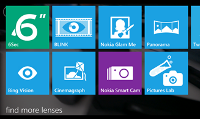

# 第八章多媒体应用

## 使用摄像头

相机是 Windows Phone 设备中最重要的功能之一，尤其是得益于诺基亚，它创造了市场上一些最好的相机手机。

作为开发人员，我们能够将相机体验集成到我们的应用程序中，以便用户可以在应用程序中直接拍照和编辑。此外，借助我们稍后将讨论的镜头应用程序功能，创建可以取代原生相机体验的应用程序变得更加容易。

|  | 注意:要与摄像机交互，需要在清单文件中启用 ID_CAP_IS_CAMERA 功能。 |

第一步是在页面上创建一个区域，我们可以在这里显示相机记录的图像。我们将使用`VideoBrush`，这是能够嵌入视频的 XAML 本地画笔之一。我们将它用作`Canvas`控件的背景，如下例所示:

```cs
    <Canvas Height="400" Width="400">
        <Canvas.Background>
           <VideoBrush x:Name="video" Stretch="UniformToFill">
                <VideoBrush.RelativeTransform>
                    <CompositeTransform x:Name="previewTransform" CenterX=".5" CenterY=".5" />
                </VideoBrush.RelativeTransform>
           </VideoBrush>
        </Canvas.Background>
    </Canvas>

```

注意已经应用的`CompositeTransform`；其目的是根据摄像机方向保持视频的正确方向。

### 拍照

现在，我们有了一个地方来显示实时摄像机提要，我们可以使用包含在`Windows.Phone.Media.Capture`名称空间中的 API。具体来说，可以拍照的类叫做`PhotoCaptureDevice`(后面我们会看到另一个录制视频的类)。

以下代码是初始化示例:

```cs
    protected override async void OnNavigatedTo(NavigationEventArgs e)
    {
        Size resolution = PhotoCaptureDevice.GetAvailableCaptureResolutions(CameraSensorLocation.Back).First();
        PhotoCaptureDevice camera = await PhotoCaptureDevice.OpenAsync(CameraSensorLocation.Back, resolution);
        video.SetSource(camera);
        previewTransform.Rotation = camera.SensorRotationInDegrees;
    }

```

在初始化实时提要之前，我们需要做出两个选择:使用哪个相机，以及我们想要使用哪个可用分辨率。

我们通过在`PhotoCaptureDevice`类上调用`GetAvailableCaptureResolutions()`方法来实现这一点，将代表我们将要使用的摄像机的`CameraSensorLocation`对象作为参数传递。该方法将返回支持的分辨率集合，这些分辨率由`Size`类标识。

|  | 提示:使用之前的代码是安全的，因为每个 Windows Phone 设备都有一个后置摄像头。如果我们想与前置摄像头交互，最好先检查是否有前置摄像头，因为不是所有的 Windows Phone 设备都有前置摄像头。为此，您可以使用`PhotoCaptureDevice`类的`AvailableSensorLocation`属性，它是所有支持的摄像机的集合。 |

一旦我们决定使用哪种分辨率，我们就可以将它作为一个参数(再次与选定的摄像机一起)传递给`PhotoCaptureDevice`类的`OpenAsync()`方法。它将返回一个包含实时提要的`PhotoCaptureDevice`对象；我们只需要将它传递给`VideoBrush`的`SetSource()`方法。如前所述，我们使用应用于`VideoBrush`的变换来处理相机方向:我们使用包含当前角度旋转的`SensorRotationInDegrees`属性来设置`Rotation`。

|  | 注意:当你试图传递一个`PhotoCaptureDevice`对象作为`VideoBrush`的`SetSource()`方法的参数时，你可能会得到一个错误。如果是这样的话，您必须将`Microsoft.Devices`命名空间添加到您的类中，因为它包含支持`PhotoCaptureDevice`类的`SetSource()`方法的扩展方法。 |

现在，应用程序将简单地在屏幕上显示摄像机的实时视频。下一步是拍照。

该应用编程接口使用的技术是创建一系列帧并将它们保存为流。不幸的是，目前的 SDK 有一个限制:你一次只能拍一张照片，所以你只能使用一帧制作的序列。

```cs
    private async void OnTakePhotoClicked(object sender, RoutedEventArgs e)
    {
        CameraCaptureSequence cameraCaptureSequence = camera.CreateCaptureSequence(1);

        MemoryStream stream = new MemoryStream();
        cameraCaptureSequence.Frames[0].CaptureStream = stream.AsOutputStream();

        await camera.PrepareCaptureSequenceAsync(cameraCaptureSequence);
        await cameraCaptureSequence.StartCaptureAsync();

        stream.Seek(0, SeekOrigin.Begin);

        MediaLibrary library = new MediaLibrary();
        library.SavePictureToCameraRoll("picture1.jpg", stream);
    }

```

该过程从代表捕获流的`CameraCaptureSequence`对象开始。由于前面提到的单 picutre 限制，您只能通过将`1`作为参数来调用`PhotoCaptureDevice`类的`CreateCaptureSequence()`方法。

出于同样的原因，我们将只处理存储在`Frames`集合中的序列的第一帧。帧的`CaptureStream`属性需要用我们将要用来存储捕获图像的流来设置。在前面的示例中，我们使用了一个`MemoryStream`将照片存储在内存中。这样，我们可以稍后将其保存在用户的照片中心(具体来说，保存在相机胶卷相册中)。

|  | 注意:要与`MediaLibrary`类交互，您需要在清单文件中启用 ID_CAP_MEDIALIB_PHOTO 功能 |

您也可以通过在需要两个参数的`PhotoCaptureDevice`对象上调用`SetProperty()`方法来自定义相机的许多设置:要设置的属性和要分配的值。可用属性由两个名为`KnownCameraGeneralProperties`的枚举器和`KnownCameraPhotoProperties`定义，前者包含一般相机属性，后者包含特定于照片的属性。

有些属性是只读的，所以你唯一可以执行的操作就是使用`GetProperty()`方法获取它们的值。

在下面的示例中，我们使用`SetProperty()`方法来设置闪光灯模式，`GetProperty()`来获取当前区域是否强制手机在拍照时播放声音的信息。

```cs
    private void OnSetPropertiesClicked(object sender, RoutedEventArgs e)
    {
        camera.SetProperty(KnownCameraPhotoProperties.FlashMode, FlashMode.RedEyeReduction);
        bool isShutterSoundRequired = (bool)camera.GetProperty(KnownCameraGeneralProperties.IsShutterSoundRequiredForRegion);
    }

```

注意`GetProperty()`方法总是返回一个类属对象，所以你必须根据你查询的属性手动转换它。

您可以在 [MSDN 文档](http://msdn.microsoft.com/en-us/library/windowsphone/develop/jj662939(v=vs.105).aspx)中看到所有可用属性的列表。

### 使用硬件相机键

通常，Windows Phone 设备有一个专用的相机按钮，既可以通过半按来设置焦点，也可以通过全按来拍照。通过订阅`CameraButtons`静态类公开的三个事件，您也可以在应用程序中使用此按钮:

*   按下按钮时，触发`ShutterKeyPressed`。
*   释放按钮时触发`ShutterKeyReleased`。
*   半按按钮时，触发`ShutterKeyHalfPressed`。

在下面的示例中，我们订阅了`ShutterKeyReleased`事件来拍照，订阅了`ShutterKeyHalfPressed`事件来使用自动对焦功能。

```cs
    public Camera()
    {
        InitializeComponent();
        CameraButtons.ShutterKeyReleased += CameraButtons_ShutterKeyReleased;
        CameraButtons.ShutterKeyHalfPressed += CameraButtons_ShutterKeyHalfPressed;
    }

    async void CameraButtons_ShutterKeyHalfPressed(object sender, EventArgs e)
    {
        await camera.FocusAsync();
    }

    void CameraButtons_ShutterKeyReleased(object sender, EventArgs e)
    {
        //Take the picture.
    }

```

### 录制视频

录制视频的过程类似于我们过去拍照的过程。在这种情况下，我们将使用`AudioVideoCaptureDevice`类代替`PhotoCaptureDevice`类。正如您在下面的示例中所看到的，初始化过程是相同的:我们决定要使用哪个分辨率和相机，并使用`VideoBrush`显示返回的实时提要。

|  | 注意:要录制视频，您还需要在清单文件中启用 ID _ CAP _ 麦克风功能。 |

```cs
    protected override async void OnNavigatedTo(NavigationEventArgs e)
    {
        Size resolution = AudioVideoCaptureDevice.GetAvailableCaptureResolutions(CameraSensorLocation.Back).First();
        videoDevice = await AudioVideoCaptureDevice.OpenAsync(CameraSensorLocation.Back, resolution);
        video.SetSource(videoDevice);
        previewTransform.Rotation = videoDevice.SensorRotationInDegrees;
    }

```

录制视频更简单，因为`AudioVideoCaptureDevice`类公开了`StartRecordingToStreamAsync()`方法，只需要指定将录制的数据保存在哪里。既然是视频，你还需要一种停止录制的方法；这就是`StopRecordingAsync()`法的目的。

在以下示例中，记录存储在本地存储中创建的文件中:

```cs
    private AudioVideoCaptureDevice videoDevice;
    private IRandomAccessStream stream;
    private StorageFile file;

    public VideoRecording()
    {
        InitializeComponent();
    }

    private async void OnRecordVideoClicked(object sender, RoutedEventArgs e)
    {
        file = await ApplicationData.Current.LocalFolder.CreateFileAsync("video.wmv", CreationCollisionOption.ReplaceExisting);
        stream = await file.OpenAsync(FileAccessMode.ReadWrite);

        videoDevice.StartRecordingToStreamAsync(stream);
    }

    private async void OnStopRecordingClicked(object sender, RoutedEventArgs e)
    {
        await videoDevice.StopRecordingAsync();
        await stream.FlushAsync();
    }

```

使用`MediaPlayerLauncher`类播放录音，可以轻松测试操作结果:

```cs
    private void OnPlayVideoClicked(object sender, RoutedEventArgs e)
    {
        MediaPlayerLauncher launcher = new MediaPlayerLauncher
             {
                  Media = new Uri(file.Path, UriKind.Relative)
             };
        launcher.Show();
    }

```

SDK 提供了一个与视频录制相关的可定制设置的特定列表。它们在 [`KnownCameraAudioVideoProperties`](http://msdn.microsoft.com/en-us/library/windowsphone/develop/windows.phone.media.capture.knowncameraaudiovideoproperties(v=vs.105).aspx) 枚举器中可用。

## 与媒体库交互

框架提供了一个名为`MediaLibrary`的类，可以用来与用户媒体库(照片、音乐等)进行交互。).让我们看看如何使用它来管理最常见的场景。

|  | 注意:在当前版本中，无法与库交互以将新视频保存在相机胶卷中，也无法访问现有视频流。 |

### 图片

由于有了`Pictures`集合，`MediaLibrary`类可以用来访问存储在照片中心的图片。这是一个`Picture`物体的集合，每个物体代表一张储存在照片中心的图片。

|  | 注意:您需要在清单文件中启用 ID_CAP_MEDIALIB_PHOTO 功能，才能访问照片中心中存储的图片。 |

`Pictures`收藏授权访问以下相册:

*   相机胶卷
*   保存的图片
*   截屏

使用`MediaLibrary`类无法访问来自远程服务(如 SkyDrive 或脸书)的所有其他相册。

|  | 提示:`MediaLibrary`类公开了一个名为`SavedPictures`的集合，该集合只包含保存在“已保存图片”相册中的图片。 |

每个`Picture`对象都提供一些属性来访问基本信息，如`Name`、`Width`和`Height`。一个非常重要的属性是`Album`，它包含存储图像的相册的引用。此外，如果您想要操作图像或在应用程序中显示图像，您将能够访问不同的流:

*   `GetPicture()`方法返回原始图像的流。
*   `GetThumbnail()`方法返回缩略图的流，这是原始图像的低分辨率版本。
*   如果您将`PhoneExtensions`命名空间添加到您的类中，您将能够使用`GetPreviewImage()`方法，该方法返回预览图片。它的分辨率和大小介于原始图像和缩略图之间。

在以下示例中，我们在相机胶卷中生成第一张可用图片的缩略图，并使用`Image`控件显示它:

```cs
    private void OnSetPhotoClicked(object sender, RoutedEventArgs e)
    {
        MediaLibrary library = new MediaLibrary();
        Picture picture = library.Pictures.FirstOrDefault(x => x.Album.Name == "Camera Roll");
        if (picture != null)
        {
           BitmapImage image = new BitmapImage();
            image.SetSource(picture.GetThumbnail());
           Thumbnail.Source = image;
        }
    }

```

|  | 提示:要使用模拟器与`MediaLibrary`类交互，您必须至少打开一次照片中心；否则在查询`Pictures`属性时会得到一个空的图片集合。 |

借助`MediaLibrary`类，您还可以做相反的事情:在应用程序中拍摄一张照片，并将其保存在 People Hub 中。当我们谈到在应用程序中集成相机时，我们已经看到了一个示例；我们可以将图片保存在相机胶卷(使用`SavePictureToCameraRoll()`方法)或保存的图片相册(使用`SavePicture()`方法)中。在这两种情况下，所需的参数是图像及其流的名称。

在下面的示例中，我们从互联网上下载了一个图像，并将其保存在“已保存的图片”相册中:

```cs
    private async void OnDownloadPhotoClicked(object sender, RoutedEventArgs e)
    {
        HttpClient client = new HttpClient();
        Stream stream = await client.GetStreamAsync("http://www.syncfusion.com/Content/en-US/Hoimg/syncfusion-logo.png");
        MediaLibrary library = new MediaLibrary();
        library.SavePicture("logo.jpg", stream);
    }

```

### 音乐

`MediaLibrary`类提供了许多访问音乐的选项，但是在处理图片时有一些不存在的限制。

|  | 注意:您需要在清单文件中启用 ID_CAP_MEDIALIB_AUDIO 功能，才能访问照片中心中存储的图片。 |

以下集合由`MediaLibrary`类公开，用于访问音乐:

*   `Albums`获取音乐专辑。
*   `Songs`获取所有可用歌曲。
*   `Genres`获取按流派分组的歌曲。
*   `Playlists`进入播放列表。

每首歌曲都由`Song`类标识，该类包含直接从 ID3 标签中获取的音乐曲目的所有常见信息:`Album`、`Artist`、`Title`、`TrackNumber`等等。

不幸的是，无法访问歌曲的流，因此播放曲目的唯一方法是使用`MediaPlayer`类，这是`Microsoft.XNA.Framework.Media`命名空间的一部分。这个类公开了许多与轨道交互的方法。`Play()`方法接受从`MediaLibrary`检索的`Song`对象作为参数。

在下面的示例中，我们重现了库中的第一首歌曲:

```cs
    private void OnPlaySong(object sender, RoutedEventArgs e)
    {
        MediaLibrary library = new MediaLibrary();
        Song song = library.Songs.FirstOrDefault();
        MediaPlayer.Play(song);
    }

```

Windows Phone 8 中引入的新功能之一允许您将存储在应用程序本地存储中的歌曲保存到媒体库，以便它可以由本机音乐+视频中心播放。这需要将`Microsoft.Xna.Framework.Media.PhoneExtensions`命名空间添加到您的类中。

```cs
    private async void OnDownloadMusicClicked(object sender, RoutedEventArgs e)
    {
        MediaLibrary library = new MediaLibrary();
        SongMetadata metadata = new SongMetadata
        {
            AlbumName = "A rush of blood to the head",
            ArtistName = "Coldplay",
            Name = "Clocks"
        };
        library.SaveSong(new Uri("song.mp3", UriKind.RelativeOrAbsolute), metadata, SaveSongOperation.CopyToLibrary);
    }

```

`SaveSong()`方法需要三个参数，如前例所示:

*   要保存的歌曲的路径。这是指向本地存储的相对路径。
*   歌曲元数据，由`SongMetadata`类标识。这是一个可选参数；如果通过`null`，Windows Phone 会自动从文件中提取 ID3 信息。
*   一个`SaveSongOperation`对象，它告诉媒体库文件是应该复制(`CopyToLibrary`)还是移动(`MoveToLibrary`)以便从存储中删除。

## 镜头应用

Windows Phone 8 引入了专门针对摄影应用的新功能。一些最有趣的叫做**镜头应用程序**，它们对图片应用不同的滤镜和效果。Windows Phone 提供了一种在不同相机应用程序之间轻松切换的方法，以动态应用滤镜。

镜头应用程序是常规的 Windows Phone 应用程序，它们与我们在本章开头使用的相机 API 进行交互。不同的是，原生 Camera 应用的**镜头**部分会显示一个镜头应用；当用户按下相机按钮时，会显示一个包含所有可用镜头应用的特殊视图。这样，他们可以轻松地切换到另一个应用程序来拍照。



图 26:相机应用程序中的镜头视图

与镜头视图的集成从清单文件开始，必须通过选择上下文菜单中的**视图代码**选项手动编辑清单文件。必须在`Extension`部分添加以下代码:

```cs
    <Extensions>
       <Extension ExtensionName="Camera_Capture_App" ConsumerID="{5B04B775-356B-4AA0-AAF8-6491FFEA5631}" TaskID="_default" />
    </Extensions>

```

每个镜头应用程序都需要一个显示在镜头视图中的特定图标。图标根据命名约定自动从**资源**文件夹中检索。必须使用下表中的约定为每个支持的分辨率添加一个图标:

| 解决 | 图标大小 | 文件名 |
| 480 × 800 | 173 × 173 | 镜头. Screen-WVGA.png |
| 768 × 1280 | 277 × 277 | Lens.Screen-WXGA.png |
| 720 × 1280 | 259 × 259 | 镜头！镜头！屏幕-720p.png |

使用镜头应用需要`UriMapper`课程。事实上，镜头应用程序是使用一个特殊的 URI 打开的，必须被拦截和管理。以下代码是示例`Uri`:

```cs
    /MainPage.xaml?Action=ViewfinderLaunch

```

当这个`Uri`被拦截时，用户应该被重定向到拍照的应用页面。在下面的示例中，您可以看到一个`UriMapper`实现，当应用程序从镜头视图打开时，该实现将用户重定向到名为 **Camera.xaml** 的页面。

```cs
    public class MyUriMapper : UriMapperBase
    {
        public override Uri MapUri(Uri uri)
        {
           string tempUri = uri.ToString();
           if (tempUri.Contains("ViewfinderLaunch"))
            {
                return new Uri("/Camera.xaml", UriKind.Relative);
            }
           else
            {
                return uri;
            }
        }
    }

```

## 支持分享

如果您已经开发了一个支持照片共享的应用程序，如社交网络客户端，您可以将其集成到照片中心的**共享**菜单中。用户可以在照片详细信息页面的应用程序栏中找到该选项。


图 27:图片详细信息页面中的共享选项

当用户选择此选项时，Windows Phone 会显示已注册支持共享的应用程序列表。我们可以通过在清单文件中添加一个新的扩展名来将我们的应用程序添加到列表中，就像我们添加镜头支持一样。

我们必须在`Extensions`部分手动添加以下声明:

```cs
    <Extensions>
       <Extension ExtensionName="Photos_Extra_Share" ConsumerID="{5B04B775-356B-4AA0-AAF8-6491FFEA5632}" TaskID="_default" />
    </Extensions>

```

当用户从列表中选择我们的应用程序时，它会以以下 URI 打开:

```cs
    /MainPage.xaml?Action=ShareContent&FileId=%7B1ECC86A2-CDD7-494B-A9A8-DBD9B4C4AAC7%7D

```

同样，我们可以使用`UriMapper`实现将用户重定向到提供共享功能的应用程序页面。在此页面携带`FiledId`参数也很重要；我们将需要它来知道用户选择了哪张照片。

下面的示例显示了一个`UriMapper`实现，它只是将原始页面的名称( **MainPage.xaml** )替换为目标页面的名称( **SharePage.xaml** ):

```cs
    public class MyUriMapper: UriMapperBase
    {
        public override Uri MapUri(Uri uri)
        {
           string tempUri = uri.ToString();
           string mappedUri;

           if ((tempUri.Contains("SharePhotoContent")) && (tempUri.Contains("FileId")))
            {
                // Redirect to PhotoShare.xaml.
                mappedUri = tempUri.Replace("MainPage", "SharePage");
                return new Uri(mappedUri, UriKind.Relative);
            }

           return uri;
        }
    }

```

将用户重定向到共享页面后，我们可以使用`MediaLibrary`类公开的名为`GetPictureFromToken()`的方法。它接受唯一的图片标识作为参数，并返回对代表用户选择的图像的`Picture`对象的引用。

图片 ID 是我们在 URI 打开应用时收到的名为`FileId`的参数。在下面的示例中，您可以看到我们如何使用`OnNavigatedTo`事件来检索参数，该事件是在用户被重定向到共享页面时触发的，并使用它来显示带有`Image`控件的选定图片。

```cs
    protected override void OnNavigatedTo(NavigationEventArgs e)
    {
        if (NavigationContext.QueryString.ContainsKey("FileId"))
        {
           string fileId = NavigationContext.QueryString["FileId"];
           MediaLibrary library = new MediaLibrary();
           Picture picture = library.GetPictureFromToken(fileId);

           BitmapImage image = new BitmapImage();
            image.SetSource(picture.GetImage());
            ShareImage.Source = image;
        }
    }

```

## 其他集成特性

还有其他方法可以将我们的应用程序与照片中心集成。他们都以同样的方式工作:

*   声明必须添加到清单文件中。
*   应用程序是使用特殊的`Uri`打开的，您需要用`UriMapper`类拦截它。
*   用户被重定向到一个专用页面，在该页面中，您可以使用`FileId`参数检索所选图像。

### 将应用程序列为摄影应用程序

这是最简单的集成，因为它只在照片中心的应用程序部分显示应用程序。为了支持它，您只需在清单文件中添加以下声明:

```cs
    <Extensions>
       <Extension ExtensionName="Photos_Extra_Hub" ConsumerID="{5B04B775-356B-4AA0-AAF8-6491FFEA5632}" TaskID="_default" />
    </Extensions>

```

不需要其他任何东西，因为这种集成将只包括照片中心的快速链接。应用程序将正常打开，就像它是使用主应用程序图标打开的一样。

### 与编辑选项集成

照片详细信息页面应用栏中的另一个选项叫做**编辑**。当用户轻按它时，Windows Phone 会显示一个支持照片编辑的应用程序列表。在选择一个之后，用户期望被重定向到可以编辑所选图片的应用页面。

清单文件中应添加以下声明:

```cs
    <Extensions>
       <Extension ExtensionName="Photos_Extra_Image_Editor" ConsumerID="{5B04B775-356B-4AA0-AAF8-6491FFEA5632}" TaskID="_default" />
    </Extensions>

```

启用此功能后，您的应用程序将使用以下 URI 打开:

```cs
    /MainPage.xaml?Action=EditPhotoContent&FileId=%7B1ECC86A2-CDD7-494B-A9A8-DBD9B4C4AAC7%7D

```

这是`Uri`拦截，将用户重定向到适当的页面，在那里您可以使用`FileId`参数检索选定的图像，就像我们在照片共享功能中所做的那样。

### 富媒体应用

富媒体应用程序是能够拍摄图片并将它们保存在用户库中的应用程序。当用户打开其中一张照片时，他们会看到:

*   照片下方的文字，带有捕捉到的消息“**”，后面是应用的名称。**
*   应用程序栏中一个名为“**”的新选项在**中打开，后面跟着应用程序的名称。


图 28:使用富媒体应用拍摄的照片

这种方法类似于共享和编辑功能。不同之处在于富媒体应用程序集成仅适用于应用程序中拍摄的照片，而编辑和共享功能适用于每张照片，无论它们是如何拍摄的。

应在清单中添加以下声明，以启用富媒体应用程序集成:

```cs
    <Extensions>
       <Extension ExtensionName="Photos_Rich_Media_Edit" ConsumerID="{5B04B775-356B-4AA0-AAF8-6491FFEA5632}" TaskID="_default" />
    </Extensions>

```

在这种情况下，应用程序使用以下 URI 打开:

```cs
    /MainPage.xaml?Action=RichMediaEdit&FileId=%7B1ECC86A2-CDD7-494B-A9A8-DBD9B4C4AAC7%7D

```

如你所见，URI 总是一样的；改变的是`Action`参数的值——在本例中为`RichMediaEdit`。

这是你需要用`UriMapper`实现拦截的 URI。您需要将用户重定向到能够管理所选图片的应用程序页面。

## 快速回顾一下

在本章中，我们学习了许多为 Windows Phone 创建出色多媒体应用程序的方法，包括:

*   集成相机功能以拍摄照片和录制视频。
*   与媒体库交互以获取图片和音频。
*   与原生相机体验集成，让用户直接在照片中心访问高级功能。