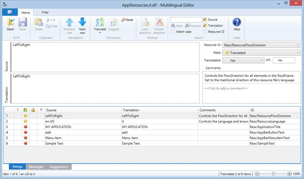
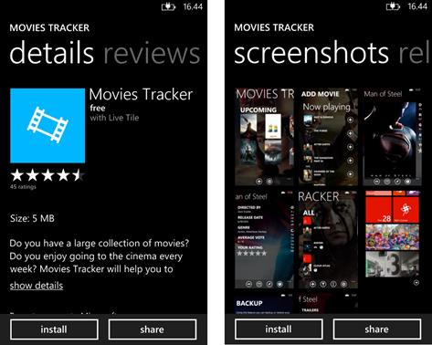

# 第 10 章分发应用程序:本地化、Windows Phone Store、
和应用内购买

## 试用应用

Windows Phone 应用程序的一个与众不同的特点是，它们支持试用模式，这使得它们可以作为具有有限功能的试用版从 Windows Phone Store 下载。一旦用户决定购买完整的应用程序，就不必从头下载；商店将简单地下载一个更新的证书，这将解锁所有以前被阻止的功能。

从开发人员的角度来看，管理试用很简单。`Windows.ApplicationModel.Store`命名空间包含一个名为`LicenseInformation`的类，它提供了一个名为`IsTrial`的属性。如果其值为`true`，则表示应用程序已经安装在试用模式下，因此我们必须锁定不想启用的功能；否则，用户已经购买了它，因此所有功能都可以使用。

您可以根据自己的应用选择最佳的试用体验。例如，您可以禁用某些功能，限制应用程序可以执行的次数，或者在游戏中选择要解锁的级别。

```
    LicenseInformation info = new LicenseInformation();
    if (info.IsTrial)
    {
        MessageBox.Show("Application is running in trial mode");
    }
    else
    {
        MessageBox.Show("Application is running in full mode!");
    }

```

## 本地化

提高应用程序的销量和下载量的最佳方法之一是支持多种语言。Visual Studio 中默认的 Windows Phone 8 模板已经通过包含一个名为**资源**的文件夹来支持本地化。它包含所有的资源文件，这些文件都是带有特殊的**的简单的 XML 文件。resx** 分机。

资源文件只是与特定键相关联的值(翻译文本)的集合，该键在应用程序中用来引用该文本。根据用户的语言，应用程序将自动使用正确的资源文件。

标准模板在**资源**文件夹中创建了一个名为 **AppResources.resx** 的文件，该文件引用了标准语言(通常是英语)。

支持一门新语言很容易。只需在**解决方案资源管理器**中右键单击您的项目，然后选择**属性**。支持的区域性框将显示所有可用的语言。当您通过在列表中选择新语言来添加新语言时，Visual Studio 将在“资源”文件夹中自动创建一个名为 **AppResources.xx-yy.resx** 的新 **AppResources** 文件，其中 **xx-yy** 是所选语言的文化代码(例如，如果您添加了意大利语，它将创建一个名为**appre sources . it-it . resx**的文件)。

Visual Studio 为处理资源文件提供了一个有用的可视化编辑器。它显示表中的所有值，您可以在其中轻松定义键、键的值和可选注释。要访问它，只需双击**资源**文件夹中的资源文件。

除了提供标准的资源文件，Windows Phone 模板还包括一个名为`LocalizedStrings`的类，它充当本地化文件和 XAML 之间的包装器。您可以在 **App.xaml** 文件中找到它定义为全局资源:

```
    <Application.Resources>
        <local:LocalizedStrings xmlns:local="clr-namespace:Localizzazione" x:Key="LocalizedStrings"/>
    </Application.Resources>

```

由于有了这个包装器，您将能够直接访问 XAML 的资源。您不必每次需要在用户界面中显示文本时都直接在 XAML 中添加它；相反，您将添加资源文件，然后使用以下语法将它们连接到您的 XAML:

```
    <TextBlock Text="{Binding Source={StaticResource LocalizedStrings}, Path=LocalizedResources.SampleText}" />

```

由于有了`LocalizedStrings`类，我们只需使用`LocalizedResources.MyKey`语法就可以访问资源文件中的每个值，其中`MyKey`是标识您想要显示的文本的键。

如果您想直接从代码中访问资源字符串，您必须使用`AppResources` singleton 类，如下例所示:

```
    private void OnShowMessageClicked(object sender, RoutedEventArgs e)
    {
        MessageBox.Show(AppResources.SampleText);
    }

```

### 多语言应用工具包

微软已经创建了一个有用的 Visual Studio 扩展，叫做多语言应用工具包，可以在这里下载。该工具不会改变本地化的工作方式；它将始终基于资源文件，应用程序使用`LocalizedString`类访问这些文件。

以下列表详细介绍了多语言应用工具包的一些主要优势:

*   使用本地化最耗时的一个方面是手动将您在基本语言中添加的所有新值复制到所有其他资源文件中。多语言应用工具包将为您完成这项工作。在构建过程中，它会将添加到 **AppResources.resx** 文件中的所有新密钥复制到所有其他资源文件中。
*   它为管理翻译提供了更好的可视化界面。您将能够立即识别要翻译的新键，并设置不同的翻译状态。
*   它支持必应服务自动翻译句子。显然，您不能完全依赖自动翻译，但它们可以成为您本地化过程的良好开端。
*   它能够自动生成伪语言，这是一种立即识别未翻译资源并更好地了解文本在用户界面中占据多少空间的方法。

安装工具包后，您必须在 Visual Studio 的**工具**菜单中选择**启用多语言应用工具包**选项，为您的项目启用工具包。启用后，Visual Studio 将与**一起工作。xlf** 文件代替**。resx** 文件(主语言除外)。在编译过程中，工具包将生成所有需要的**。resx** 文件为您准备。

要进入工具箱可视化界面，只需双击一个**。xlf** 文件，您将看到完整的资源列表。图标将通知您每个资源的状态。如果资源尚未翻译，则会显示一个红色圆圈。如果资源已翻译但需要修订，则会显示一个黄色圆圈。如果翻译已获批准，将显示一个绿色圆圈。



图 38:多语言应用工具包

### 强迫一种语言

Windows Phone 将自动选择与手机语言匹配的资源文件。如果缺少适当的资源文件(因为您的应用程序不支持手机的语言)，将使用默认值。

您可以更改此行为，例如，如果您想让用户选择他们喜欢的语言，而不考虑手机的语言。为此，您需要在创建`App`类(在 **App.xaml.cs** 文件中声明)时设置不同的区域性代码:

```
    public App()
    {
        CultureInfo culture = new CultureInfo("it-IT");
        Thread.CurrentThread.CurrentCulture = culture;
        Thread.CurrentThread.CurrentUICulture = culture;
    }

```

通过将区域性代码作为参数传递来定义`CultureInfo`对象后，可以将其分配给`Thread.CurrentThread`对象的两个不同属性:

*   `CurrentCulture`是应用程序的文化，用于定义日期和时间格式、货币等特性。
*   `CurrentUICulture`是用户界面文化，用来理解要挑选哪个资源文件。

如果您想在测试过程中使用多语言应用工具包生成的伪语言，也需要这种方法。由于伪语言不是平台支持的官方语言，您必须使用`qps-ploc`文化代码强制使用它，如下例所示:

```
    public App()
    {
        CultureInfo culture = new CultureInfo("qps-ploc");
        Thread.CurrentThread.CurrentCulture = culture;
        Thread.CurrentThread.CurrentUICulture = culture;
    }

```

使用伪语言是识别尚未翻译的文本以及测试应用程序的布局是否能够管理长文本的好方法。开发应用程序时通常会发生的情况是，您只使用几种语言进行测试，而忘记了一个在英语中看起来很短的单词在翻译成德语时可能会很长。

## 商场体验

正如第一章中提到的，除非您追求企业分发，否则 Windows Phone Store 是向用户分发应用程序的唯一方法。你需要一个付费的开发者账号，可以从[https://dev.windowsphone.com/en-us/join](https://dev.windowsphone.com/en-us/join)购买。费用是每年 19 美元，除非你是一个学生订阅了梦想火花计划，在这种情况下访问是免费的。MSDN 用户也获得了类似的福利:在福利页面，您可以获得一个令牌，可以免费注册。

除了年费之外，微软还采用了收入分成的方式:应用程序价格的 30%由微软保管，而另外 70%则交给开发者。当然，如果应用是免费的，这种分享就不适用了。

一旦您的开发人员帐户被激活，并且您的应用程序准备就绪，您可以将其提交到位于[dev.windowsphone.com](http://dev.windowsphone.com/)的门户网站。在这个过程中，您必须定义应用程序营销特性，如价格、元数据和分发类型。之后，提交完成，认证过程开始。应用程序不会自动发布到商店；首先，他们需要通过一个认证过程，从技术和内容的角度验证应用程序。

技术测试确保应用程序为用户提供良好的体验:它不会崩溃，速度快，响应快，用户界面不会混乱。

手动测试检查应用程序的内容。一些类型的内容，如色情、过度暴力等。，是不允许的，会导致认证失败。

当您开始提交过程时，您将看到一个完成该过程的步骤列表。让我们简单看一下每一步。

### 第一步:应用信息

发布过程的第一步是用来设置一些基本信息，如应用的类别、价格层和市场分布。您的应用程序将自动以您选择的价格在所有受支持的国家分发。价格将自动转换成每个国家的货币。在这一步中，您可以选择自动排除像中国这样内容政策更严格的国家。认证过程还提供了可选的**市场选择和定制定价**步骤，该步骤提供了更深层次的定制:您可以选择仅在特定国家分发应用程序，并为每个国家定制价格。

在此步骤中要设置的另一个重要选项是分销渠道。有三种方法可以分发 Windows Phone 应用程序:

*   **公共商店**:app 可以被任何用户发现和下载。
*   **隐藏**:应用在公店里还是有的，但是用户发现不了。找到它的唯一方法是使用应用程序发布时生成的直接链接。
*   **Beta** :应用不能被用户发现，而且只允许授权用户下载。用户被授权使用他们注册电话的微软帐户。在提交过程中，您最多可以包含 10，000 个用户。创建此分发渠道是为了支持测试版测试；然而，在这种情况下，应用程序实际上不会被测试，而是在提交应用程序后的两个小时内可供选定的用户使用。测试版应用程序在第一次提交后 90 天自动过期，无论以后是否更新。

### 第二步:上传并描述你的 XAP

第二步需要更多的时间来完成，因为您必须提供将在 Windows Phone Store 中显示的所有应用程序信息。

第一步是上传 XAP 文件。XAP 是 Visual Studio 在您编译项目时生成的包，它包含应用程序运行所需的所有文件。你可以在你的 Visual Studio 项目的 **bin** 文件夹中找到它。切记始终在发布模式下编译应用程序；否则不会被接受。

一旦您上传了 XAP，门户将自动显示应用程序功能的摘要，如支持的分辨率、所需的功能等。您还必须设置正在上传的应用程序的版本号。

门户还会自动检测您支持的语言，显示在名为**语言详情**的下拉菜单中。您必须为每种支持的语言设置应用程序的元数据(标题、描述和关键词)。当用户打开您的应用程序页面时，此信息将显示在商店中。



图 39:商店中显示的应用程序信息

您还需要为每种语言和支持的分辨率上传至少一个截图(允许八个)，以及应用程序图标。它们将显示在商店的截图部分。要截图，您可以使用模拟器中可用的工具之一。

一旦您完成了所有必需的步骤，门户将向您显示提交内容的摘要，供您确认。

### 管理应用程序的生命周期

一旦您的应用程序通过认证，您就可以访问许多报告，这些报告将帮助您了解您的应用程序的性能。有下载报告、销售报告和崩溃报告。

如果应用程序没有通过认证过程，您将在仪表板中找到一个包含完整报告的 PDF 文件。它会详细地告诉你哪里出了问题，以及你应该做些什么来解决已发现的问题。

当然，最后你也可以更新你的应用程序。在这种情况下，您只需重复所有提交步骤，尽管所有字段都已经填充了旧信息和元数据。如果您只想更改价格、描述和截图等信息，流程也是一样的。只有当您更改了任何需要验证的信息时，才需要认证提交。如果只更改价格，更新会立即发布。

## 应用内购买

用 Windows Phone 应用赚钱的另一种方式是支持应用内购买。除了从商店购买应用程序之外，用户还可以在应用程序本身内进行购买。

应用内购买一直是允许的，但 Windows Phone 8 引入了特定的 API 和微软后端支持。以前，开发人员负责创建服务器基础设施、管理支付和连接客户端。

现在，您可以简单地依赖商店基础设施。用户将使用从商店购买应用程序或音乐时使用的同一张信用卡进行支付，门户将允许您在应用程序中创建一个或多个要购买的产品。同样在这种情况下，将采用收入分享办法。如果你想避免它，你可以自由实现自己的应用内购买基础设施；微软不会强迫开发者使用其服务。

需要强调的是，通过微软服务进行的应用内购买只允许用于虚拟产品(如新功能、游戏等级等)。);它不能用来购买实物商品。

Windows Phone 支持两种产品:

*   **耐用品**是可以一次购买的产品，像应用功能、等级包等。
*   **消耗品**是消费后可以再次购买的产品，就像虚拟硬币一样。

### 定义产品

产品在门户中定义。在应用程序的页面中，**产品**部分提供了添加新应用程序内产品的选项。定义产品类似于提交应用程序:您必须设置一些基本属性，如名称、价格和元数据，然后提交它。

有两个关键属性:

*   产品标识符，它是您在应用程序中用来引用产品的唯一标识。
*   产品类型，可以是可消耗的或耐用的。

### 与产品互动

一旦定义了所有属性，就可以开始使用应用程序中的产品了。可能，第一个要求是显示用户可以购买的可用产品列表。这个目标是使用属于`Windows.ApplicationModel.Store`命名空间的`CurrentApp`类来实现的。

```
    private async void OnListStuffClicked(object sender, RoutedEventArgs e)
    {
        ListingInformation listing = await CurrentApp.LoadListingInformationAsync();
        List<ProductListing> productListings = listing.ProductListings.Values.ToList();

        Purchases.ItemsSource = productListings;
    }

```

`CurrentApp`类公开了`LoadListingInformationAsync()`方法，该方法返回一个`ListingInformation`对象，该对象存储所有可用产品的信息。

产品储存在`ProductListings`集合中。在前面的示例中，我们使用`LongListSelector`控件向用户显示它们，该控件具有以下定义:

```
    <phone:LongListSelector x:Name="Purchases" SelectionChanged="OnSelectedPurchaseChanged">
        <phone:LongListSelector.ItemTemplate>
           <DataTemplate>
                <StackPanel Orientation="Horizontal" Margin="15, 0, 0, 20">
                    <TextBlock Text="{Binding Path=Name}" Margin="0, 0, 20, 0" />
                    <TextBlock Text="{Binding Path=FormattedPrice}" />
                </StackPanel>
           </DataTemplate>
        </phone:LongListSelector.ItemTemplate>
    </phone:LongListSelector>

```

每个`ProductListing`对象都包含我们在商店中分配给产品的相同属性。在前面的示例中，我们显示了产品的名称(`Name`)和价格(`FormattedPrice`)。

一旦你有了产品清单，你就必须管理购买过程。同样，我们需要使用`CurrentApp`类，它提供了`RequestProductPurchaseAsync()`方法。作为参数，我们将传递用户选择的`ProductListing`对象。

```
    private async void OnSelectedPurchaseChanged(object sender, SelectionChangedEventArgs e)
    {
        ProductListing selectedPurchase = Purchases.SelectedItem as ProductListing;
        await CurrentApp.RequestProductPurchaseAsync(selectedPurchase.ProductId, true);
    }

```

一旦购买了产品，您可以使用`CurrentApp.LicenseInformation.ProductLicenses`集合来检查其状态。它包含所有具有相关许可证状态的受支持产品。每个产品都由一个密钥标识，这是我们在门户中创建产品时分配的唯一标识符。

```
    private void MainPage_Loaded(object sender, RoutedEventArgs e)
    {
        if (CurrentApp.LicenseInformation.ProductLicenses.ContainsKey("CoolProduct"))
        {
           ProductLicense license = CurrentApp.LicenseInformation.ProductLicenses["CoolProduct"];
           if (license.IsActive)
            {
                //Unlock the feature.
            }
           else
            {
                //Lock the feature.
            }
        }
    }

```

在前面的示例中，我们可以通过检查`IsActive`属性的值来确定是否购买了带有`CoolProduct`标识符的产品。操作在页面加载时执行:如果产品已经购买，我们解锁相关功能，否则等待用户购买。

对于消耗品，购买过程是相同的。唯一的区别是，消费完之后，我们需要上报，这样就可以“解锁”再次购买。

我们可以通过调用`CurrentApp`类的`ReportProductFullfillment()`方法来报告它，该方法需要识别产品的`ProductLicense`对象作为参数。

```
    private void OnConsumeButtonClicked(object sender, RoutedEventArgs e)
    {
        var licenses = CurrentApp.LicenseInformation.ProductLicenses;
        if (licenses.ContainsKey("CoolProductConsumable"))
        {
           ProductLicense productLicense = licenses["CoolProductConsumable"];
           CurrentApp.ReportProductFulfillment(productLicense.ProductId);
        }
    }

```

### 测试应用内购买

不幸的是，测试应用内购买并不容易。由于产品必须在门户中定义，因此在测试购买过程之前，您必须提交申请。

一种解决方法是将应用程序发布为测试版；由于该应用不需要认证，它将立即可供测试。缺点是，如果出现问题，很难对其进行正确的测试，因为您不能像使用其他应用程序一样使用 Visual Studio 进行调试。

为此，微软提供了一个名为 **MockIAP** 的测试库。它的目的是“模拟”真实的应用内购买 API，这样操作就不会针对真实的微软服务执行，而是使用应用内定义的假冒产品。

MockIAP 可以从 [MSDN](http://code.msdn.microsoft.com/wpapps/Mock-In-App-Purchase-33080f0c) 下载并添加到您的解决方案中。它提供的 API 与原生 SDK 公开的相同；唯一不同的是，它们属于`MockIAPLib`命名空间，而不是`Windows.ApplicationModel.Store`命名空间。

要开始使用 MockIAP 库，有两件事要做。首先是添加一些条件编译指令，这样当应用程序在调试模式下编译时(通常在测试期间)，它将使用模拟库。当它在发布模式下编译时，它将使用真正的微软服务。

下面的代码示例显示了命名空间声明在页面中的外观:

```
    #if DEBUG
        using MockIAPLib;
        using Store = MockIAPLib;
    #else
        using Windows.ApplicationModel.Store;
    #endif

```

第二步是定义我们需要使用的产品。由于应用程序不会连接到真正的服务，我们需要在代码中复制我们在门户中定义的产品。

下面的代码显示了一个初始化示例:

```
    private void SetupMockIAP()
    {
        MockIAP.Init();

        MockIAP.RunInMockMode(true);
        MockIAP.SetListingInformation(1, "en-US", "This is a sample app", "1", "SampleApp");

        ProductListing p = new ProductListing
        {
            Name = "Cool product",
            ProductId = "CoolProduct",
            ProductType = Windows.ApplicationModel.Store.ProductType.Durable,
            Description = "A cool product",
            FormattedPrice = "10.00 €",
            Tag = string.Empty
        };

        MockIAP.AddProductListing("CoolProduct", p);

        ProductListing p2 = new ProductListing
        {
            Name = "Cool product consumable",
            ProductId = "CoolProductConsumable",
            ProductType = Windows.ApplicationModel.Store.ProductType.Consumable,
            Description = "A cool consumable product",
            FormattedPrice = "5.00 €",
            Tag = string.Empty
        };

        MockIAP.AddProductListing("CoolProductConsumable", p2);
    }

```

我们创造了两种产品:由键`CoolProduct`标识的耐用产品和由键`CoolProductConsumable`标识的易耗产品。每个产品都由`ProductListing`类(与我们在真实服务中使用的类相同)标识，我们可以使用它来定义通常从微软服务中检索到的所有产品属性，如名称、类型、价格等。

我们使用`MockIAP`类的`AddProductListing()`方法添加每个产品。添加产品后，我们可以使用标准 API 进行应用内购买。操作将在本地用假冒产品而不是真正的服务来执行，但是行为将完全相同。我们将能够列出、购买和消费可用的产品。

## 快速回顾一下

当我们谈论移动应用程序时，开发并不是我们需要考虑的唯一方面。如果我们想要成功，我们还必须分发和推广我们的应用程序。在本章中，我们讨论了:

*   如何本地化应用程序，以便吸引更广泛的受众。
*   Windows Phone Store 和认证过程是如何工作的。提交应用程序是至关重要的一步，因为我们必须做出许多重要的营销决定，如应用程序的价格、它将在哪些国家上市等。
*   如何通过支持应用内购买增加收入？